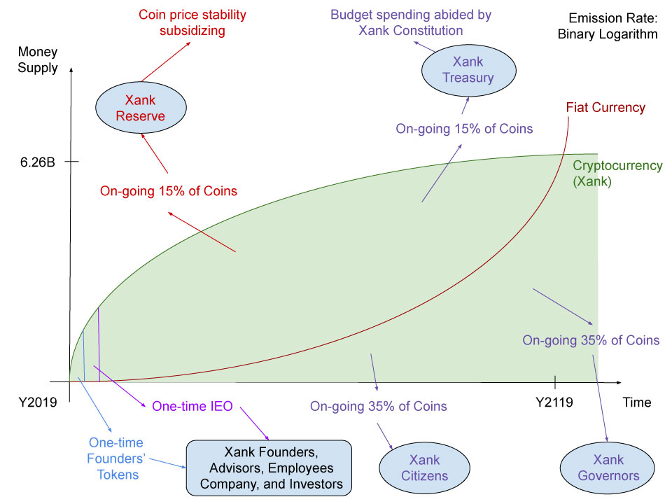
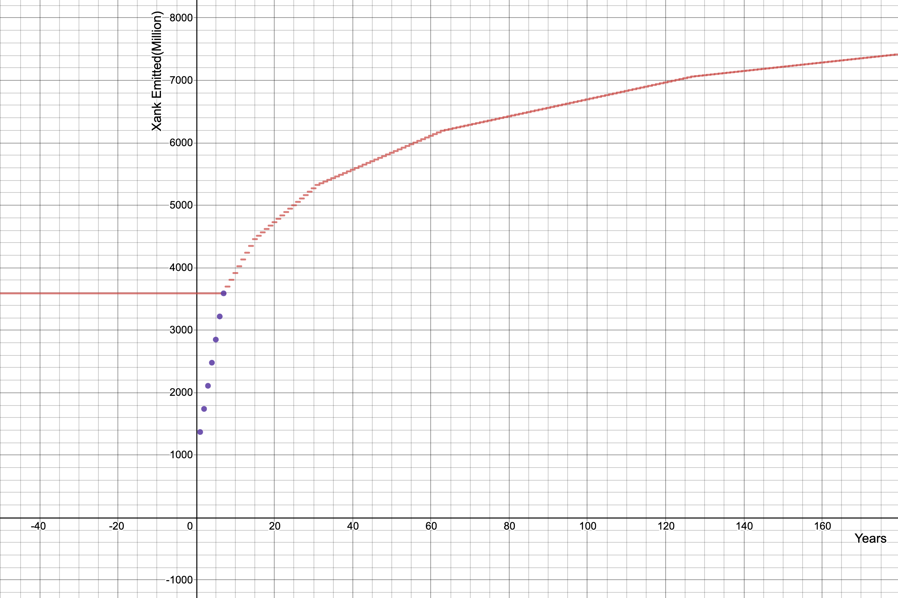

# Xank: A Treasury-backed Stability-guaranteed Cryptocurrency

Author:

Kim Ryu Hyun ([ryu@xank.io](mailto:ryu@xank.io))

Contributors:

Ryan Lee ([rl@xank.io](mailto:rl@xank.io))

Sung Kim ([sung@xank.io](mailto:sung@xank.io))

Version 0.99.9r

First published: April 7, 2018

For the most updated version, check: [xank.io](https://xank.io/)

# Legal Disclaimer:

Definitions

**Whitepaper**: This informational document and all of the content presented in it. 

**Company**: Xank and its associated members. 

**Token**: Tokens created and distributed by Xank for use on the Xank platform.

By making use of any information in this Whitepaper or available on the Xank website, you agree to the following:

The purpose of this Whitepaper is to present information relating to the non-technical and technical aspects of the Xank project. This information is not intended to be exhaustive and does not constitute a contractual relationship. 

This Whitepaper does not constitute a prospectus of any sort or a solicitation for investment, nor does it in any way amount to an offering or a solicitation of an offer to buy any securities in any jurisdiction. It is not, therefore, composed in accordance with, and is not subject to, laws or regulations designed to protect investors in any jurisdiction. Certain statements, estimates and financial information contained in this Whitepaper constitute forecasted statements or information. Such predictions involve both known and unknown risks and uncertainties which may cause actual events or results to differ materially from the estimates or the results implied or expressed in such forward-looking statements. 

This English language Whitepaper is the primary official source of information about Xank and its project. The information herein may, from time to time be translated into other languages or used in the course of written or verbal communications with existing and prospective customers. In the course of such translation or communication, some of the information may be lost, corrupted or misrepresented/ mistranslated. The accuracy of such (alternative) communications cannot be warranted. In the event of any conflicts or inconsistencies between such translations and communications and this official English language Whitepaper, the provisions of this English language original document shall always prevail.

Xank is being built to provide the functions described herein. The project and its Token are not being developed to provide users of the system with any financial product or investment opportunity. On the contrary, Xank and it’s Token is being developed as a product, not as a security or other investment opportunity. The Token is intended to function solely as described in these materials, and, except as described herein, will not give any holder voting rights over anything that Xank or the project may do.  Xank does not make any representation as to or otherwise guarantee, the potential future value of any Token. Once the project is launched, it is contemplated that holders of the Token will only engage with and use the Tokens as they are described herein and not for purposes of any speculative investment opportunity.

# Abstract

In order for any currency to be useful, it should at the very least display the following three qualities: it should serve as a medium of exchange, a store of value, and a unit of account. It has been observed that although cryptocurrencies can be used as mediums of exchange, they have proved too volatile in terms of being dependable stores of value and units of account. The stablecoin concept has emerged out of a need to address these weaknesses present in most cryptocurrencies to date. A stablecoin is a cryptocurrency whose price is pegged to another stable asset, such as the USD. What emerges is a price-stable cryptocurrency asset that can fulfill the store of value and unit of account qualities alongside the medium of exchange function. 

Most dominant cryptocurrencies consistently show volatility in price. Although such volatility can attract speculative investment, the positive effect is often outweighed by hindering adoption as both consumers and merchants are reluctant to speculative price risk exposure if their purpose is to transact for goods and services. Simple financial transactions, like employee remuneration and the extending of credit services, are not easily embarked on because of the distorting effects of continuous price fluctuations.

We propose Xank, a cryptocurrency that utilizes a soft price pegging mechanism to achieve price stability while also remaining decentralized and free-floating. Xank will allow the soft peg to be set by a protocol governance mechanism where the price peg will be decided on at the network level. For example, a Xank transaction can be set by the network to simulate a peg against an amount of the IMF’s Special Drawing Right (SDR, or currency code XDR, which will be used in the rest of this paper) or other supported fiat currencies of the world such as but not limited to the U.S. dollar (USD), euro (EUR), British pound sterling (GBP), Japanese yen (JPY), Chinese renminbi (RMB), Korean won (KRW), and New Taiwan dollar (TWD). At a subsequent stage, the network may decide to update the peg to a Consumer Price Index (CPI) of a basket of goods as is performed by central banks to achieve inflation targets. The Xank protocol achieves this by algorithmically adjusting the count of XANK coins on a per-transaction basis to maintain a floating price point between the XANK-XDR rate or XANK-Currency rate. The soft peg is activated during transaction life-cycles, that is, during buying, selling, and settlement, which lets a supply and demand equilibrium be established, thus making Xank the only stablecoin designed to have investment value.

# Table of Contents

- [Abstract](#abstract)
- [Introduction](#introduction)
- [Xank Design Considerations: Implementing Price Stability](#xank-design-considerations--implementing-price-stability)
  * [Avalanche Protocol for the Xank Network](#avalanche-protocol-for-the-xank-network)
  * [Adoption of a Self-funding Treasury System](#adoption-of-a-self-funding-treasury-system)
  * [Soft-pegging to the IMF’s SDR (Special Drawing Rights)](#soft-pegging-to-the-imf-s-sdr--special-drawing-rights-)
    + [**A brief history of the IMF’s SDR**](#--a-brief-history-of-the-imf-s-sdr--)
  * [Xank and the Bridgewater Idea Meritocracy System](#xank-and-the-bridgewater-idea-meritocracy-system)
  * [**Idea Meritocracy**](#--idea-meritocracy--)
    + [Meaningful Work](#meaningful-work)
    + [Meaningful Relationships](#meaningful-relationships)
    + [Radical Truthfulness](#radical-truthfulness)
    + [Radical Transparency](#radical-transparency)
  * [The Xank Protocol](#the-xank-protocol)
    + [Stable Pay Functionality](#stable-pay-functionality)
    + [Local Pay Functionality](#local-pay-functionality)
    + [Xank Proof-of-Stake (PoS) Governance](#xank-proof-of-stake--pos--governance)
    + [The Xank Reserve](#the-xank-reserve)
    + [Go-to-market Strategy](#go-to-market-strategy)
    + [Measuring the Exchange Rate](#measuring-the-exchange-rate)
      - [SDR and Currency Feeds](#-span-style--text-decoration-underline---sdr-and-currency-feeds--span-)
      - [Oracle System](#-span-style--text-decoration-underline---oracle-system--span-)
      - [Oracle Feed Redundancy](#-span-style--text-decoration-underline---oracle-feed-redundancy--span-)
    + [Stable/Local Pay Transaction Lifecycle](#stable-local-pay-transaction-lifecycle)
    + [Xank Multi-currency Support](#xank-multi-currency-support)
    + [Extreme Volatility Safeguard (EVS) Price Floor Mechanism](#extreme-volatility-safeguard--evs--price-floor-mechanism)
    + [Atomic Swap Basket](#atomic-swap-basket)
    + [Idea Meritocracy Governance](#idea-meritocracy-governance)
    + [Xank Self-sovereign Identity and Xank Reputation Index](#xank-self-sovereign-identity-and-xank-reputation-index)
    + [Xank Budget Allocation](#xank-budget-allocation)
- [Applications and Use Cases](#applications-and-use-cases)
  * [Exchanges](#exchanges)
  * [Individuals](#individuals)
  * [Merchants](#merchants)
  * [Business and Startup Funding](#business-and-startup-funding)
  * [Activism](#activism)
- [Xank in a Post-fiat World](#xank-in-a-post-fiat-world)
  * [Soft-pegging to a Consumer Price Index](#soft-pegging-to-a-consumer-price-index)
  * [Giving Power Back to the People](#giving-power-back-to-the-people)
  * [A Preamble to the Xank Constitution](#a-preamble-to-the-xank-constitution)
- [Conclusion](#conclusion)
- [Appendix](#appendix)
  * [Pros and Cons of Existing Stablecoins](#pros-and-cons-of-existing-stablecoins)
    + [Tether](#tether)
    + [Maker (Dai)](#maker--dai-)
    + [Carbon](#carbon)
  * [**Xank Network Specifications and Comparisons**](#--xank-network-specifications-and-comparisons--)
  * [**Xank Units of Measure**](#--xank-units-of-measure--)
  * [XANK Coin Supply Algorithm](#xank-coin-supply-algorithm)
    + [Introduction](#introduction-1)
    + [Limited Supply](#limited-supply)
    + [Unlimited Supply and Inflation](#unlimited-supply-and-inflation)
    + [GDP](#gdp)
    + [Xank Network Transactions](#xank-network-transactions)
    + [Xank Coin Supply](#xank-coin-supply)
    + [Xank Emission Algorithm](#xank-emission-algorithm)
      - [Initial Design](#initial-design)
      - [Current Design](#current-design)
  * [**Xank Protocol Characteristics Comparison**](#--xank-protocol-characteristics-comparison--)
- [References and Resources](#references-and-resources)
  * [Notes](#notes)

# Introduction

Cryptocurrencies have not been embraced by the market for use in typical transactional scenarios. Traditional cryptocurrencies like Bitcoin and Ethereum are not able to scale to meet potential market demands. Cryptocurrencies that have difficulties scaling result in increased user transactional costs for entering their transactions in cumbersome blockchains. The latest breed of cryptocurrencies such as Dash and Bitcoin Cash make claims of being able to confirm transactions in under a second while also allowing for a higher transaction throughput per second along with cheap and declining transaction fees. These claims are particularly attractive to merchants who show a preference to cash over dealing with credit card fees. As cryptocurrencies are immune to chargebacks, it should only follow that merchants prefer cryptocurrencies that can perform as cash. 

For merchants that already accept payments in cryptocurrencies, it is typical for them to immediately use a crypto-to fiat merchant service to convert their cryptocurrencies to fiat with some services able to achieve real-time conversions at the time of sale. Merchants typically convert back to fiat as they are in the business of providing goods and services to their customers and are not in the business of speculating on the price of cryptocurrencies or any other price volatile assets like gold. It is not uncommon for a cryptocurrency to experience a 50% price drop in a day, and this price drop can often carry on over a period of weeks, which is not merchant friendly as it can wipe out any profits as the costs and prices of merchants’ goods and services are usually static in fiat denominated terms.

Ardent cryptocurrency proponents may show much enthusiasm for many of the attributes of cryptocurrencies, like having direct control over their wealth, the convenience of being able to transact at any time with anyone in the world, the pseudo-anonymity, or even high anonymity offered by some privacy coins. Yet, even the most outspoken proponents are shy to keep their entire life-savings in cryptocurrencies and often advise friends, family, and newcomers to only invest a percentage of their savings that they are willing to lose in such volatile assets. 

To move beyond the speculative phase of investment and to move into mainstream adoption, there is a great need for cryptocurrencies to tend toward and achieve price stability so as to become stable stores of value - a key component of useful money.

Although cryptocurrency speculators play a key role in price volatility, they are not the leading causal factor. Network level issues can often be the main drivers for any price instability. 

Let’s consider the Dash network, which has been designed in such a way so as to overcome the scalability and privacy issues that plague Bitcoin. To achieve this, Dash has implemented a masternode network layer. Because of the high levels of capital expenditure and network hardware requirements to run a masternode, the Dash network is assured a high-level of transactional throughput and has also been able to introduce levels of transactional pricing. Achieving this level of scalability and throughput has propelled Dash to be one of the leading cryptocurrencies. However, it did require certain network tradeoffs. Masternodes have introduced an element of centralization and widened the network’s attack surface as a well-funded adversary can theoretically buy up as many masternodes as necessary to establish control of certain network functions. Dash also lends itself to a democratic model for network governance, which moves the network away from meritocratic governance into the foray of the wisdom of the crowd. This can lead to unskilled decision making, further weakening the network. In time, as these network weaknesses are discovered by the market, price stability cannot be maintained, resulting in digital asset price volatility.

In order for a cryptocurrency to achieve mass adoption, it must be designed in such a way that achieves a balance between price stability, scalability, privacy, and decentralization. Unstable networks do not instill confidence for end consumers or merchants to choose cryptocurrencies over existing and mature fiat alternatives. Unscalable networks cannot handle many users on the network at the same time, and this hinders global scale adoption. Networks that lack a certain level of privacy leave user details exposed to crypto-analysis and develop fungibility issues resulting in blacklisted and censored transactions. Networks that can not achieve a certain level of decentralization become exposed to corruption and value erosion (see Xank Protocol Characteristics Comparison chart in Appendix).

In this paper, we describe how the Xank network achieves an essential balance between these competing network forces, and in so doing, describe how it can establish its place as the most useful stablecoin and is therefore set to achieve dominance among cryptocurrencies.

# Xank Design Considerations: Implementing Price Stability

In order to achieve price stability, the Xank protocol has chosen design elements from leading cryptocurrencies and combined them with a conceptual framework that is based on the concepts of sound and stable money. Xank will technically be implemented as a fork of the Dash network and therefore will retain many of the Dash technical characteristics. The Xank protocol will also incorporate various adjustments and enhancements to the Dash protocol which are designed to achieve the price stability that is necessary for Xank to serve and function as a stablecoin. 

In this section, we describe the importance of decentralized governance and a self-funded budget system as implemented on the Dash network. We then look at the concepts of the IMF’s Special Drawing Rights (ISO 4217 currency code XDR (numeric: 960), also abbreviated SDR) instrument, which will be used as the first soft peg for the Xank network. In contrast to Dash’s democratic governance model, we also consider the advantages that can be gained by implementing Ray Dalio’s meritocratic governance system, as outlined in his essay, which led to the success of the company he founded, Bridgewater[1](#f1), and how this can be applied in the Xank network.

## Avalanche Protocol for the Xank Network

While Xank inherits properties of the Dash blockchain, Xank will not use Proof-of-Work to achieve network-wide consensus and security. Instead, Xank will implement Avalanche, a new family of leaderless Byzantine fault tolerance protocols built on a metastable mechanism. 

_Leaderless Consensus_

Avalanche follows these four basic protocols to achieve consensus:

1. Slush: Metastability —> A node initiates a query to its peers and based on the response of other nodes (red or blue), the node updates its color to the one selected by the majority of its peers. As nodes perform such queries, the network will tip towards red or blue. 
2. Snowflake: Byzantine fault-tolerance (BFT) —> Byzantine fault-tolerance is achieved by a counter that captures the strength of a node’s conviction. The counter goes up every time there is a successful query that indicates that the response is the same color as the node’s original color.
3. Snowball: Boosting confidence —> Because Snowflake resets a node’s counter with each color flip, Snowball adds confidence counters that record the number of queries that have given a threshold result for their corresponding color. With every successful query, the node increments its confidence counter for that color. After a certain number of consecutive queries, a node switches colors if the confidence counter exceeds or falls below the other color.
4. Avalanche: DAG —> Finally, a dynamic append-only Directed Acyclic Graph (DAG) with all known transactions is added for efficiency and security. 

While Proof-of-Work or Proof-of-Stake elect one validator for block creation, Avalanche does not need to elect a leader in any form for consensus. Rather, the protocol, metastable by nature, is designed to tip one way or the other, steering all nodes to consensus. With no miners, delegates, or privileged nodes, Avalanche protocol yields an egalitarian network of equal-standing nodes. Thus, the protocol is inherently independent of a central figure or major player in the network. All nodes contribute equally to reaching consensus.

_High Throughput and Scalability_

In addition to the element of decentralization, Avalanche provides several additional critical benefits to the Xank network. First, Avalanche exhibits significantly higher throughput than that of its counterparts that rivals widely accepted fiat payment systems.

*   Bitcoin — 7 transactions per second
*   Ethereum — 15 transactions per second
*   XRP — 1,500 transactions per second
*   EOS — 50 transactions per second
*   VISA — 2,000 transactions per second
*   PayPal — 193 transactions per second
*   Avalanche — 6,500 transactions per second (1,000 nodes hosted on AWS)

As Xank becomes more widely adopted and used for various purposes, the number of transactions will naturally increase, and the Xank network will need the capacity to handle a growing number of transactions. Avalanche, which reached 6,500 transactions per second on a test network of 1,000 nodes and stabilized at 5,000 transactions per second[2](#f2), has exhibited the ability to handle far more transactions per second than its predecessors. Therefore, Avalanche protocol is the optimal solution for a cryptocurrency like Xank, which will require both high throughput and scalability to function as a truly usable cryptocurrency.

_Environment-friendly_

Bitcoin’s Proof-of-Work is notorious for its excessive consumption of electricity that rivals that of entire countries’ electricity usage. Unlike Proof-of-Work, Avalanche is a green, quiescent, and efficient protocol that does not use energy when there are no decisions to be made in the ecosystem. One of Xank’s core convictions is to eradicate pollution in the world, and Avalanche’s sustainability reduces the usage of electric power. Doing so will diminish the need for electricity generation, a process that emits greenhouse gases that contribute to air pollution. 

_Privacy_

Privacy, whether it is built into the blockchain or made possible through an external application, is essential for a cryptocurrency like Xank. Xank will enable optional transactional privacy that will be implemented at the wallet level to allow for users to protect their identity and data. The Xank Universal Wallet will follow after the footsteps of Samourai Wallet[3](#f3) and Wasabi Wallet[4](#f4) to ensure private transactions for not only bitcoin transactions but also for those of other cryptocurrencies. With built-in privacy features, the Xank Universal Wallet will prevent the unwanted exposure of users’ personal information.

In summary, Avalanche is a third-generation protocol that displays advantages over other protocols that are prevalent today. Avalanche will give the Xank network the decentralization, speed, security, and quiescence that is required for Xank to perform as the next-generational stable cryptocurrency.

## Adoption of a Self-funding Treasury System

Xank will utilize the Dash self-funding treasury system which has proven vital in overcoming the challenges faced by other cryptocurrencies, in particular, overcoming the challenges of building out the network while maintaining its decentralized system of governance, funding, development, system maintenance, and project expansion. The Dash network was the first cryptocurrency that attempted to solve these issues and successfully implemented a self-funding treasury system that has resulted in the project’s development and expansion efforts remaining independent and well-funded. This ensures the perpetual success of the network and minimizes the risk that the network can be corrupted or overtaken by bad actors. 

As Xank adopts a self-funding treasury system, it will set up a for-profit company that is tasked with maintaining the core protocol while also promoting the network and native Xank cryptocurrency. The company’s key directives will be activities that are beneficial to the network’s software development, constitutional development, community building and market adoption activities. Beyond adding value to the network, the Xank self-funding mechanism will assure that the development and well-being of the network does not rely on donations or the goodwill of the network’s major token holders in any meaningful way; this has plagued the development and upgrade process of other cryptocurrencies that are not self-funded.

Xank has decided to use a for-profit company mechanism as opposed to a foundation setup. Although the company will be active in the initial development and setting up of the network, it will subsequently be competing in the open market for network funding proposals after the network launch. This is in line with the network’s meritocratic principles and sets it apart from other networks that set up non-profit foundations to serve this purpose. As observed with Bitcoin and other earlier cryptocurrencies, any such foundations that were established with the intention to support the development of the project were not directly related to the success of their platforms and were more prone to serve the interests of early adopters, large token holders, and foundation members themselves. These foundations struggled to get funding and were prone to imploding once the initial funding was spent. This resulted in protocol development being left to volunteers and enthusiasts  who, although involved in valiant efforts to maintain said networks, would not be able to compete with a well-funded network development team that is dedicated to the task. Leaving the development team unfunded and only able to survive from donations also allows the centralizing element of the donors having a say in the direction of the development of the network. When self-interested parties directly sponsor the development of the network, especially ones with competing interests like miners and exchanges, the network can find itself at odds with its users and the interests of other interested parties. 

Some projects fund their development team by premining coins or running pre-launch sales. Although these fundraising efforts do not particularly harm the network and can provide for adequate amount of funding to bootstrap the launch of a new project, the actual value of funds that are raised remain subject to market forces, and there is no way to predetermine the funding levels that will be achieved or if those funding levels will be sufficient for the continual development and future needs of the network. 

Xank will also operate through a network of incentivized full nodes, also known as masternodes, that will be required to put up a collateral to establish voting seats on the network. Masternode operators are invested in the success of the network and can act as stewards that can guide the network development process by applying their vote for network upgrades and direction. Unlike miners that can extend their mining investment to other altcoins, Xank masternode operators are paired with the network as their network infrastructure investment cannot be redirected to other cryptocurrencies. This mechanism thereby locks in their network loyalty and acts as an incentive.

A percentage of each block reward will be held in escrow by the network for appropriation toward the expansion and continual development of the network and wider Xank ecosystem. The escrowed funds will be appropriated in accordance with the masternode voting preference. Funds will invariably be used for the promotion and development of the Xank coin and network, and the budgets for each use will be determined by the masternode voting mechanism in an open and transparent way. This process ensures that the budgets policies and initiatives that are to be funded are decided on in a decentralized way that also assures that the Xank network can evolve and upgrade to any new market demands and adopt new emergent technologies in the future.

A self-funded treasury system ensures that the Xank network will be able to hire core developers as funds will be appropriated for this specific purpose. People will be hired not by a company, but effectively by the network itself as a result of the decentralized votes cast by masternodes for this specific purpose. Masternode operators are replaceable to the extent that they can decide to leave the network and be replaced by a new operator that is willing to put up the same level of collateral, thereby acquiring a masternode voting seat. This means that the Xank network will continue to operate and thrive in perpetuity, even if all initial masternode operators are replaced.

## Soft-pegging to the IMF’s SDR (Special Drawing Rights)

The Xank cryptocurrency will initially set it’s soft peg functionality to the IMF’s SDR at launch to assure its position as a stablecoin that is useful to the member countries of the IMF and by extension the rest of the world. At the time of Xank’s launch and bootstrapping, the SDR can be considered as the most stable international reserve asset, as its price is representative of a bundle of currencies and cannot be arbitrarily manipulated by any one of the member countries that may choose to employ its central bank to inflate the member states money supply. If a more stable measure of value emerges than the SDR in the future, the Xank network can adopt it through the masternode voting system as described above.

### **A brief history of the IMF’s SDR**

The SDR is an international reserve asset created by the IMF in 1969 to supplement the reserves of the member countries. As of September 2017, 204.2 billion SDRs[5](#f5) (\$291 billion USD equivalent) had been created and allocated to the member states. SDRs are freely interchangeable for other participant currencies. 

The SDR was created as a supplementary international reserve asset within the context of the Bretton Woods fixed exchange rate system, where participating countries needed official reserves in the form of government or central bank holdings of gold and widely internationally accepted currencies in order to establish and maintain a fixed and balanced exchange rate. The expansion of international trade and finance was impaired, however, as there was an inadequate international supply and reserve of the two key reserve assets: gold and the U.S. dollar. This prompted the international community to decide on the creation of a new international reserve asset that was to operate under the auspices of the IMF. 

The SDR primarily serves as a supplementary reserve asset and also has secondary uses as the unit of account among IMF members along with some other international organizations.

Subsequently, the Bretton Woods system collapsed some years after the creation of the SDR, and the major currencies moved to a floating exchange rate. In the meantime, international capital markets had expanded due to new borrowing capabilities based on the creditworthiness of governments, which resulted in many countries being able to accumulate sizable international reserves. As such, the need to rely on the stability of the SDR as a global reserve asset was lessened. Reliance on the SDR was re-established around the time of the 2009 global financial crisis. At the time, the allocated SDR 182.6 billion played an important role in providing liquidity to the global economic system for supplementing member countries’ reserves. Subsequently, the SDR reclaimed its role as a stabilizing force on the world economy.

The SDR itself cannot be considered a currency, and holding SDRs does not equivocate to a claim in reserves from the IMF. Instead, it is part of a mechanism that allows for claims against ‘freely usable currencies of IMF members’. This means that a holder of SDRs can make a claim against other member state currencies that are in free reserve in exchange for their SDR through a voluntary exchange between two member states set by agreement. SDR holders can also be called upon by the IMF if they have strong external positions to purchase SDRs from other member states that hold weak external positions.

When the SDR scheme was launched in 1969, it’s value was initially set as equivalent to 0.888671 grams of fine gold. At the time, this rate was also a fixed equivalent of the U.S. dollar. It was with the collapse of the Bretton Woods agreements in 1973 that a basket of currencies was used to determine the rate of the SDR. The SDR basket that was settled on was made up of the U.S. dollar, Japanese yen, and British pound sterling, with the Euro and the Chinese renminbi added later on.

The IMF posts the value of the SDR in U.S. dollar terms on its website, and its value is determined and updated on a daily basis. It is calculated as the sum of specific amounts of each basket currency valued in U.S. dollars, based on the spot exchange rates observed at around noon London time. 

Every five years, the composition of the basket is reviewed by the Executive Board of the IMF. This periodicity can be altered if there are compelling economic circumstances in the meantime between meetings. The Executive Board bases its determination of the basket composition in consideration of the relative importance of the position of the five main member states in terms of international trade. The most recent inclusion was the Chinese Renminbi (Chinese yuan) in October of 2016 in recognition that it met the criteria that had been set for inclusion. This also coincided with a new weighting algorithm that was adopted that same year, which incorporated the assignment of equal shares to the currency issuer’s exports and a composite financial indicator in the new weighting formula. According to the IMF’s 2016 factsheet[6](#f6),

“The financial indicator comprises, in equal shares, official reserves denominated in the member’s (or monetary union’s) currency that are held by other monetary authorities that are not issuers of the relevant currency, foreign exchange turnover in the currency, and the sum of outstanding international bank liabilities and international debt securities denominated in the currency.”

The value of the SDR is algorithmically set on a basket of five major currencies weighted in the following proportions:

*   U.S. dollar - 41.73 percent (compared with 41.9 percent at the 2010 Review)
*   Euro - 30.93 percent (compared with 37.4 percent at the 2010 Review)
*   Chinese renminbi - 10.92 percent
*   Japanese yen - 8.33 percent (compared with 9.4 percent at the 2010 Review)
*   British Pound sterling - 8.09 percent (compared with 11.3 percent at the 2010 Review)

*figures obtained from the IMF’s 2016 factsheet.

These weights will remain in place until the next review, which is currently scheduled to take place by September 2021, unless an earlier review is warranted by economic and financial developments that are deemed to be of global significance in the interim. 

This level of stability has been chosen to bootstrap the first three years of the Xank ecosystem.

## Xank and the Bridgewater Idea Meritocracy System

The Xank network will employ meritocratic governance. The following key points on meritocracy have been extracted from an essay[7](#f7) written by Ray Dalio, the founder of Bridgewater, wherein he outlines how a meritocratic governance system and the implementation of its key principles and components were intricate to the success of the Bridgewater venture. We will also describe how some of these meritocratic principles will echo through the Xank network, in particular, the Xank governance system.

Ray summarises the idea in the following quote:

> In one long sentence, our success occurred because we created a real **idea meritocracy** in which the goal was to have **meaningful work** and **meaningful relationships** and the way we went after them was through **radical truthfulness** and **radical transparency**. Let's look at these words individually so we are clear on what they mean.

To get a feel for the Xank governance system, it is important to look at these key concepts.

## **Idea Meritocracy**

An idea meritocracy is a decision-making system where the best ideas rise to the top and win out. Although many meritocratic systems have been theorized, few have been able to practically implement such a system within organizations or networks of people. For the idea meritocracy to succeed, it relies on all people involved to adhere to these three things paraphrased here:

1. People have to put their honest thoughts on the table for everyone to see, not what they believe others want to see.
2. People have to have thoughtful disagreements within a reasonable back-and-forth process. This process allows for people to evolve their thinking so as to come up with better solutions and decisions than they could have come up with individually.
3. If after this process the decisions remain unresolved, there are agreed upon protocols in place that help guide people past their disagreements in idea-meritocratic ways.

The Xank governance mechanism provides governance tools to the network that are based on these concepts, and it implements this governance system at the protocol level.

### Meaningful Work

Ray Dalio describes meaningful work as: “work that people get absorbed in, are excited about, and find that working collectively on becomes a common mission so that producing GREAT results is thrilling.” In terms of Xank governance, the participants on the network will be given a meaningful role in network decision-making process so as to ensure the results are decentralized and, combined with the idea-meritocratic model, work in a way that reflects the best action that the network can take.

### Meaningful Relationships

Ray Dalio describes meaningful relationships as: “the genuine caring about each other's well being that makes for a strong community.” In terms of Xank governance, the participants of the network will be incentivized to ensure that decisions are in the best interests of the network while at the same time empowering the individuals on the network.

He describes this as a ‘tough love’ approach where decisions have consequences for the whole network. Yet he has found that this is a crucial element for ensuring the network’s success. He has seen this play out in other organizations, such as the Navy Seals, that also employ this tough love approach. To get the most out of this model and approach, two more key elements are needed.

### Radical Truthfulness

Here, Ray describes radical truthfulness as “not filtering one’s thoughts and one’s questions, especially about problems and weaknesses. It makes sense because it's only by talking about these things openly that one can come up with paths for dealing with them effectively.” The Xank governance model will adhere to radical truthfulness as all governance level decisions will be openly discussed and critiqued before they are decided on and implemented. Ideas can even be deployed in test situations and testnets so as to discover any potential weaknesses or problems that may arise.

### Radical Transparency

Radical transparency is described as: “giving mostly everyone the ability to see mostly everything. To give people anything less would deny them what they need to form their own opinions about what’s happening around them. It would make them vulnerable to others’ spin and exclude them from the idea-meritocracy.” In the Xank governance model, not only will people be able to discuss and critique ideas openly, but they will also be aware at all stages of decision-making how much weight each participant has in the decision-making process beforehand.

In his essay, Ray goes on to describe how the idea-meritocratic system is implemented and what results it has achieved. In practice, a minority of people naturally gravitate to the system automatically. Another small minority is repelled by this system and does not participate. He then describes how the majority of people that stick with it get better with it in time and eventually wouldn't want to work any other way.

He then describes that although this system seems counterintuitive in terms of efficiency, which has traditionally been dealt with through the centralization of the decision-making process in organizations, the process proves remarkably efficient in contrast to these centralized governance models where many of the participants feel detached and become less interested in the direction the organizations are going. Ray then goes on to explain how the right people get attracted to the meritocratic model of governance, and this, in turn, feeds back into the model to further ensure its success. 

The Xank network will be underpinned by an idea-meritocracy and emulate the associated principles that allow such a system to thrive. With such a mechanism in place, we expect to attract the most talented participants to the network, as there will exist the right mix of incentives to reward all individual and collective efforts to advance the Xank network. As they add value to the network, this will feed back into empowering all the Xank network participants and bolster the network as a whole.

## The Xank Protocol

The Xank protocol will deploy an automated subsidizing mechanism for stabilizing the transaction value expressed in the form of a fiat currency. This automated mechanism will be deployed as a Decentralized Autonomous Organization (DAO) that will calibrate the funds allocated in the Xank Reserve to offer exchange value stability.

This mechanism will be referred to as the Xank Reserve throughout this paper. This mechanism is designed to calibrate the value of the soft-pegged currency of the network on a per transaction basis to an equalized fiat value when the Xank Stable Pay feature is used. 

When considering the Xank protocol, it is useful to understand that Xank will be initiated as a fork of the Dash protocol and therefore have the same base technical characteristics as the Dash protocol together with the following additional characteristics which define the Xank protocol:

* **The Xank Reserve will be funded by a percentage of the block rewards.** 15% of all coins from Xank’s coin emission will fund the Xank Reserve, the decentralized and autonomous mechanism that calibrates Stable Pay and Local Pay transactions, both of which are outlined next.

*   **The Xank protocol will specify and assign a soft peg to an underlying asset.** Special transaction types called Stable Pay and Local Pay will be made available to the users of the network. 

    The Stable Pay transaction type will allow a user to make a transfer of value that is denominated in the IMF’s SDR, another fiat currency, an index like the Consumer Price Index (CPI), or a predefined basket of goods. The underlying asset to be pegged in simulation will be decided on and set by the network as specified by the Xank protocol’s governance mechanism. At launch, the soft peg will be set to the SDR, and the SDR value of a Stable Pay transaction will remain constant throughout the timeline of the transaction, that is, from initiation to final settlement and receipt between the transacting parties. Because the initial pegged asset is set as the IMF’s SDR, the soft SDR peg will be referred to by example throughout the rest of this paper. 
    
    Local Pay allows a user to make a transfer of value that is denominated in a national currency, such as the U.S. dollar or Japanse Yen. The fiat value of a Local Pay transaction will remain constant throughout the timeline of the transaction, that is, from initiation to final settlement and receipt between the transacting parties.

*   **The Xank blockchain will use an oracle service to monitor an exchange rate feed to measure price.** The Xank-XDR exchange rate will be fed to the Xank blockchain by a real-time exchange rate oracle. This can be achieved in a decentralized way so as not to expose the network to centralized points of failure. This process is described in more detail in this paper.
*   **The Xank blockchain calibrates the precise count of XANK coins on a per Stable Pay transaction basis,** so as the value that is transferred does not deviate from the underlying pegged asset’s exchange rate at the time of the transaction. 
    *   If at the time of the Stable Pay transaction the XANK coins are trading at a **lesser** value than the desired SDR equilibrium rate, the number of XANK coins involved in that transaction will be algorithmically **increased** to the required amount so as the transacted value is equal to the intended purchase price. This process is described in more detail in this paper.
    *   If at the time of the Stable Pay transaction the XANK coins are trading at a **higher** value than the desired SDR equilibrium rate, the number of XANK coins involved in that transaction will be algorithmically **decreased** to the required amount so as the transacted value is equal to the intended purchase price. This process is described in more detail in this paper.
*   **All profits and losses will be put back into the Reserve.** This process will be regulated by the Xank Reserve, which will calibrate any XANK coin profits and losses made during Stable Pay transaction life-cycles with the Xank Reserve fund, thereby keeping the value within the confines of the blockchain and its reserve system without the need for any human intervention or manual manipulation. All this will be set from the onset at the protocol level.
    
    *   If the price of XANK decreases during the transaction process, then all the loss made from the algorithmic adjustment will be refunded from the Reserve. If the price of XANK increases during the transaction process, then the receiver receives fewer coins. However, the fiat equivalent is still equal to that sent by the sender, and the difference is paid into the Reserve.
*   **An Extreme Volatility Safeguard (EVS) price floor mechanism will be set** to safeguard the economy from a complete collapse. This mechanism will assure that the Xank cryptocurrency will serve as a stablecoin even after it recovers from a catastrophic failure, an occurrence that is extremely unlikely, while also remaining a free-floating cryptocurrency during normal times. The Extreme Volatility Safeguard is described in more detail later in this paper. 
*   **An Extreme Volatility Safeguard (EVS) price ceiling mechanism will _not_ be set** to assure that any upside will remain in the Reserve, assuring the stability and continuity of the reserve function and confidence in the wider network sustainability at large.

At this point, it is useful to think of the soft-pegging mechanism in practice as an autonomously adjusting price tracking mechanism, and not as a peg as such, as a peg usually refers to a figure arbitrarily set by a centralized governing body. We provide this example:

If Alice decides to use the Xank Stable Pay feature to send 100 XDR worth of XANK coins to Bob, the following two scenarios can occur when Bob receives the XANK coins and tries to exchange his coins back to fiat:

<strong>Figure 1</strong>: Xank Price Increase Scenario

**Scenario A**

> The price of XANK was $10.00 USD at the time that Alice sent the transaction. This means that Alice needed to send Bob 10 XANK coins to achieve the required USD value (10 XANK = $100.00 USD). In the time that it took Bob to receive the transaction, the value of XANK doubled, meaning that only 5 XANK coins are required to achieve the value of $100.00 USD. In this scenario, the protocol deducts 5 XANK coins from the receiving wallet and places them in the Xank Reserve system. When Bob transfers his Xank to fiat, he will receive $100.00 USD worth in fiat terms. Alice and Bob’s need to transact using a stablecoin has been met.

<strong>Figure 2</strong>: Xank Price Decrease Scenario

**Scenario B**

> The price of XANK was $10.00 USD at the time that Alice sent the transaction. This means that Alice needed to send Bob 10 XANK coins to achieve the required USD value (10 XANK = $100.00 USD). In the time that it took Bob to receive the transaction, the value of XANK halved, meaning that 20 XANK coins are required to achieve the value of $100.00 USD. In this scenario, the protocol adds an extra 10 XANK coins to the receiving wallet by extracting them from the Xank Reserve system. When Bob transfers his Xank to fiat, he will receive USD $100.00 worth in fiat terms. Alice and Bob’s need to transact using a stablecoin has been met.

<strong>Figure 3</strong>: Xank Universal Wallet with In-wallet Stable/Local Pay Conversion

**Scenario C**

> The price of XANK is $9.99 USD at the time that Alice wants to send the transaction to Bob. This means that Alice needs to send Bob 10.00728 XANK coins to achieve the required USD value (10.00728 XANK = $100.00 USD). Alice is choosing to use regular XANK coins for this transfer. She is also wanting to send using Stable Pay instead of normal send as the transfer method. The Xank Universal Wallet supports in-wallet Stable Pay conversions, since it is a phone number based wallet that can be connected with multiple Xank wallets holding regular XANK and Stable/Local Pay coins. Alice can easily send fiat money using the Xank Universal Wallet as well since it supports fiat currency bank accounts and credit/debit cards.

### Stable Pay Functionality

This protocol function described in the above scenarios is called Stable Pay and is an optional function. This means that the sender and receiver can mutually decide if they want to use the protocol for a stablecoin transaction that is tracked to an underlying soft peg or alternatively decide to do a raw XANK coin transaction that is not pegged to an underlying asset.

### Local Pay Functionality

Local Pay works exactly the same as Stable Pay, but it uses supported local fiat currencies instead of the IMF SDR as a stable value. This functionality is useful for people who wish to transact in their relatively stable local currencies (for example, national currencies of G20 countries). With Local Pay, the sender and receiver mutually decide which currency they want to use for a stablecoin transaction. If the two select the U.S. dollar as their Local Pay currency, the transaction will maintain a soft peg value denominated in the U.S. dollar. Local Pay, like Stable Pay, is an optional feature, so users are free to perform raw Xank coin transactions without the stability factor.

### Xank Proof-of-Stake (PoS) Governance

Unlike Bitcoin and Dash that use the Proof-of-Work (PoW) mining consensus mechanism to achieve network-wide consensus and security, Xank will implement Avalanche protocol, a new metastable consensus protocol. By choosing to implement Avalanche, the Xank network participants will avoid having to deal with problems that arise out of PoW implementations, such as 51% mining attacks and investment in hardware that quickly obsoletes and is characterized by excessive electricity consumption. While consensus is achieved through the Avalanche family of protocols, governance takes the form of a Proof-of-Stake masternode system.

There will be one form of staking in the Xank ecosystem:

*   **Masternode Staking** - Masternode operators will stake 1,000 XDR worth of XANK coins at the point of masternode creation to operate a Xank masternode that gives them voting privileges on the Xank network. Xank masternode operators are also known as **Governors** and receive incentives from the network.

The reason we are using XDR as a unit of account instead of a XANK coin count for masternode staking is to remove the potential entry barrier for latecomers who wish to operate a masternode on the Xank network. If we set 1,000 XANK as the masternode staking requirement, it will be easy to stake a masternode in the beginning, but as the price rises, it will become increasingly difficult to stake a masternode. If we set 1,000 XDR as the masternode staking requirement, the number of XANK required for each masternode will fluctuate, but the value in fiat terms will always be constant. We believe this system will make it easier for later investors to participate in the network as Governors. Since building a non-inflationary currency is a significant objective of cryptocurrencies, we believe this makes more sense. 

With regards to the fairness to early investors, early investors will be handsomely rewarded if the Xank price goes up, whether they own masternodes or not. However, if the price rises to such a level that later investors cannot join the only decision-making body of Xank, early investors will be the only entities governing the Xank blockchain. The lack of new Governors could lead to a dead body of control with no fresh blood supply, a phenomenon we observe in most of today’s masternode networks.

### The Xank Reserve 

One of the main deterrents to the wider adoption of cryptocurrencies is their degree of volatility in comparison to fiat currencies and other traditional assets. This volatility means that they cannot be readily used as a store of value, as the value is exposed to price fluctuations. Variations in price are not over the medium to long-term; they can also happen during the time it takes for a transaction to clear or to be converted from cryptocurrency to fiat. When cryptocurrencies are used for payments of goods and services, price volatility during the time of transaction transit can leave the receivers exposed. 

Xank’s proposed solution is to establish an autonomous reserve fund that acts as a stabilizing mechanism. With this mechanism, network users can choose to activate the Stable Pay (or Local Pay) feature at the time of the transaction. Such a transaction will be calibrated by the autonomous reserve system and equilibrium will be established in terms of an underlying asset or fiat currency value. As such, the sender and receiver can use the Stable Pay feature and agree on an underlying value in fiat terms - the protocol will then ensure that the fiat-stable amount is sent by the sender and that the receiver receives an amount of XANK coins that is equivalent to the agreed value in fiat terms. Any differences in XANK coins that arise from this type of transaction will be calibrated against the reserve mechanism. 

*   Should the transaction require more XANK coins to be fulfilled because of a drop in the Xank-XDR value, the reserve system will provide the required amount of Xank to calibrate the transaction in fiat terms.
*   Should fewer XANK coins be needed to fulfill a transaction due to an increase in the Xank-XDR value, the excess amount of XANK coins will be retrieved by the Reserve system for transaction calibration in fiat terms.

The Xank Reserve will need to be aligned with the economic incentives present in the Xank protocol to ensure that it maintains adequate funding to meet its stablecoin functionality objectives when the Stable Pay feature is chosen. At all times, the amount of XANK coins in the Reserve must be greater than the cost of the subsidy that the Reserve provides. The cost of the subsidy will proportionally depend on the volume of Stable Pay enabled transactions multiplied by the value of the XANK coin. The subsidy cost needs to be aligned with the incentives provided throughout the Xank ecosystem. All the protocol components - Governors, Reserve, Citizens, and Treasury (some components will be further discussed later in this paper) - need to tend toward an equilibrium point in order for the system to function as specified.

<strong>Figure 4</strong>: How Xank Reserve is Created from Block Rewards

The masternode count has a direct effect on the number of XANK coins that are circulating in the economy. Masternode interests need to be aligned with the Xank protocol’s Reserve and Treasury system. As already mentioned, Xank will be a fork of Dash with additional features. This decision was chosen based on Dash’s success as an autonomous self-funding network. The above described tendency toward equilibrium is necessary so as no players or faction of the Xank ecosystem is able to establish and yield central power over the network. 

To achieve this, we will be allocating funds from block rewards in the following manner:

**1.	Governors** - 35% of total block rewards

* Xank Governors are Xank node operators that have staked 1,000 XDR as collateral and are thus qualified to be Xank masternode operators. Masternode operators can establish voting rights on how Treasury funds are spent. Masternode operators can also establish voting rights so as to vote on proposals for protocol modifications, upgrades, and underlying asset pegging mechanisms in order to be able to respond to market conditions, network robustness, and network competitiveness. Governors must maintain the original XANK coins for 1,000 XDR as collateral at all times and will lose all voting rights should they maintain a balance less than that. 35% of each block reward will be allocated for distribution toward the network’s Governors. There is no upper limit to the number of masternodes an operator may acquire, but a Self-sovereign Identity (SSI) system will ensure that a masternode operator can only establish the power of one reputation weighted vote regardless of how many masternodes they have in operation. The reward mechanism will maintain a minimum of 5% of the coin supply at all times for the Governors portion of the Xank Reserve Pool, which we’ll cover later in this paper.

**2.	Citizens** - 35% of total block rewards

* Xank has a lot of special features, but a cryptocurrency is only as good as its adoption rate. That is why we've allocated 35% of our coin emission for market adoption via a loyalty points redemption program, which we call the Redeemers program. The Redeemers program allows three parties - merchants, consumers, and Xank - to benefit from Xank's distinct loyalty redemption structure, as well as from any other market adoption strategy the network chooses to implement in the future. For example, at a subsequent stage, the network may decide to use the Citizens pool to fund a Universal Basic Income (UBI) initiative, similar to the ones adopted by certain governments, to ensure that every citizen receives a minimum income. As more businesses and consumers see the merit in Xank's adoption strategies and come on board, we believe usage will come naturally. Then, the Xank network will grow to be not only a uniquely designed protocol but also a widely used cryptocurrency. The reward mechanism will maintain a minimum of 5% of the coin supply at all times for the Citizens portion of the Xank Reserve Pool, which we'll cover later in this paper. 

**3.	Xank Reserve** - 15% of total block rewards

* Calibrating the value of XANK coins against the value of the XDR, fiat currency, or any underlying asset chosen by the network for the purposes of stablecoin functionality, will require transactions to be subsidized from a reserve fund. The Xank Reserve fund will operate autonomously and will be funded by a percentage of each block reward. The Xank protocol’s use of the Xank Reserve is designed in such a way so as the protocol remains resistant to death spirals and positive feedback loops that have the opposite effect of maintaining stablecoin functionality. By default, 15% of each block reward will be allocated for distribution toward the Xank Reserve. Most government-run central banks in the world maintain a less than 10% reserve to stabilize their respective currency. Since no one can predict whether the XANK price will rise or fall during a transaction lifecycle, which starts and ends at a different price level, the Reserve is forecasted to maintain 15% of the total coin supply, a percentage that is higher than most government-run central banks' reserves. 

**4.	Xank Treasury** - 15% of total block rewards

* The Xank Treasury is the network’s self-funding mechanism for network development and growth. The Xank Treasury will contribute funds for code development, code auditing, marketers, translators, and all other funding needs that are set out in the Xank Constitution. The allocation of funds and percentages of funds to be used will vary according to each masternode voting round. The Xank Constitution is described in more detail later in this paper. 15% of each block reward will be allocated for distribution toward the Xank Treasury. The reward mechanism will maintain a minimum of 5% of the coin supply at all times for the treasury portion of the Xank Reserve Pool, which we’ll also cover later in this paper.

### Go-to-market Strategy

The Citizens pool of Xank coins will be used for mass adoption programs that encourage companies and consumers to take part in the Xank network. One such example is a Xank loyalty program. How this works is Xank will partner with a merchant, let's say merchant X, to allow consumers holding its loyalty points to use the Xank wallet to redeem merchant X's points for Xank coins. Consumers who have exchanged their points for Xank coins are free to hold Xank, cash out at a local exchange, or spend Xank at stores where Xank coins are accepted. Xank, which has now received merchant X's loyalty points in exchange for Xank coins, will simply burn the points, subsequently allowing merchant X to write off its loyalty program liability. In exchange for having its points erased, merchant X will accept Xank at all of its payment terminals. 

### Measuring the Exchange Rate

In order for the Xank Reserve system to function autonomously and in real time, the Xank blockchain will be informed of the Xank-XDR exchange rate by using exchange rate feeds that are generated by an oracle system. It is important to note that the XANK coin will be a free-floating cryptocurrency with built-in stablecoin functionality that is derived from using the Stable Pay feature. The XANK coin will be exposed to supply and demand market forces and will vary in value and be priced accordingly and independently on all exchanges where it will be listed. This does not in any way diminish the usefulness of the Stable Pay feature which, when chosen, provides the stablecoin functionality that is required for certain types of transactions. 

#### SDR and Currency Feeds

The Xank-XDR exchange rate measurement must take into account various data feeds. In particular, the exchange rate calculation requires the SDR and all its component basket currencies to be tracked. The resultant real-time data needs to be independently and autonomously fed to the blockchain as needed for Stable Pay functionality. The data will be handled at the masternode level, and the established rate will be calculated and entered into each Xank block to be made available to the whole network.

Seeing as the SDR rate is measured against a basket of weighted currencies and is announced and published by the IMF on its website on a daily[8](#f8) basis, this daily feed will be fed directly into the oracle system and used as a basis for calculating the Xank-XDR exchange rate. 

As the currency value of the SDR is determined by summing the values in U.S. dollars based on market exchange rates of a basket of major currencies, a further step is required to establish the Xank-XDR exchange rate. The exchange rate calculation needs to track the exchange rate of the XANK coin against the fiat currencies that are included in the SDR basket. The oracle system needs to establish feeds from exchanges where the XANK coin is listed, traded and denominated in the U.S. dollar, Euro, Japanese yen, British pound sterling, and the Chinese renminbi. These feeds will be made available during the launch of the Xank blockchain, and a voting mechanism will be outlined in the Xank Constitution should more reliable feeds become available or should more feeds be added for better aggregation calculations ensuring the robustness of the feed information. Should the Xank network also decide as a whole to change the Stable Pay peg away from the SDR and choose a different underlying asset value, the same voting mechanism will be enacted for the provision of the new feeds, and the oracle system will be updated.

At the time of the launch of the network and during the infancy of the network, should Xank only trade on exchanges that only provide non-fiat cryptocurrency trading pairs, such as the Xank-BTC or Xank-ETH pairs, the fiat denominated rates can be extrapolated from the selected cryptocurrency rate against the corresponding fiat rates that make up the SDR basket. 

#### Oracle System

These feeds will be provided by purpose-built oracles that will function autonomously and transparently. Oracle input streams will be known and their code will be made publicly available and open to scrutiny. This level of openness and autonomy will assure that they are tamper proof and trusted. The oracle system will be implemented at the Xank masternode level, ensuring that the feeds will be supported by the robust network infrastructure. 

#### Oracle Feed Redundancy

Should any of the public feeds that the oracle system rely upon experience failure or permanent loss of data, such as in the case of a sustained denial-of-service attack, regional IP censorship or geo-blocking, permanent shutdown of data feed, or any other temporary or permanent feed interruption, the masternodes will be able to rely on further layers of redundancy - Masternode Feed Aggregation, Masternode Direct Manual Feed Input, and Staker Oracle Feed Data Corruption Assurance.

*   **Masternode Feed Aggregation** - should autonomous feed interruptions or losses affect 49% or less of the masternode network, such as in the case where certain oracle feeds are geo-blocked in certain regions, the affected masternodes can retrieve feed data from the unaffected masternodes on the network that are still able to retrieve the oracle feeds. The affected masternodes will aggregate the information and feed it back into the network.
*   **Masternode and Staker Feed Aggregation** - should autonomous feed interruptions or losses affect 50% or more of the masternode network and less than 49% of the Staker’s node software, such as in the case where certain oracle feeds are geo-blocked in certain regions, the affected masternodes can retrieve feed data from the unaffected masternodes and unaffected Staker nodes on the network that are still able to retrieve the oracle feeds. The affected masternodes will aggregate the information and feed it back into the network.
*   **Masternode Direct Manual Feed Input** - should autonomous feed interruptions or losses affect 50% or more of the masternode network and 50% or more of the Staker’s node software resulting in the autonomous nature of the feeds becoming unreliable, such as in the case of the feeds being shut down or discontinued, the masternode network will be allowed to provide Direct Manual Feeds until reliable autonomous feeds can be reestablished. Such an event will also activate a daily masternode voting mechanism where masternodes will vote on whether a new feed needs to be permanently established to replace the defunct feed, and if so, which is the preferred new feed. This mechanism will be activated in accordance with the voting rules that are established in the Xank Constitution. When the Direct Manual Feed mode is activated, the Xank masternode network will aggregate manual masternode feeds along with any remaining autonomous feeds still available to any of the masternodes to derive the desired exchange rate.
*   **Staker Oracle Feed Data Corruption Assurance** - As a further redundancy measure, Staker nodes will be incentivised to monitor the network for corrupt or compromised feeds. Staker node software will be able to monitor individual masternode feeds and alert the network of Staker nodes if any masternodes are corrupted or compromised, where votes are weighted according to stake ownership. Should corrupt or compromised masternodes be identified, a vote can be arranged among the Staker network to suspend the masternode from the network until the problem is resolved and uncorrupted and uncompromised feeds can be resumed from the masternode in question. This mechanism can act as a counter to any masternode collusion as the Staker network is incentivized to preserve the long-term viability and robustness of the network and to retain its decentralized nature. It should be noted that this mechanism will not punish masternodes that are not able to retrieve oracle feed information. Rather, this mechanism will only be activated should a masternode provide feed data that is not consistent with oracle feeds or masternode aggregation data and is a deliberate or compromised attempt to provide the network with false information.

### Stable/Local Pay Transaction Lifecycle

To calibrate the count of Xank coins per Stable/Local Pay transaction, the Xank protocol defines the lifecycle of a transaction that meets the following four explicit stages:

*   **Stable/Local Pay Coin Send** - for example, Alice sends 100 XDR worth of XANK coins to Bob. They have agreed to use the Stable Pay method for this transaction. 
*   **Stable Pay XDR Calculation** - Alice’s wallet software uses data provided to the Xank blockchain by the Oracle system as implemented by the masternodes and makes her aware of the required amount of XANK coins that is equivalent to 100 XDR as agreed. She selects the required amount of Xank and performs a Stable Pay send transaction. Bob receives the amount of XANK coins that is equivalent to the 100 XDR as agreed. As the transaction is entered into the blockchain, the coins are flagged and are known to the network as Stable/Local Pay coins. 
*   **Stable/Local Pay Coin Sell** - at a future point in time, Bob is ready to sell the coins he received from Alice. Seeing as these coins are flagged as Stable/Local Pay coins, he will receive the denominated amount of XANK coins in return when he sells his coins. The terminology of sell here simply refers to Bob using the Stable/Local Pay coins he received in a subsequent transaction that includes these coins. When Bob sends this ‘sell’ transaction, the sent amount will be denominated in XDR value in his wallet software, and he can send up to the full 100 XDR amount that he currently holds. The Stable Pay feature will be activated, and the required amount of XANK coins will be sent to the receiver to fulfill the 100 XDR rate at the time of the sell transaction.
*   **Stable Pay XDR Normalization** - After the sale, the coins are no longer pegged as Stable/Local Pay coins on the network, and the coins become ‘free-floating’ XANK coins once again.

### Xank Multi-currency Support

The Xank blockchain is a closed network that is disconnected from the world. It cannot retrieve the daily SDR price from the official IMF SDR website, nor is it going to manually pull data from the exchanges on which Xank is listed to calculate the Xank-XDR rate for Stable Pay transactions. Thus, the Xank network requires an oracle system to provide the SDR rate and the price of the XANK coin for the Xank blockchain.

Every day at noon (London time), the IMF publishes the SDR rate on its website. Xank’s oracle system will feed the SDR rate to the Xank blockchain so that it has the numbers it needs to fulfill Stable Pay calibrations. It is important to note that the SDR rate will not only be pulled from the official IMF website, but also from multiple other sources. This is important because a single-source feed, if compromised, has the potential to corrupt the entire network. Here, the oracle provides the Xank blockchain with real-world information, that is, the SDR rate.

However, that is only one part of the equation. In order to determine the Xank-XDR rate, we also need the price of the XANK coin. Let’s say that Xank is listed on 10 different cryptocurrency exchanges in locations around the world. The oracle would establish feeds from all 10 exchanges and calculate the average Xank price to be used in determining the Xank-XDR rate.

Similar to the SDR rate, the oracle will draw data from multiple exchanges, and not just one. The reason is twofold. First, one exchange does not accurately represent the global price of the XANK coin. Second, if the one exchange were to suffer an attack or any sort of downtime, the XANK coin’s price may be misrepresented or not retrievable at all. Here, the oracle provides the Xank blockchain with real-world information, that is, the price of the XANK coin.

Let’s look at XDR/USD rate in the chart below. This should give you an idea of how the SDR rate (“XDR/USD Rate”) and the price of the XANK coin (“Xank Price in USD”) are used to calculate the Xank-XDR rate (“Xank Price in SDR”). Note that this local currency conversion takes place in the wallet and not in the protocol.

|                       |    Close     | Price Increase |  Scenario   | Price Decrease |   Scenario   |
| --------------------- | :----------: | :------------: | :---------: | :------------: | :----------: |
|                       |              |  1 Year High   | 1 Year Low  |  1 Year High   |  1 Year Low  |
| XDR/USD Rate          |   1.38195    |    1.45998     |   1.37778   |    1.45998     |   1.37778    |
| Xank Price in USD     |    \$10.00    |     \$20.00     |   \$20.00    |     \$5.00      |    \$5.00     |
| Xank Price in XDR     |     7.24     |      13.7      |    14.52    |      3.42      |     3.63     |
| Stable Pay in USD     |   \$100.00    |    \$105.65     |   \$99.70    |    \$105.65     |    \$99.70    |
| Stable Pay in XDR     |    72.36     |     72.36      |    72.36    |     72.36      |    72.36     |
| No. of XANK Coins     |      10      |  5.282318463   | 4.984912623 |  21.12927385   | 19.93965049  |
| Xank Reserve Position |      0       |  4.717681537   | 5.015087377 |  -11.12927385  | -9.939650494 |
|                       |              |                |             |                |              |
| XDR/EUR Rate          |   1.22087    |    1.16335     |   1.16335   |    1.16335     |   1.16335    |
| Xank Price in EUR     |   € 10.00    |    € 20.00     |   € 20.00   |     € 5.00     |    € 5.00    |
| Xank Price in XDR     |     8.19     |     17.19      |    17.19    |      4.3       |     4.3      |
| Stable Pay in EUR     |   € 100.00   |    € 95.29     |   € 95.29   |    € 95.29     |   € 95.29    |
| Stable Pay in XDR     |    81.91     |     81.91      |    81.91    |     81.91      |    81.91     |
| No. of XANK Coins     |      10      |  4.764430283   | 4.764430283 |  19.05772113   | 19.05772113  |
| Xank Reserve Position |      0       |  5.235569717   | 5.235569717 |  -9.057721133  | -9.057721133 |
|                       |              |                |             |                |              |
| XDR/RMB Rate          |   9.60669    |    9.66967     |   9.0478    |    9.66967     |    9.0478    |
| Xank Price in RMB     |   ¥100.00    |    ¥200.00     |   ¥200.00   |     ¥50.00     |    ¥50.00    |
| Xank Price in XDR     |    10.41     |     20.68      |    22.1     |      5.17      |     5.53     |
| Stable Pay in RMB     |  ¥1,000.00   |   ¥1,006.56    |   ¥941.82   |   ¥1,006.56    |   ¥941.82    |
| Stable Pay in XDR     |    104.09    |     104.09     |   104.09    |     104.09     |    104.09    |
| No. of XANK Coins     |      10      |   5.03277924   | 4.709114169 |  20.13111696   | 18.83645668  |
| Xank Reserve Position |      0       |   4.96722076   | 5.290885831 |  -10.13111696  | -8.836456678 |
|                       |              |                |             |                |              |
| XDR/JPY Rate          |  156.89423   |   161.49191    |  152.41589  |   161.49191    |  152.41589   |
| Xank Price in JPY     |  ¥1,000.00   |   ¥2,000.00    |  ¥2,000.00  |    ¥500.00     |   ¥500.00    |
| Xank Price in XDR     |     6.37     |     12.38      |    13.12    |      3.1       |     3.28     |
| Stable Pay in JPY     |  ¥10,000.00  |   ¥10,293.04   |  ¥9,714.56  |   ¥10,293.04   |  ¥9,714.56   |
| Stable Pay in XDR     |    63.74     |     63.74      |    63.74    |     63.74      |    63.74     |
| No. of XANK Coins     |      10      |  5.146521641   | 4.857281558 |  20.58608656   | 19.42912623  |
| Xank Reserve Position |      0       |  4.853478359   | 5.142718442 |  -10.58608656  | -9.429126234 |
|                       |              |                |             |                |              |
| XDR/KRW Rate          |  1559.10086  |   1594.68606   | 1513.16261  |   1594.68606   |  1513.16261  |
| Xank Price in KRW     |   ₩10,000    |    ₩20,000     |   ₩20,000   |     ₩5,000     |    ₩5,000    |
| Xank Price in XDR     |     6.41     |     12.54      |    13.22    |      3.14      |     3.3      |
| Stable Pay in KRW     |   ₩100,000   |    ₩102,282    |   ₩97,054   |    ₩102,282    |   ₩97,054    |
| Stable Pay in XDR     |    64.14     |     64.14      |    64.14    |     64.14      |    64.14     |
| No. of XANK Coins     |      10      |  5.114120904   | 4.852677106 |  20.45648362   | 19.41070843  |
| Xank Reserve Position |      0       |  4.885879096   | 5.147322894 |  -10.45648362  | -9.410708426 |
|                       |              |                |             |                |              |
| XDR/TWD Rate          |   42.80559   |    43.36092    |  41.99386   |    43.36092    |   41.99386   |
| Xank Price in TWD     | NT\$1,000.00  |  NT\$2,000.00   | NT\$2,000.00 |   NT\$500.00    |  NT\$500.00   |
| Xank Price in XDR     |    23.36     |     46.12      |    47.63    |     11.53      |    11.91     |
| Stable Pay in TWD     | NT\$10,000.00 |  NT\$10,129.73  | NT\$9,810.37 |  NT\$10,129.73  | NT\$9,810.37  |
| Stable Pay in XDR     |    233.61    |     233.61     |   233.61    |     233.61     |    233.61    |
| No. of XANK Coins     |      10      |  5.064866528   | 4.905184113 |  20.25946611   | 19.62073645  |
| Xank Reserve Position |      0       |  4.935133472   | 5.094815887 |  -10.25946611  | -9.620736451 |

Looking at the first example of the XDR/USD rate, we can see that the oracle system makes it possible for the network to retrieve the values for the XDR/USD Rate and the Xank price in USD, both of which are necessary to calculate the Xank price in SDR that is required for Stable Pay transactions.

SDR: Special drawing rights (ISO 4217 currency code XDR) are supplementary foreign-exchange reserve assets defined and maintained by the International Monetary Fund (IMF).

### Extreme Volatility Safeguard (EVS) Price Floor Mechanism

 Price Floor Mechanism")

<strong>Figure 5</strong>: Extreme Volatility Safeguard (EVS) Price Floor Mechanism

The Xank Treasury has a minimum limit set to 5% of the total circulating supply of Xank. Therefore when the Xank Treasury falls beneath that level, it algorithmically stops any more funding. Because of how Stable Pay operates, the equilibrium state of the Xank Reserve is expected to retain 15% of the total circulating supply of Xank at normal times. When extreme volatility hits, the first level of EVS is set at 50% price drop in a single day. When that happens, the Xank Reserve will automatically pull all funds preserved in the Xank Treasury. The second level of EVS is set at 70% price drop in a single day. When that happens, the Xank Reserve will pull all funds engaged in Xank Governors’ masternode collaterals automatically. The third level of EVS is set at 90% price drop in a single day. When that happens, the Xank Reserve will pull all funds engaged in Xank Citizens’ staking collaterals automatically. On top of these measures, 30% of the Xank Reserve Pool will at all times be atomically swapped with five cryptocurrencies with a low or negative correlation to Xank in prorated percentages reviewed every year as an extra safety net. When volatility subsides and normal times return, all collaterals from Xank Citizens will be returned first, and all collaterals from Xank Governors will be subsequently returned.

> Xank Reserve Pool = Xank Reserve (15% of Circulating Supply) + Xank Treasury (5% of Circulating Supply) + Xank Governors’ Collaterals (5% of Circulating Supply) + Xank Citizens’ Collaterals (5% of Circulating Supply)

### Atomic Swap Basket

The Atomic Swap Basket will be composed of tokenized assets and cryptocurrencies that have a low or negative correlation to Xank. We currently have no historical data on Xank, so Bitcoin correlation to various crypto assets is used as a proxy. Depth of market liquidity will also be evaluated for these tokenized assets. Our current proposed Atomic Swap Basket is composed of the following:

*   BNB Binance Coin 30%
*   USDC USD Coin 30%
*   TRX Tron 20%
*   ATOM Cosmos 10%
*   BTC Bitcoin 10%

Composition and weighting of the Atomic Swap Basket will be voted on by Xank DAO monthly. If Xank has a low correlation to BTC, we anticipate BTC to become a greater proportion within the basket. Tokenized commodities such as gold are currently not large enough to be included in the basket but we hope to include commodities when liquidity is sufficient. 

> Atomic Swap Basket = Xank Reserve Pool 30% circulating supply x Atomic Swap Ratio 30% = 9% of Xank circulating value 

### Idea Meritocracy Governance

Xank will introduce an idea meritocracy based on Ray Dalio’s implementation of it at the Bridgewater firm, which transformed the fledgling firm operating out of a bedroom into one of the largest hedge funds in the world, into its governance ecosystem. To avoid centralizing forces that are evident in democratic or pseudo-democratic blockchains, Xank will implement a meritocratic governance system. The Xank DAO will implement a Self-sovereign Identity system that will allow for the operation of a reputation-based mechanism that will operate at the Xank masternode level, which will have a bearing on the voting power that each masternode operator has on the network. This way, a masternode operator cannot simply buy into the network governance and voting mechanisms. They must develop reputation credentials that are recognized by other masternode operators as beneficial to the network in order to be able to have the appropriate influence over the network and earn their vote.

It has been found that blockchains coalesce toward centralization when they implement democratic or pseudo-democratic based governance models. These centralizing forces can increase over time with the effect of solidifying the networks and often make them incapable of simple upgrades. In order for a network to remain dynamic and thrive, it must be able to respond to new market conditions and adapt to new technologies as they evolve. We look at the weaknesses present in earlier blockchain governance implementations and then describe the Xank Idea and Social Meritocracy Governance system at the Xank DAO level.

Satoshi Nakamoto decided on using the Proof-of-Work mechanism for Bitcoin’s network governance, where each node on the network can effectively vote on Bitcoin Improvement Proposals (BIPs). With Bitcoin, each node is able to upgrade its node software to the software that was proposed. Upon achieving a certain threshold of acceptance, that is when enough nodes upgrade to the new software, a consensus is achieved on the upgrade, and the network forks accordingly. In the early days of Bitcoin, each node operator was also a miner, which effectively gave each miner a vote. This governance model could be thought of as pseudo-democratic in that it mapped a democratic governance model. 

As mining hardware became increasingly competitive, the mining component of Bitcoin started to become centralized. Nodes decoupled and specialized from the original nodes that performed all network functions to mining nodes, validating nodes, pruning nodes and archival nodes. Mining nodes retained the ability to ‘vote’ on network proposals. However, the miner’s voting process was heavily influenced by non-mining node operators with economic network gravity, such as exchange and Bitcoin service operators. Further, mining node operators often found their economic interests clashing with leading Bitcoin protocol developers, who seem more conservative in their approach to network development, which led to upgrade standoffs between competing interests. These standoffs have resulted in controversial network forks along with difficulties in achieving an easy path to technological upgrades. 

The Dash network resembles Bitcoin in many ways, as it was modeled after the Bitcoin network. However, Dash made distinct changes to the network governance system by introducing masternodes and allowing the masternodes to have one vote as recognition of the commitment of their resources to the network. The Dash masternode voting mechanism can be seen as a direct effort to add a democratic element to the governance model. This enabled Dash to become self-funding, as the masternodes were rewarded from the block rewards and could also allocate funds towards the development and growth of the network. This gave the Dash network the ability to operate autonomously and self-fund its development, which has contributed to the network’s success and prominence. 

This development has been a revolution in the ability for blockchains to self-fund. It has also introduced a new element of centralization in that a large economic player external to the network could influence the network by buying up a simple majority of masternodes. Due to the value of the masternode capital buy-in, it is not economically viable that an attacker would use this method under current market conditions, but this does remain a theoretical centralizing force and network weakness. Potential network weaknesses are usually reflected in the market value of the network in real-time, meaning that the Dash network is not realizing its full potential. 

The Dash network made tangible improvements over the Bitcoin network, and that is the main reason Xank has decided to be a fork of the Dash network, thereby inheriting many of its favorable characteristics. Xank starts by using the Dash framework as a proven and well-functioning base and then builds new features and characteristics to avoid the potential centralization that Dash is exposed to. Xank is set to move away from the democratic governance mechanisms employed in earlier blockchains and move towards meritocratic governance as described and implemented at Bridgewater. 

### Xank Self-sovereign Identity and Xank Reputation Index

A Self-sovereign Identity system and a reputation system will be built into the Xank DAO and will operate at the masternode level, which has voting power over the network’s funding mechanisms. Xank masternodes require 1,000 XDR worth of XANK coins at the creation point and dedicate this capital, along with appropriate network resources, to gain access to the Xank voting mechanism. This can be thought of as gaining a ‘seat at the Xank network’s governance table’. Unlike the Dash network, however, this seat does not give the masternode an automatic vote. Xank votes will be awarded to Xank masternodes based on their merit, and this will be decided by a weighted reputation-based system, known as the Xank Reputation Index, that will resemble the Bridgewater Believability Index. With Bridgewater, company employees rate each other on their merits, which results in highly rated employees establishing more voting clout in terms of company direction, initiatives, and governance.  

The Xank Reputation Index will work in conjunction with the Xank Self-sovereign Identity system ensuring that masternode operators cannot gain additional votes by simply purchasing more XANK coins as each ‘seat at the table’ will need to establish a reputation that is favorable to the network in order to establish voting power. This does not diminish a masternode operator’s ability from purchasing additional masternodes that support the Xank network; it only diminishes their ability to buy voting power. With Xank, a Governor needs to earn their vote by establishing a Reputation Score, which will give them weighted voting power but never more than one vote. The Reputation Score will be aggregated from all masternodes and will be logged with the masternode operators’ Self-sovereign Identity and be made visible to all. The score will award the masternode operator with a proportion of a full vote. Masternode operators that do not establish a Reputation Score can continue supporting the network with their resources and allocated capital stake but will not be able to vote on network funding proposals.

We consider the attack scenario where a masternode operator attempts to game the Xank Reputation System by purchasing additional masternodes and covertly appointing fake or proxy-operators that are under control in order to create a sufficient voting block to overpower the network. Even if the masternodes are geographically dispersed, the masternode operator would need to establish Self-sovereign Identities for each of these masternodes, and each fake operator would need to establish their reputation among the masternode social ecosystem - that is to be rated by other nodes based on their public standing, one of the key attributes of the merit-based system. For the attacker to have any chance of success, they would need to recruit highly principled people with high standing within the cryptocurrency and wider scientific and business community. The people that rise to the top of these meritocratic hierarchies are in whole the most protective of their reputations and are often the least corruptible. To bribe and corrupt enough people with high social-standing in order to establish a voting block of a size that can dominate a reputation-based network is a task that is doomed to failure, as it would need high levels of simultaneous coordination, untainted loyalty, and sustained effort over time. Such an attack will be more costly to coordinate than the profits a masternode operator can make by contributing resources to the network to profit from its existing incentives and rewards.

The algorithm that allocates weighting for masternode voting powers will take many factors into consideration that will fall under two key pillars of additional proofs as described herein; Proof-of-Service (PoSv) and Proof-of-Merit (PoM):

*   **Proof-of-Service (PoSv)** - Base voting seat
    *   A masternode operator is required to purchase 1,000 XDR worth of XANK coins and put them up as collateral to obtain a base voting seat in the Xank congress. Although the seat has no voting power in and of itself, it is the first necessary step in the process of establishing voting power, as it is proof that the operator has extended resources that support and service the network, hence the ‘Proof-of-Service’ moniker. A Xank masternode operator reserves the right to not establish voting power, and this in no way limits the masternode operator from acquiring more masternodes and receiving the block reward incentives proportional to their investment. Should an operator operate one or many masternodes, they still only establish one voting seat.
*    **Proof-of-Merit (PoM)** - Establishing voting power
    *   A seat, as such, has no voting power until it has secured a Self-sovereign Identity with a Reputation Score. A Reputation Score is attained by providing credentials to the network that are assessed by the network of masternodes that assign weights to each masternode’s Reputation Index, which will be based on criteria that indicate the level of merit the masternode operator can provide to the network. Merit scoring will take into consideration expertise, talents, and intellect that lends itself to being of benefit to the network. The Self-sovereign Identity system, along with the 1-10 point Reputation Index, ensure that a masternode operator is weighted according to their Proof-of-Merit to the Xank network, making sure that network funding proposals and approvals are governed in a meritocratic way. 

### Xank Budget Allocation

Masternodes operators that have established their Self-sovereign Identity and have been awarded a weighted vote according to the Reputation Index criteria will be able to vote on network proposals. The total available budget of the network can be calculated by taking 15% of the block rewards over the period of time between two superblocks. Superblocks occur every 87,600 blocks, or approximately 30.41 days. A voting cutoff will occur prior to the superblock in order for the final votes to be tallied, and the results will be made available to the network so as all have time to prepare for the superblock event. A voting proposal must be formulated so that the resultant vote data can be presented as a boolean data type format where Yes/True = 1 and No/False = 0. Governors must also establish the desired funding amount, either as a total amount or a percentage of funds awarded between superblocks. 

A successful Yes vote will be indicated by the total number of weighted Yes votes being 50% or greater than the Total Voting Power allocated to the masternode network at that time. If multiple proposals are awarded funding rights, they will be ranked according to their voting margins and will receive a share of funding in proportion to their rank and voting margin up until the level of the entire budget being allocated or where all funding requests have been exhausted within budget. Any funds that remain after intra-superblock funding allocations will be deposited in the Xank Treasury and be made available for future funding proposals.

As mentioned above, a purpose-built for-profit company will be created to overlook the development, launch, and initial deployment of the network. Once the network has been launched and is operational, the company will then compete in the free market for network funding proposals. Funding proposals will often require the setting up of organizational structures, such as companies or committees, that are responsible for the completion of tasks or projects. A successful vote will result in the tasked organization being funded directly. This can be in the form of an initial budget allocation in-full, payment on the conclusion of the task, or milestone payments. For payment tasks or projects where funds need to be withheld until the conclusion of the project or task, their funds can be held in escrow in a treasury mechanism and released as agreed. Some proposals will require varying levels of human oversight, management, and reporting for their implementation and completion. Managers, team managers, and committees that are responsible for the proposals will also be responsible for the reporting of budget expenditure and milestone achievements to indicate how the funds were allocated and managed during the execution of the said project. 

The use of the Xank Self-sovereign Identity system can be used where said managers or committees can build a Reputation Score based on their success of completed projects and in time gain a reputation for managing funds in a way that is to the ultimate benefit of the network. Successful implementers will be preferred by the network and favored for future proposals, and less successful implementers will be overlooked for future funding proposals in an organic and meritocratic way.

# Applications and Use Cases

In this section, we explore the primary applications envisioned for the Xank network in its relation to the wider cryptocurrency and digital asset ecosystem and examine how Xank will be used by the five main user groups: exchanges, individuals, merchants, businesses, and activists.

We will focus on the main advantages as they apply to each of these user groups:

*   Xank properties that will be bestowed on other asset classes
*   The reduction of volatility and the establishment Xank as a reliable unit of account
*   Migration of global assets to the Xank blockchain

## Exchanges

Digital currency and asset exchange operators that accept fiat currency deposits and allow for fiat currency withdrawals experience varying degrees of friction when interfacing with the legacy financial infrastructure. This is often challenging, risky, and costly. Here are some of the common issues digital currency and asset exchanges face:

*   Creating fiat to crypto on-ramps and off-ramps (also known as payment rails) that require interfacing with traditional legacy financial institutions, primarily banks.
    *   Establishing agreements with the rigid financial legacy system while internally dealing with irreversible transactions, low transaction fees, fraud protection and more.
*   Interfacing with banking platforms that are not up to speed with appropriate APIs for transaction and account integration
*   Liaising with these banks and other financial institutions to organize compliance, security, and build trust
*   Prohibitive costs for small value transfers
*   3-7 days for international wire transfers to clear
*   Unfavorable and often arbitrary currency conversion charges and procedures
*   Needing to interface with traditional financial sector intermediaries when clearing and settling funds with other cryptocurrency exchanges

Digital asset and cryptocurrency exchanges can use Xank to overcome many of these friction points and gain access to new benefits, such as:

*   Accept cryptocurrency and fiat-denominated crypto amounts for deposits, withdrawals, and storage purposes in order to bypass legacy banks and payment providers.
*   Eliminate the risks that are inherently present in Proof-of-Work chains that employ mining for their security mechanism, which expose exchanges that list coins with weak hashpower and mining support that are open to miner attacks and double spending hacks
*   Allow users to move a fiat-denominated cryptocurrency in and out of the exchange with little to no friction
*   Outsource their fiat custodial risk and take advantage of the Xank Reserve stabilizing mechanism, thereby freeing them up to only deal and manage cryptocurrencies
*   Offer more fiat-to-crypto trading pairs by taking advantage of Xank’s pegging mechanism and stability
*   Secure customer assets purely through cryptocurrency industry best practices and encryption technologies, such as multisignature security, cold and hot wallet usage, Hierarchical Deterministic (HD) wallets (BIP32)[9](#f9) and more.

*   Set up their systems to purely deal with cryptocurrencies thereby reducing complexity and improving audit readiness.
*   Utilize all additional functionality that Xank offers over earlier blockchains, such as Xank stablecoin functionality, reduced block times for quicker withdrawal and deposit confirmations, and more transactions per second, allowing for a new class of trading products

Exchange users undergo risks when holding fiat on exchanges and may face barriers to exiting exchanges with fiat amounts that exceed bank account limits that are often arbitrarily set. Exchanges can support the Xank Stable Pay functionality and extend it to their users, who can store withdrawals privately in a fiat-denominated cryptocurrency and retain value while remaining under bank account limits. Exchanges can take advantage of the reduction in counter-party risk to users and thereby attract more users.

## Individuals

From traders looking to find value in digital assets; to cryptocurrency holders that are looking at a long-term value proposition for storing their wealth with potential upside; to the technology savvy who are looking to avoid credit card and remittance fees when transacting and shopping; to the philosophically inclined that see digital assets as revolutionary with the potential to save the world; to those looking to accept payments internationally more effectively; to those in third world nations looking for access to financial services for the first time; to developers that create new technologies; and to those who have found other applications for Bitcoin and cryptocurrencies that are not mentioned here - we believe that Xank offers similar utility with additional features, for example:

*   Transact with a fiat denominated digital asset, pseudo-anonymously, without any middlemen/intermediaries
*   Fiat value digital asset storage, including cold storage and multisig private keys outside of the financial system
*   Avoid the risk of storing fiat on exchanges — move crypto­fiat in and out of exchanges faster
*   Avoid having to open a fiat bank account to store wealth in a fiat denominated value
*   Anything you can do with Bitcoin as an individual, one can also do with Xank

## Merchants

Merchants need payments systems that work seamlessly with their operations so that they can focus on their business. In an increasingly connected world where payments need to be made inexpensively across borders, there is a lack of inexpensive, near-instant and ubiquitous payments systems that don’t rely on the legacy financial system, which leaves merchants as a captive audience. Earlier cryptocurrencies also came with the promise of cheap and fast transactions, but their price volatility is not compatible with merchant services. Additionally, cryptocurrency transaction fees have often rivaled and sometimes exceeded those of the legacy financial system. Waiting for block confirmations before a customer leaves with the goods has also not helped the cryptocurrency use case for merchants. Merchants large and small deserve better. Here are some of the ways Xank can help:

*   Goods and services can be valued and invoiced in fiat values by requesting payments that use the Xank Stable Pay or Local Pay feature (no moving conversion rates/purchase windows)
*   Prevent the need to regularly convert cryptocurrencies to fiat as well as remove all associated fees and procedures
*   Prevent chargebacks, reduce fees, and gain greater transactional privacy
*   Provide novel services that derive from cryptocurrency features, such as privacy, cold-storage, escrow accounts, and multisignature private-keys
*   Token-specific, data-rich features such as customer loyalty points, gift cards, promotions, affiliate programs, and more
*   Additional Xank features that are useful to merchants that are not offered by Bitcoin, such as stablecoin functionality, fast confirmations, additional privacy features, and near-instant transactions

## Business and Startup Funding

In the data and information age, new businesses and startups need to be more responsive to environmental concerns and differentiate themselves from business practices that were more common during the industrial age. Running a business that is eco-friendly and that complies with new environmental and employment regulations is becoming more costly while there is an increasing lack of government support, consumer awareness, and other funding initiatives. Sometimes these higher costs prohibit new businesses from entering the market altogether. The Xank protocol seeks to help businesses and startups achieve their funding goals if their behaviour is congruent and in principle with the Xank Constitution. Here are a few potential use case scenarios and ways Xank can help:

*   Fund composting toilets and alternative septic systems startups that can drastically reduce waste, chemicals, and general pollution that reaches the oceans
*   Fund high-rise aquaponics farm startups that can drastically reduce soil pollution and degradation
*   Fund plant-based diet campaigns and support research grants that can drastically reduce global warming
*   Fund clinical experiments of natural medicine that can drastically improve human health
*   Fund startups and individuals in the tiny house movement to reduce carbon footprint at the household level
*   Fund Tesla-style wall battery installations to homes and offices around the world to improve air quality
*   Other proposals that are aligned with the Xank Constitution can seek funding as a viable alternative to Initial Coin Offering (ICO) fundraising, something that is facing increased regulatory capture and compliance costs as a funding model

## Activism

Community-driven events and organizations that seek to foster improved human relationships often lack appropriate funding to create positive community awareness. Activist organizations are typically poorly funded, lack government support, and struggle to gain recognition for causes that can potentially improve human behavior and promote peaceful interactions. The Xank protocol seeks to help activists, communities, and non-governmental organizations (NGOs) achieve their funding goals when their intent is congruent and in alignment with the Xank Constitution. Here are a few potential use case scenarios and ways Xank can help:

*   Foster cultural exchanges and understanding through sponsoring K-pop, anime, food, and other cultural aspects
*   Advocate for LGBTQ equality by lobbying for LGBTQ rights at federal, state, and local government levels
*   Advocate for equality by lobbying for women’s rights at federal, state, and local government levels
*   Advocate for racial equality by lobbying for different ethnicity rights at federal, state, and local government levels
*   Support non-violent anti-hate rallies to counter negativism and encourage positive engagement by the larger population
*   Fund and foster awareness in installing accessibility equipment, custom roads, and pathways for the disabled in public and private spaces
*   Other proposals that are aligned with the Xank Constitution can seek funding as a viable alternative to NGO fundraising

# Xank in a Post-fiat World

By soft-pegging to the IMF SDR, Xank will be able to leverage all of the economic stabilization policies and efforts that are pursued by the world’s most dominant central banks. Xank’s stablecoin functionality offers the world a currency with stable buying power. This feature alone is aligned with the concept of an ideal money that is set to attract individuals, businesses, communities, and organizations to use it. As the Xank ecosystem grows through increased adoption and use, so too will it’s self-funding Reserve and Treasury grow, offering transactional stability and funding opportunities that are rarely seen outside institutional and governmental organizations that rely on taxing populations. 

It should be emphasized that the SDR facility is only offered to participating central banks that are members of the IMF. This means that until now, only these member banks could benefit from the stabilizing currency forces offered by the SDR facility. Xank is set to distribute this stabilizing power right down to the individual level in an effort to truly democratize this currency stabilizing functionality. This sets the scene for Xank’s increasing adoption as a widely used medium of exchange with the potential to even displace fiat currencies in trade volume. Were this to happen, Xank would present the world with both the technology and the chance to develop an independent, transparent, and possibly a more stable financial system with a more reliable infrastructure than the current central bank-based financial system.

What are the possible future implications? What follows is an exploration of several scenarios.

## Soft-pegging to a Consumer Price Index

Should Xank begin to control a significant share of the world's transaction volume, we could assume that some goods will begin to be offered at costs denominated in Xank. In such a world, the Xank protocol could be updated to a peg that is independent of any currency that is denominated in a nation-based currency or even a basket of currencies, such as the SDR. It is probable that Xank would move to a peg that reflects the value of a Xank denominated basket of products. Functionally, this could be similar to the way the central banks currently implement monetary policies based on a Consumer Price Index (CPI) to maintain a purchasing power equilibrium for their respective national currencies.

A Xank protocol pegged to the Xank denominated CPI-like basket would be an implementation of a monetary policy that is independent of any government with the potential to achieve a global trade scale. 

At the highest level of consideration, we believe that governments provide two critical solutions for their citizens in preserving control over the money supply: verifiability and price stability. Regarding verifiability, governments can issue cash notes and coins and create the legal protections against counterfeiting. Regarding price stability, central banks are able to intervene in an economy through the use of monetary and fiscal policies with the intent to provide stability to the financial system and encourage financial demand. Financial stability in an economy can encourage growth, reduce unemployment, and attract investment. Most central banks have a mandate to provide stable conditions to the local economies.

Bitcoin provided a solution to the double spend problem that doesn’t need enforcement by a central authority, thereby removing the need for centralized verifiability. Xank is proposed as a solution to the current reliance on centralized economic interventions for achieving relative price equilibrium. As well-intentioned and well-insulated central banks might be, authorities often exert pressure on them to inflate the money supply when their economies end up in too much debt. This increases inflationary pressure and results in the value of government-issued currencies eroding over time, sometimes even catastrophically as countries end up in default on their debts. 

We believe that when cryptocurrencies mature to the point where they can fulfill all the necessary functions of money, they will be preferred by citizens and taxpayers to replace the legacy financial and governance system. Digital money alternatives can offer society independent, transparent, cryptocurrency-based monetary policies that offer degrees of accountability to the likes never been seen in history.

## Giving Power Back to the People

When Oda Nobunaga found himself in fragmented feudal Japan in the mid-sixteenth century, he sought to unify Japan into a modern state through military force taking territories controlled by many warlords at that period. 500 years later, we find ourselves similarly fragmented - into some 200 nation states controlled by many local governments (akin to modern-day warlords) even as the globe has been connected on the Internet for some time now. The increased interconnectedness of the world brought about by advances in communications, transportation, and trade have made the use of national currencies and passports cumbersome, which have increasingly become more of a hindrance to trade and human global relations. 

Multinational corporations that span the globe, communities, NGOs, and increasingly, individuals, face bureaucratic friction when navigating multiple jurisdictions and their regulations, to perform otherwise simple tasks, such as electronically engaging in commerce across borders. As these technologies become more ubiquitous in our daily lives, the need to rely on central banks and nation states will dissolve.

In his era, Nobunaga had to resolve territorial disputes in order to unite the world. Thanks to Nakamoto’s blockchain technology, we no longer need to resort to this kind of hard power to unite the world. The widespread use and adoption of blockchain technology can be the soft power humanity needs to establish a global currency and governance. This change need not happen through violent revolution or the destruction of the nation-state world. Instead, as technology thrives and evolves, it will leave the nation-state model behind, and history will see its era of rule as a remnant of its time. The transformation will be a grassroots change as humanity moves toward using more efficient technological alternatives to the current paradigm.

Having lived in both South Korea and the United States for more than ten years in each country, both two of the most successful economies in the world, I have developed an understanding of how these governments operate. Both governments proclaim to serve their people, as servants. Instead, I observed the citizens of both countries becoming more aware that they were watching big-brother states being built around them. The authorities increasingly grant themselves more power, which results in systemic corruption. Instead of serving the best interests and the will of the people, those in power devote most of their time to special interest groups and corporate lobbyists, not the general population.

In the last century, two dominant political systems emerged to govern over most populations: autocracies, as seen in North Korea, and liberal democracies as seen in South Korea and the United States. Both political systems are equally prone to failure at serving their populations. It can be argued that liberal democratic systems have performed better than their autocratic counterparts; yet these results are often only apparent on the surface level. Even the liberal democracies that oversee successful market-based economies have managed to create a huge divide between the haves and the have-nots.

> “The top 1/10 of 1% of the population has a net worth that is equal to the bottom 90% combined. The wealth gap is the largest wealth gap that there has been since the 1935 to 1940 period. And so while we have good conditions here, for the bottom 60% of the population, we have bad conditions. So, the averages don’t convey what the picture is because of this disparity. And so, what was tapped into and what we see is there’s a large percentage of the population who is hurting, and that there is a conflict between the “haves” and the “have-nots” and liberal ideas and conservative ideas and all of that. And we have a greater polarity.”
>
> – Ray Dalio, Founder of Bridgewater Associates

With the exception of Singapore, autocratic systems all but failed. Consider North Korea and South Korea, for example, where both populations share the same ethnicity and where the only clear division is their political systems. The South is economically flourishing to the degree of 100 to 1 in terms of GDP per person while their northern counterparts are daily preoccupied with their survival. One thing both populations do have in common is that they are both increasingly being surveilled by the state as technology has made it more feasible for mass surveillance.

To maintain hegemony, one system collect taxes, and the other distributes wages. Both governance systems have failed as the Earth is being ravaged, waterways are increasingly becoming polluted, corporations are allowed to run rampant and destroy air-quality, industrial farming is depleting the soils, and many regions are becoming uninhabitable for humans, native species, and plants. 

Both systems fail us economically as they resort to inflating the money supply to manage ever-increasing costs of servicing debt, which in turn deflates our assets and national wealth. 

Both systems fail us as they spend taxes on military buildup and often senseless wars instead of education, health, research, and societal well-being. These systems become corrupt, overbearing, and ultimately can turn oppressive, often in spite of their original intent.

## A Preamble to the Xank Constitution

Here we document the principles that will be drafted to be embedded in the full version of the Xank Constitution, which will be ratified and passed by the Xank DAO as a priority.

The draft is primarily modeled from the work laid out in Ray Dalio’s book, _Principles_. Ray Dalio is often fondly thought of as a modern-day Adam Smith and Karl Marx. A businessman foremost, Ray is also a philosopher. 

Ray originally set out to create a meritocratic system that would be of benefit to himself and his company, but what emerged is a system that can have much wider institutional level implications throughout society. 

The ultimate success of the Xank network can be measured by the degree to which it enriches the people of the world with a true meritocracy that can scale to a global level - this is our intent. It is, therefore, no coincidence that Xank will share characteristics with Ray Dalio’s meritocratic model. Xank sets out to address the problems that are most vital to human survival and prosperity that are not being addressed by the current crop of governments and corporations. The Xank Constitution will act as a magnet to attract people to the Xank economy based on their merit. These people will earn the ability to guide how the Xank Treasury funds are to be spent with a view of prolonging human sustainability on this Earth and beyond.

**Pollution Clause** - efforts that aim to provide for:

1. Clean Air
2. Clean Soil
3. Clean Water

**Discrimination Clause** - efforts that aim to eliminate discrimination of:

1. Ethnicity or Disability
2. Religion or Ideology
3. Sex or Sexual Orientation

**Oppression Clause** - efforts that aim to counter and eliminate the destructive forces of:

1. War and Military Buildup
2. Inflation and Quantitative Easing
3. Systemic Corruption

**Consumption Clause** - efforts that aim to counter and curtail the use of:

1. Overconsumption
2. Big houses
3. Food Waste

**Sustainable Development Goals (SDGs)** - efforts that aim to support the UN initiative[10](#f10):

1. No Poverty
2. Zero Hunger
3. Good Health and Well-being
4. Quality Education
5. Gender Equality
6. Clean Water and Sanitation
7. Affordable and Clean Energy
8. Decent Work and Economic Growth
9. Industry, Innovation, and Infrastructure
10. Reducing Inequality
11. Sustainable Cities and Communities
12. Responsible Consumption and Production
13. Climate Action
14. Life Below Water
15. Life On Land
16. Peace, Justice, and Strong Institutions
17. Partnerships for the Goals

We are the same people even though we came to speak different languages and have different skin colors. We are all brothers and sisters sharing the same planet. We can be more friendly toward each other and respect each other. A more peaceful, loving, and compassionate world cannot be achieved as long as people hate others based on their differences. As all people are unique, we are all different from each other, and this should be celebrated. A better world cannot be built if people allow forces that divide us into opposing groups that are often based on ethnicity, social class, economic clout, religious and ideological beliefs, race, gender, sexual orientation, and all other perceived human differences to exist. Xank will add clauses in its constitution to allow for the funding of projects that work toward the elimination of pollution, discrimination, oppression, and curtail consumption.

The act of moving assets away from government-backed fiat currencies and establishing assets in decentralized self-funding and self-governed cryptocurrencies can alleviate much of the government-sponsored oppression and corruption that is rampant in the world, should the required scale be achieved. Ultimately, the governments of the world are collectively sponsored by citizens in the form of taxes collected in fiat. When assets are moved off the balance sheets of centralizing forces, such as governments, central banks, and corporations, and move into decentralized human-powered networks, the governments of the world will lose their self-imposed influence and lordship over the people’s wealth and the allocation thereof. As governments are no longer able to sustain monopolies over the people’s wealth through taxation and reallocation, they will lose their ability to sustain large centralized infrastructure, such as is required to maintain large militaries and wage senseless and unnecessary wars.  Centralized government will give way to more decentralized governance structures that empower locally based communities that exercise governance in transparent ways to provide for the required levels of community protection, health, education, well-being, and prosperity. Nation-state-backed fiat currencies will lose their relevance as nation-states themselves become less relevant. Currency wars and inflationary monetary policies will no longer have such degrading influence over the people's wealth. Locally based community governance structures can be held more accountable, which will degrade the scale of corruption that is rampant in centralized, opaque government structures and institutions.

The Xank Constitution will act as a mechanism to guide network proposals and initiatives that are beyond the scope of network maintenance, development, upgrades, and promotion. The Xank Reputation Index criteria will allow masternode operators to gain voting influence over the network each time they back initiatives that are beneficial to the network or in line with the Xank Constitution - and this will be the basis for building a meritocratic network that benefits all users and humanity. As more proposals that benefit humanity get funded, a positive feedback loop that will attract more involvement by the wider community will be created. This will further fund and grow the Xank network and fulfill it’s imbued intention to be of service to humanity by building a better society.

# Conclusion

The birth of Bitcoin gave rise to the idea of cryptocurrencies competing with fiat currencies for transactional usage and removing the world’s reliance on centralized institutions that make up the legacy financial system. However, Bitcoin’s inherent price volatility does not lend itself to such use cases. 

In this paper, we introduced Xank, a robust, decentralized, autonomous organization, a treasury-backed stability-enabled cryptocurrency. Xank’s stablecoin functionality will act to stabilize the purchasing power and offer protection against price volatility. Xank, therefore, stands as a network that can be used for price stable payments and wealth storage. As Xank’s unique stablecoin characteristics and use cases gain traction and adoption, we believe this contribution will cause cryptocurrencies to experience a virtuous cycle of adoption and help them transition into a mainstream medium of exchange.

# Appendix

## Pros and Cons of Existing Stablecoins

It is important to consider what problems certain cryptocurrencies have attempted to solve and how their efforts have resulted in gaining a better understanding of the Xank proposition. Below are commentary, analysis, observations and extracts based on a post by Haseeb Qureshi on Hackernoon, where he explains the key concepts behind the current batch of stablecoins (full text[11](#f11)).

### Tether

Tether’s attempt at a stablecoin was to create an IOU-based debt instrument that is redeemable for \$1.00 USD. By depositing dollars into a bank account, you can issue Tether on a 1:1 basis. Users that wish to redeem their value are paid back the Tether value in fiat and the Tether coins are destroyed so as to maintain the 1:1 ratio in the available supply and the amount in the bank account.

This simple setup requires trust in a central Tether issuer who constitutes a single point of failure. Trust can be minimized through periodic audits or full level transparency which is lacking.

The peg should remain stable as long as the amounts issued match with the funds that are allocated in the bank account.

Tether can be useful for price stable payments, but the U.S. dollar is a currency that is continually inflated and experiences value degradation over time, which does not make it ideal for wealth preservation and a store of value. Furthermore, it cannot attract a rate of interest on deposits as can its fiat counterpart in a savings account, which further degrades its value proposition.

Fiat-backed schemes are also highly regulated and constrained by legacy payment rails that involve bank wires and cheques when cashing out back into fiat.

**Pros:**

*   100% price-stable
*   Simplest (a big virtue)
*   Less vulnerable to hacks, since no collateral is held on the blockchain

**Cons:**

*   Centralized — need a trusted custodian to store the fiat (otherwise vulnerable to brick and mortar theft)
*   Expensive and slow liquidation into fiat
*   Highly regulated
*   Need regular audits to ensure transparency

Tether recently avoided an audit which allows room for doubt on whether they hold the funds they purport to hold. Other stablecoins like Saga are trying to do the same thing but with more transparency. Digix Gold is a similar scheme, except that the collateral is gold instead of fiat. Nevertheless, such stablecoins share the same fundamental properties.

### Maker (Dai)

The basic concept here is to peg to a fiat currency by reserving collateral in a cryptocurrency. To combat the price volatility of the underlying cryptocurrency, one must establish an overcollateralized pool of funds that can absorb price shocks. The incentive for someone to ‘lock-up’ their funds as collateral is that their position can be leveraged against the base cryptocurrency in fiat value terms. 

> ...if a depositor locks up \$200 of Ether, they can create \$100 of stablecoins. If they use the 100 stablecoins to buy another \$100 of Ether, they now have a leveraged position of \$300 Ether, backed by \$200 in collateral. If Ether goes up 2x, they now have \$600, instead of the \$400 they’d otherwise make.

This mechanism can be set up to operate on a transparent blockchain and thereby eliminate the need to trust the amounts held in collateral. However, it has one required feature, and that is a constant price feed that records price fluctuations on the blockchain to keep the peg ‘informed’. This means that although trust is eliminated in the collateralization, the trust has now shifted onto the trusted feed. 

Crypto-collateralized coins are also exposed to sharp drops in the valuation of the underlying cryptocurrency asset. If the underlying asset drops in value to below the collateralized amounts, the coins will instantly be liquidated into the underlying asset, which then fully exposes the held value to the price volatility of the underlying cryptocurrency. This failing makes the crypto-collateralized stablecoin unlikely to be used by exchanges, which vastly reduces its adoption surface area. 

**Pros:**

*   More decentralized
*   Can liquidate quickly and cheaply into underlying crypto collateral (a blockchain transaction)
*   Very transparent — easy for everyone to inspect the collateralization ratio of the stablecoin
*   Can be used to create leverage

**Cons:**

*   Can be auto-liquidated during a price crash into underlying collateral
*   Less price-stable than fiat
*   Tied to the health of a particular cryptocurrency (or basket of cryptocurrencies)
*   Inefficient use of capital
*   Most complexity

Thus, MakerDAO’s Dai crypto-collateralized stablecoin is collateralized by Ether. BitUSD is another example, the first crypto-collateralized stablecoin to be issued and collateralized with BitShares.

### Carbon

The idea that a coin does not need to be issued by an underlying asset gained traction in thought circles since it was first propounded by F.A. Hayek in the 1970s. After all, the United States was able to decouple the dollar from the gold standard and maintain a relatively stable valuation using monetary inflationary and deflationary policies to regulate the supply of the currency in circulation. Seigniorage shares, a scheme invented by Robert Sams in 2014, was based on the simple idea that a central bank can be replaced by a smart contract that regulates the amount of the currency that is in circulation. The smart contract could be mandated to peg the currency to a fiat value, say \$1.00 USD. 

Expanding the money supply is a simple matter of course for a central issuer. You simply issue more coins as demand for the coin increases to keep the price stable. Contracting the money supply, however, is not as straightforward, as it would involve you having to buy back the coins at market value, which would be lower than the peg and thereby restricting the price until the value returns to the peg. Offering newly issued coins to the market to lower the price returns a profit; this is known as seigniorage.

Contracting the supply would mean that the smart contract would need to have a large reserve of funds that can buy up excess coins in price downturns, which is not very feasible or practical. The seigniorage shares proposed solution is to issue shares that would cover the difference in times of price downturn. Shareholders would then gain access to seigniorage profits when the market turns the other way, and the coin becomes profitable to the smart contract. 

Other non-collateralized stablecoins use variations of this method. There are many detractors to this methodology, and critics are quick to highlight its potential flaws, the most prominent one being that the system assumes that network growth will be continual in order for it to fulfill its obligations toward the shareholders. Others feel it is akin to a pyramid scheme where new entrants are continuously needed to prop the system up, and others yet point to the system virtually collateralizing from its future growth, thereby inherently cannibalizing its future growth potential and limiting the growth of the network. The coin is also open facing to a death spiral if it comes under continual pressure to sell, where traders sell their shares even below the peg value whereby the currency can experience a catastrophic collapse. 

Non-collateralized stablecoins are inherently susceptible to failure should they come under sustained selling pressure. However, as seen with many fiat currencies, they are issued with the intention of achieving a Schelling point, that is, if enough people believe that the system will survive, the belief itself will ensure the system’s survival as more entrants enter the network. This makes it one of the most exciting stablecoin propositions because if such a network can achieve a Schelling point, then it can potentially become resistant to shocks that other currencies experience, as it will act independently from them. Even if the U.S. dollar and Ethereum collapse, the non-collateralized stablecoin could act as a more stable store of value. And unlike central banks that can be overtaken by perverse incentives under the influence of nation-state governments, the stablecoin’s smart contract would carry on fulfilling its mathematically coded mandate to maintain price stability. For this reason, non-collateralized stablecoins have the potential to revolutionize money but exist on a knife’s edge where they can also experience catastrophic failure. 

**Pros:**

*   No collateral required
*   Most decentralized and independent (not tied to any other cryptocurrency or to fiat)

**Cons:**

*   Requires continual growth
*   Vulnerable to general crypto market decline or crash and cannot be liquidated in a crash
*   Difficult to analyze safety bounds or health
*   High levels of complexity

Carbon is a seigniorage shares style stablecoin that emerged in early 2018 with plans for protocol-governed expansion and contraction of the money supply via the issuance of additional tokens as the price moves above the peg and the withdrawal of tokens as the price moves below the peg. 

## **Xank Network Specifications and Comparisons**

| Masternode Cryptocurrency      |                             Dash                             |                             Pivx                             |                             Xank                             |
| ------------------------------ | :----------------------------------------------------------: | :----------------------------------------------------------: | :----------------------------------------------------------: |
| Consensus algorithm            |       Proof-of-Work (PoW) Proof-of-Service (PoSv)        |       Proof-of-Stake (PoS) Proof-of-Service (PoSv)        |  Avalanche Proof-of-Stake (PoS) Proof-of-Merit (PoM)   |
| Hashing algorithm              |                             X11                              |                            Quark                             |                            Quark                             |
| Hardware mineable              |                             Yes                              |                No* (but multipool supported)                 |                No* (but multipool supported)                 |
| Block time                     |                         150 seconds                          |            60 Seconds (Re-targeting every block)             |             60 Seconds (Time based Super-block)              |
| Block size                     |                             2MB                              |                             2MB                              |             A batch size (Block size) of 40 TXs              |
| Datastore                      |                          Blockchain                          |                          Blockchain                          |                 DAG (Directed acyclic graph)                 |
| Premine                        | No premine. But 2M Dash was mined within first 36 hours of launch. (aka. instamine) | 60K on genesis block for setup of 6 initial masternodes. Premine was burnt from coin supply at block 279917. | 1B on genesis block for setup of 6 initial masternodes, early backers, ICO investors, founders, and founding company. |
| Max. coin supply               |                Approx. 17.6M after 100 years.                | No max. Increases by approx. 2.6M PIV per year. Approx 312M after 100 years. | No max. Increases by XANK coin Supply Algorithm. Approx 6.26B after 100 years. |
| Denominations                  |                           1e8 Duff                           |                             1e8                              |                         1e16 Ryu(𝔯)                          |
| Masternodes                    |                             Yes                              |                             Yes                              |                             Yes                              |
| Instant Pay                    |                             Yes                              |                        Yes (SwiftTX)                         |                        Yes (SwiftTX)                         |
| Private Pay                    |                        Yes (Coinjoin)                        |                        Yes (Zerocoin)                        |                Yes (Zerocoin at Wallet level)                |
| Stable Pay                     |                              No                              |                              No                              |                             Yes                              |
| IPv6 support                   |                              No                              |                Yes (both wallet & masternode)                |                Yes (both wallet & masternode)                |
| Decentralized governance       |                   Yes (masternode voting)                    |                   Yes (masternode voting)                    |                   Yes (masternode voting)                    |
| Budget funding                 |                  Yes. 10% of block reward.                   |                  Yes. 10% of block reward.                   |                  Yes. 15% of block reward.                   |
| In-wallet BIP38 encryption     |                              No                              |                      Yes (private key)                       |                      Yes (private key)                       |
| Permanent self funded treasury |                              No                              |                             Yes                              |                             Yes                              |

## **Xank Units of Measure**

Xank has a metric system of denominations used as units of Xank. Each denomination has its own unique name. The smallest denomination aka base unit of Xank is called a Ryu. Below is a list of the named denominations and their value in Ryu. Following a common pattern, Xank also designates a unit (of 1e16 or ten quadrillions Ryu) of the currency. 
| Unit | Ryu                    | Symbol | Xank               | Symbol | Ryu Value |
| ---- | ---------------------- | ------ | ------------------ | ------ | --------- |
| Ryu  | 1                      | 𝔯 =    | 0.0000000000000001 | 𝔛      | 1 𝔯       |
|      | 10                     | 𝔯 =    | 0.000000000000001  | 𝔛      | 1e1 𝔯     |
|      | 100                    | 𝔯 =    | 0.00000000000001   | 𝔛      | 1e2 𝔯     |
| Kryu | 1,000                  | 𝔯 =    | 0.0000000000001    | 𝔛      | 1e3 𝔯     |
|      | 10,000                 | 𝔯 =    | 0.000000000001     | 𝔛      | 1e4 𝔯     |
|      | 100,000                | 𝔯 =    | 0.00000000001      | 𝔛      | 1e5 𝔯     |
| Mryu | 1,000,000              | 𝔯 =    | 0.0000000001       | 𝔛      | 1e6 𝔯     |
|      | 10,000,000             | 𝔯 =    | 0.000000001        | 𝔛      | 1e7 𝔯     |
|      | 100,000,000            | 𝔯 =    | 0.00000001         | 𝔛      | 1e8 𝔯     |
| Bryu | 1,000,000,000          | 𝔯 =    | 0.0000001          | 𝔛      | 1e9 𝔯     |
|      | 10,000,000,000         | 𝔯 =    | 0.000001           | 𝔛      | 1e10 𝔯    |
|      | 100,000,000,000        | 𝔯 =    | 0.00001            | 𝔛      | 1e11 𝔯    |
| Tryu | 1,000,000,000,000      | 𝔯 =    | 0.0001             | 𝔛      | 1e12 𝔯    |
|      | 10,000,000,000,000     | 𝔯 =    | 0.001              | 𝔛      | 1e13 𝔯    |
|      | 100,000,000,000,000    | 𝔯 =    | 0.01               | 𝔛      | 1e14 𝔯    |
| Qryu | 1,000,000,000,000,000  | 𝔯 =    | 0.1                | 𝔛      | 1e15 𝔯    |
| Xank | 10,000,000,000,000,000 | 𝔯 =    | 1                  | 𝔛      | 1e16 𝔯    |

## XANK Coin Supply Algorithm

### Introduction

Cryptocurrencies are produced through a sophisticated cryptographic process known as mining. Mining involves the use of high powered computers running hash algorithms to find solutions to cryptographic problems that vary in complexity, known as the mining difficulty.  A solution is discovered once a problem is solved and the miner is permitted to create new units of the currency. This is known as the block reward. To ensure that the currency is not subject to endless inflation, the block reward is reduced at regular intervals. The coin emission rate is the term used to describe the quantum at which new cryptocurrency is introduced into the system.

### Limited Supply

Bitcoin and Dash are two important cryptocurrencies that have upper boundaries on the amount of cryptocurrency that can be theoretically minted. Bitcoin’s total coin emission can be calculated as the sum of a geometric series, with the total emission approaching (but never reaching) 21,000,000 BTC. While Dash is based on Bitcoin, it significantly modifies the coin emission rate to offer a smoother reduction in coin emission over time. Bitcoin reduces the coin emission rate by 50% every 4 years, whereas Dash reduces the emission by one-fourteenth (approx. 7.14%) every 210,240 blocks (approx. 383.25 days). It can be seen that reducing the block reward by a smaller amount each year offers a smoother transition to a fee-based economy than Bitcoin.

Dash’s total coin emission is also the sum of a geometric series, but the ultimate total coin emission is uncertain because it cannot be known a priori how much of the 10% block reward reserved for budget proposals will actually be allocated, since this depends on future voting behavior.

### Unlimited Supply and Inflation

Unlike Bitcoin, which has a maximum supply capped at 21,000,000 BTC, Ethereum does not have an overall cap. While the total annual issuance of ETH is fixed, the relative inflation decreases every year. Since the total supply increases, the inflation caused by issuance reduces.

By approximately the year 2140, the issuance of BTC ceases, and since some BTC will likely be lost each year, the monetary base of Bitcoin is expected to start shrinking at that point.

At approximately the same time, the expected rate of annual loss and destruction of ETH will balance the rate of issuance.  If the demand for ETH is still growing at that point due to an expanding economy, prices will be in a deflationary regime. 

### GDP

Almost no coins use any economic indicators to assess the current growth of the economy. They hope to adjust the emission rate, to account for price deflation, through external community-based consensus, if needed. Xank uses the current global GDP value as an economic indicator inside the emission logic to reduce deflationary pressure in the future.

GDP at purchaser's prices is the sum of gross value added by all resident producers in the economy plus any product taxes and minus any subsidies not included in the value of the products. It is calculated without making deductions for depreciation of fabricated assets or for depletion and degradation of natural resources. Data are in current U.S. dollars. Dollar figures for GDP are converted from domestic currencies using single year official exchange rates. World Bank national accounts data provide us with the current value at \$85 trillion USD.  The global GDP shows economic growth/decline, which will, in turn, increase or decrease Xank economy. Hence it is used as a primary factor in Xank emission. 

### Xank Network Transactions

Xank also measures the network usage or adoption by calculating the cumulative Xank collected as gas (tx fee). We release equal amounts of newly created Xank during emission. As the number of transactions in the network increases, the gas fee also collected increases. Hence the coins emitted will also increase. As the newly created Xank is evenly split between different stakeholders, the network effect is bound to increase Xank transactions.

### Xank Coin Supply

If the increase in the value obtained by holding a coin becomes larger than the value of using the coin, economically minded users will refrain from using the coin. To encourage widespread usage of the coin, the issuance of coins should be coordinated in a direct relationship to the size of the economy.

Conversely, if an infinite number of coins are issued, the value of a coin will dramatically fall as the coin will depreciate due to oversupply. If the coin discourages investors from holding it, no investors will assist in the growth of the coin economy. Therefore, the issuance policy should take this into consideration to avoid reducing and discouraging the coin’s investment value.

The initial money supply should be sufficient to ensure liquidity, and coin issuance should gradually decrease as the network’s economy stabilizes. However, if the economy grows rapidly, more coins must be issued to ensure sufficient liquidity and minimal price variance. Therefore, the maximum number of coins must remain unrestricted.

Initially, there will be 1 billion Xank coins pre-mined that will be made available to the founders, advisors, initial public token sale (ICO) participants, and early backers.

### Xank Emission Algorithm

#### Initial Design 

In our initial design, a binary logarithmic emission based on the initial year issuance(800m) was used, where the supply will double in 1.5 years, triple by the fifth year, quadruple by the thirteenth year, and quintuple by the thirty-first year; and so on. 

Emission volume is reduced by half every 2n years.  For example, the 1st year 800M, the next two years 400M each year, and the next 4 years 200M each, and so on. In this distribution formula, it is self-evident that the summation of coins in the 2n period always becomes 800M. So the coin issue rate converges to zero, but the sum of them diverges infinitely.

#### Current Design 

We use the binary logarithm to calculate the emission of the Xank coins in the nth year. The binary logarithm is the logarithm to the base 2. It is the inverse function of the power of two functions and is used to reduce the coin emission gradually. Instead of using a fixed issuance amount, Xank takes into account the current global GDP as an economic growth Indicator and Xank TPS as the network growth indicator. As the global GDP, as well as Xank TPS, is bound to increase over time, we can reduce them gradually by applying binary logarithm.

The general term of the emission sequence of Xank coins is:

From the below graph, you can see that the amount of Xank released per year is very high during the initial years and gradually reduces over time. This gives rise to very high inflation during the initial period.  From the above link, you can see that any changes in GDP or TPS in the initial years cause significant variance in issuance amount. As seen in the table, this initial volatile years corresponds to the first three logarithmic cycles.

<strong>Figure 6</strong>: Xank Emission for 100 years

To mitigate the high volatility as well as high inflation of logarithmic emission, we use a fixed emission for the first 7 years. The fixed emission amount should be selected such that, after 7 years, the total Xank emitted will be equal to that of normal binary logarithmic emission. Hence we have used 340M Xank as the fixed emission for the first 7 years, after which the binary logarithmic emission resumes.

Hence we define the general term for Xank emission per year as,

Where, 

*    year emission
*    year Global GDP divided by 100K (Rounded off to Millions)
*    year Xank network transactions per second
*    Integer-valued function which takes integer part of the given number 
    *   For instance 
        *    
        *    
        *    
        *    so that 

<strong>Figure 7</strong>: Xank Final Emission for 100 years

The partial sum of the sequence is:

Where,

*   Total summation of money supply up to the  year
*    billion (Pre-mined coins.)

Mathematically it is easy to prove  converges to zero, but  diverges infinitely.

Proof: 

1. If , then  also  so that 
2. Since  function takes the integer part of the given numbers so that  is always true, therefore the following is also true.  from the definition of the logarithm  and the above relation we can see that  using integral test 

By the theorem of the integral test, since the integral on the left side diverges, the series on the right side also diverges. Hence  

Proof end.

Using the above equation, money supply for 100 years can be calculated by substituting _n_ to 100. 

<strong>Figure 8</strong>: Xank Money Supply for 100 years

We have not set a maximum coin supply and the amount of Xank emitted in a year depends on the GDP and TPS of that respective year.  The emission volume, per year, is reduced by  times every  years. 

E.g.: Considering current GDP and average TPS of 10, In the 4th logarithmic cycle(Year 8 -Year 15) 111.2M Xank is released,  in the 5th cycle(Year 16 - Year 31) 55.6M Xank and next cycle  each, and so on. In this distribution formula, it is self-evident that the summation of coins in the 2n period is always equal to the average value of  over the period. So the coin issue rate converges to zero, but the sum of them diverges infinitely.

## **Xank Protocol Characteristics Comparison**

To gain a better understanding of how the Xank network will work, it can be useful to compare the network’s characteristics against those of other cryptocurrency networks. The following metrics have been used in the comparison:

*   **Stability** - can the network achieve price stability, either through network design or price stabilizing features?
*   **Scalability** - can the network perform a payment settlement in a few seconds, even under a large-scale and sustained network load?
*   **Privacy** - are network users given the right tools to achieve adequate levels of anonymity and fungibility?
*   **Decentralization** - can the network’s governance remain independent from coercion and collusion by central authorities or major stakeholders?

| Cryptocurrency     | Stability | Scalability | Privacy | Decentralization |
|--------------------|:---------:|:-----------:|:-------:|:----------------:|
| Bitcoin            | ✘         | ✘           | △       | ✔                |
| BitShares (BitUSD) | ✔         | ✘           | ✘       | ✔                |
| Carbon             | ✔         | ✘           | ✘       | ✘                |
| Dash               | ✘         | ✔           | ✔       | ✘                |
| Digix (DGX)        | ✔         | ✘           | ✘       | ✘                |
| EOS                | ✘         | ✔           | ✘       | ✔                |
| Ethereum           | ✘         | ✘           | ✘       | ✔                |
| Libra              | ✔         | ✔           | ✘       | ✘                |
| Maker (DAI)        | ✔         | ✘           | ✘       | ✔                |
| Monero             | ✘         | ✘           | ✔       | ✔                |
| Pivx               | ✘         | ✔           | ✔       | ✔                |
| Reserve            | ✔         | ✘           | ✘       | ✘                |
| XRP                | ✘         | ✔           | ✘       | ✘                |
| Saga               | ✔         | ✔           | ✘       | ✘                |
| Synthetix          | ✔         | ✘           | ✘       | ✔                |
| Terra              | ✔         | ✘           | ✘       | ✔                |
| Tether             | ✔         | ✘           | ✘       | ✘                |
| Xank               | ✔         | ✔           | △       | ✔                |
| Zcash              | ✘         | ✘           | ✔       | ✔                |
△ Implemented at the wallet level.

# References and Resources

Understanding the Governance and Budget System

[https://dashpay.atlassian.net/wiki/spaces/DOC/pages/8585240/Understanding+the+Governance+and+Budget+System](https://dashpay.atlassian.net/wiki/spaces/DOC/pages/8585240/Understanding+the+Governance+and+Budget+System)

The Key to Bridgewater's Success: A Real Idea Meritocracy

[https://www.linkedin.com/pulse/key-bridgewaters-success-real-idea-meritocracy-ray-dalio](https://www.linkedin.com/pulse/key-bridgewaters-success-real-idea-meritocracy-ray-dalio)

Employees at the world's largest hedge fund use iPads to rate each other's performance in real-time — see how it works

[http://www.businessinsider.com/bridgewater-ray-dalio-radical-transparency-app-dots-2017-9](http://www.businessinsider.com/bridgewater-ray-dalio-radical-transparency-app-dots-2017-9)

Special Drawing Right (SDR)

[https://www.imf.org/external/np/exr/facts/sdrcb.htm](https://www.imf.org/external/np/exr/facts/sdrcb.htm) 

Stablecoins: designing a price-stable cryptocurrency

[https://hackernoon.com/stablecoins-designing-a-price-stable-cryptocurrency-6bf24e2689e5](https://hackernoon.com/stablecoins-designing-a-price-stable-cryptocurrency-6bf24e2689e5)

Binary logarithm

[https://en.wikipedia.org/wiki/Binary_logarithm](https://en.wikipedia.org/wiki/Binary_logarithm)

Protocol Spotlight: Avalanche Part 1

[https://flatoutcrypto.com/home/avalancheprotocol](https://flatoutcrypto.com/home/avalancheprotocol)

Protocol Spotlight: Avalanche Part 2

[https://flatoutcrypto.com/home/avalancheprotocolpart2](https://flatoutcrypto.com/home/avalancheprotocolpart2)

The Mathematics of Agile Communication

[https://theagiledirector.com/article/2013/12/09/the-mathematics-of-agile-communication/](https://theagiledirector.com/article/2013/12/09/the-mathematics-of-agile-communication/)

Avalanche (AVA) — Blockchain 3.0: A Novel Metastable Consensus Protocol

[https://hackernoon.com/avalanche-ava-blockchain-3-0-a-novel-metastable-consensus-protocol-28cdc4ee8984](https://hackernoon.com/avalanche-ava-blockchain-3-0-a-novel-metastable-consensus-protocol-28cdc4ee8984)

Demystifying “Snowflake to Avalanche”

[https://medium.com/@elseidy/demystifying-snowflake-to-avalanche-966f56c33fd7](https://medium.com/@elseidy/demystifying-snowflake-to-avalanche-966f56c33fd7)

“Snowflake to Avalanche” Consensus Protocol Family: Overview and Technicality

[https://medium.com/@marcomanoppo/snowflake-to-avalanche-consensus-protocol-family-overview-and-technicality-68db9febfa1](https://medium.com/@marcomanoppo/snowflake-to-avalanche-consensus-protocol-family-overview-and-technicality-68db9febfa1)

Snowflake to Avalanche: A Novel Metastable Consensus Protocol Family for Cryptocurrencies

[http://muratbuffalo.blogspot.com/2018/06/snowflake-to-avalanche-novel-metastable.html](http://muratbuffalo.blogspot.com/2018/06/snowflake-to-avalanche-novel-metastable.html)

Bitcoin Cash and Avalanche Video:

[https://www.youtube.com/watch?v=F1HZSKdR7eA](https://www.youtube.com/watch?v=F1HZSKdR7eA)

## Notes

<b id="f1">1</b>:Ray Dalio’s meritocratic governance system, as outlined in his essay, which led to the success of the company he founded, Bridgewater [↩](#a1)
    https://www.linkedin.com/pulse/key-bridgewaters-success-real-idea-meritocracy-ray-dalio

<b id="f2">2</b>:Avalanche, which reached 6,500 transactions per second on a test network of 1,000 nodes and stabilized at 5,000 transactions per second [↩](#a2)
    https://medium.com/avalabs/avalanche-ava-monthly-update-may-2019-7a78657217f4

<b id="f3">3</b>:Samourai Wallet [↩](#a3)
    https://samouraiwallet.com/

<b id="f4">4</b>:Wasabi Wallet [↩](#a4)
    https://wasabiwallet.io/

<b id="f5">5</b>:As of September 2017, 204.2 billion SDRs ($291 billion USD equivalent) had been created and allocated to the member states. [↩](#a5)
    https://www.imf.org/en/About/Factsheets/Sheets/2016/08/01/14/51/Special-Drawing-Right-SDR

<b id="f6">6</b>:IMF’s 2016 factsheet [↩](#a6)
    https://www.imf.org/external/np/exr/facts/sdrcb.htm 

<b id="f7">7</b>:How a meritocratic governance system and the implementation of its key principles and components were intricate to the success of the Bridgewater venture. [↩](#a7)
    https://www.linkedin.com/pulse/key-bridgewaters-success-real-idea-meritocracy-ray-dalio

<b id="f8">8</b>:Seeing as the SDR rate is measured against a basket of weighted currencies and is announced and published by the IMF on its website. [↩](#a8)
    https://www.imf.org/external/np/fin/data/rms_sdrv.aspx

<b id="f9">9</b>:Multisignature security, cold and hot wallet usage, Hierarchical Deterministic (HD) wallets (BIP32) [↩](#a9)
    https://bitcoin.org/en/glossary/hd-protocol

<b id="f10">10</b>:Sustainable Development Goals (SDGs) [↩](#a10)
    https://www.un.org/sustainabledevelopment/

<b id="f11">11</b>:A commentary, analysis, observations and extracts based on a post by Haseeb Qureshi on Hackernoon, where he explains the key concepts behind the current batch of stablecoins. [↩](#a11)
    https://hackernoon.com/stablecoins-designing-a-price-stable-cryptocurrency-6bf24e2689e5
