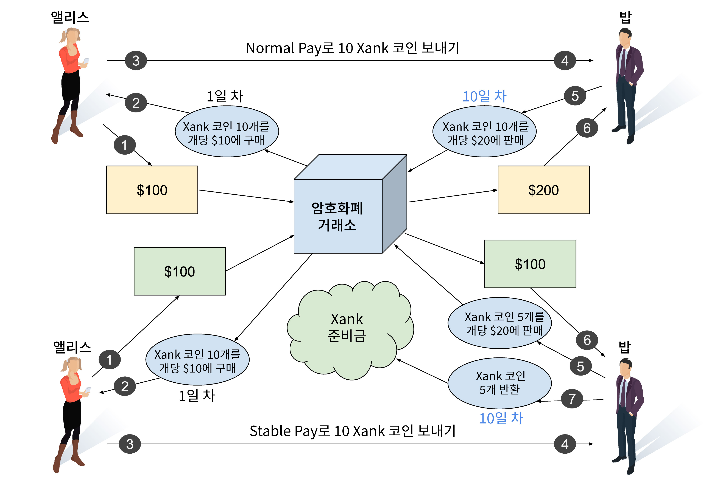
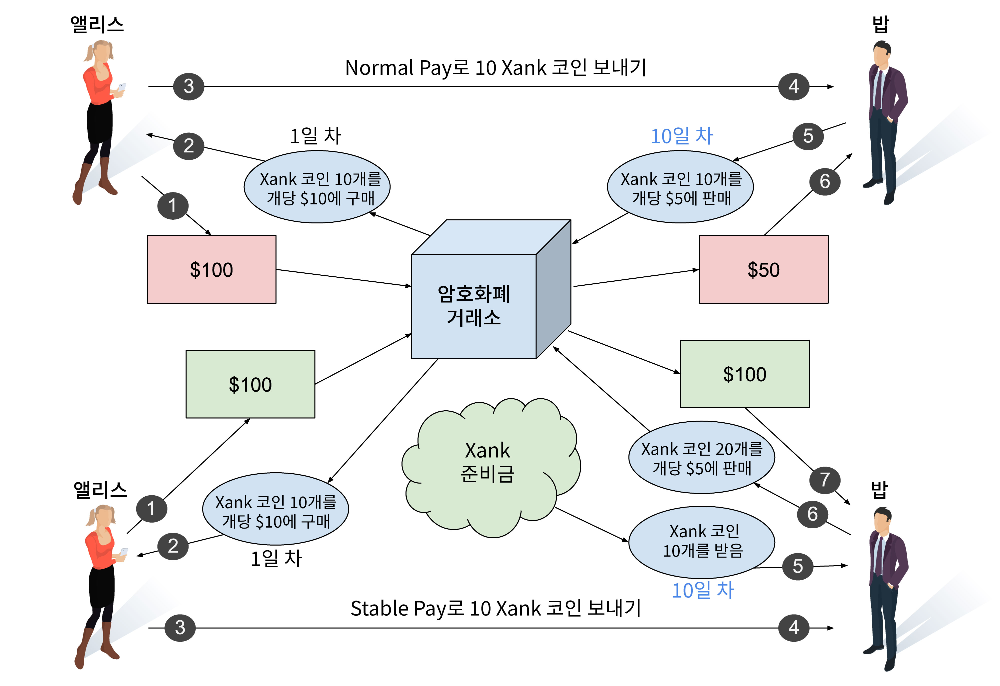

# Xank: 준비금으로 뒷받침되는 안정적인 거래 암호화폐

저자 :

김유현 ([ryu@xank.io](mailto:ryu@xank.io))

기여자 :

이성신 ([rl@xank.io](mailto:rl@xank.io))

김성협 ([sung@xank.io](mailto:sung@xank.io))

버전 0.99.9s

최초 발행일 : 2018년 4월 7일

최신 버전 확인 : [xank.io](https://xank.io/)

저작권 © 2018-2024 Xank Holdings OÜ. 모든 권리 보유.

# 법적 면책 조항 :

정의

**백서** : 이 정보 문서와 그에 포함된 모든 내용.

**회사** : Xank 및 관련 구성원.

**토큰** : Xank 플랫폼에서 사용하기 위해 Xank가 생성하고 배포한 토큰.

이 백서 또는 Xank 웹사이트에 제공된 정보를 사용하는 경우, 귀하는 다음 사항에 동의하는 것입니다:

이 백서의 목적은 Xank 프로젝트의 비기술적 및 기술적 측면에 관한 정보를 제공하는 것입니다. 이 정보는 포괄적이지 않으며 계약 관계를 구성하지 않습니다.

이 백서는 어떤 형태로든 투자 청약서나 투자 권유를 구성하지 않으며, 어떤 관할권에서도 증권을 매수할 제안이나 제안의 권유로 간주되지 않습니다. 따라서 투자자를 보호하기 위해 설계된 법률이나 규정에 따라 작성되지 않았으며, 그러한 법률이나 규정의 적용을 받지 않습니다. 이 백서에 포함된 특정 진술, 추정치 및 재무 정보는 예측된 진술 또는 정보로 구성됩니다. 이러한 예측은 알려진 및 알려지지 않은 위험과 불확실성을 수반하며, 실제 사건이나 결과가 예측된 진술에 포함되거나 명시된 추정치나 결과와 실질적으로 다를 수 있습니다.

영문 백서는 Xank 및 그 프로젝트에 대한 주요 공식 정보 출처입니다. 여기 포함된 정보는 때때로 국문 또는 다른 언어로 번역되거나 기존 및 잠재 고객과의 서면 또는 구두 의사소통 과정에서 사용될 수 있습니다. 이러한 번역 또는 의사소통 과정에서 일부 정보가 손실되거나 손상되거나 잘못 전달/번역될 수 있습니다. 그러한 (대체) 의사소통의 정확성은 보장되지 않습니다. 이러한 번역 및 의사소통과 이 공식 영문 백서 간에 충돌이나 불일치가 발생할 경우, 항상 영문 원본 문서의 조항이 우선합니다.

Xank는 여기서 설명한 기능을 제공하기 위해 구축되고 있습니다. 이 프로젝트와 그 토큰은 시스템 사용자에게 금융 상품이나 투자 기회를 제공하기 위해 개발되는 것이 아닙니다. 반대로, Xank와 그 토큰은 제품으로 개발되고 있으며, 증권이나 기타 투자 기회로 개발되는 것이 아닙니다. 토큰은 이 자료에서 설명한 대로만 작동할 것이며, 여기에서 설명한 경우를 제외하고, Xank 또는 프로젝트가 수행할 수 있는 어떤 사항에 대해 토큰 보유자에게 투표 권리를 부여하지 않습니다. Xank는 토큰의 잠재적 미래 가치를 보장하거나 달리 표현하지 않습니다. 프로젝트가 시작되면, 토큰 보유자는 여기 설명된 대로만 토큰을 사용하고 투기적 투자 목적으로 사용하지 않을 것으로 예상됩니다.

# 요약

어떤 통화가 유용하려면 최소한 다음 세 가지 특성을 보여야 합니다 : 교환 매체로서의 기능, 가치 저장 수단으로서의 기능, 회계 단위로서의 기능. 암호화폐는 가치 저장 수단으로 사용할 수 있지만, 교환 매체와 회계 단위로서 신뢰할 수 있는 기능을 하기에는 너무 변동성이 크다는 점이 관찰되었습니다. 스테이블코인 개념은 현재 대부분의 암호화폐에서 나타나는 이러한 약점을 해결할 필요성에서 등장했습니다. 스테이블코인은 가격이 미국 달러(USD)와 같은 다른 안정적인 자산에 고정된 암호화폐입니다. 그 결과, 교환 매체와 회계 단위의 특성을 충족하면서 가치 저장 기능을 수행할 수 있는 가격 안정적인 암호화폐 자산이 탄생하게 됩니다.

가장 지배적인 암호화폐는 지속적으로 가격 변동성을 보입니다. 이러한 변동성은 투기적 투자를 유치할 수 있지만, 그 긍정적인 효과는 소비자와 상인이 상품 및 서비스 거래의 목적으로 가격 위험에 노출되는 것을 꺼리는 경우가 많아 채택을 방해하는 부정적인 효과를 종종 발휘합니다. 직원 보수 지급이나 신용 서비스 연장과 같은 간단한 금융 거래도 지속적인 가격 변동의 왜곡 효과로 인해 쉽게 시작할 수 없습니다.

우리는 가격 안정성을 달성하면서도 탈중앙화되고 자유 변동적인 암호화폐인 Xank를 제안합니다. Xank는 소프트 가격 고정 메커니즘을 사용하여 네트워크 수준에서 가격 고정을 결정하는 프로토콜 거버넌스 메커니즘에 의해 설정됩니다. 예를 들어, Xank 거래는 IMF의 특별인출권(SDR, 또는 이 문서에서 사용될 통화 코드 XDR[1](#f1)) 또는 미국 달러(USD), 유로(EUR), 영국 파운드 스털링(GBP), 일본 엔화(JPY), 중국 위안(RMB), 한국 원화(KRW), 신 타이완 달러(TWD) 등의 다른 지원되는 법정 화폐에 대한 금액에 대해 네트워크에 의해 고정되도록 설정될 수 있습니다. 이후 단계에서는 네트워크가 인플레이션 목표를 달성하기 위해 중앙은행이 수행하는 것처럼 상품 바스켓의 소비자 물가 지수(CPI)에 대한 고정을 업데이트할 수도 있습니다. Xank 프로토콜은 XANK-XDR 비율 또는 XANK-통화 비율 사이의 변동 가격을 유지하기 위해 거래별로 XANK 코인의 수를 알고리즘적으로 조정하여 이를 달성합니다. 소프트 페그는 구매, 판매 및 결제 동안 거래 수명 주기 동안 활성화되며, 이를 통해 수요와 공급의 균형을 확립할 수 있어 Xank를 투자 가치를 가진 유일한 안정적인 암호화폐로 만듭니다.

# 차례

- [Xank: 준비금으로 뒷받침되는 안정적인 거래 암호화폐](#xank-준비금으로-뒷받침되는-안정적인-거래-암호화폐)
- [법적 면책 조항 :](#법적-면책-조항-)
- [요약](#요약)
- [차례](#차례)
- [서론](#서론)
- [Xank 설계 고려사항 : 가격 안정성 구현](#xank-설계-고려사항--가격-안정성-구현)
  - [Xank 네트워크를 위한 Avalanche 프로토콜](#xank-네트워크를-위한-avalanche-프로토콜)
  - [자체 자금 조달 재정부 시스템 채택](#자체-자금-조달-재정부-시스템-채택)
  - [IMF의 SDR(특별인출권)에 대한 소프트 페깅](#imf의-sdr특별인출권에-대한-소프트-페깅)
    - [**IMF의 SDR 역사 개요**](#imf의-sdr-역사-개요)
  - [Xank와 Bridgewater의 실적주의 시스템](#xank와-bridgewater의-실적주의-시스템)
  - [**아이디어 실적주의(Idea Meritocracy)**](#아이디어-실적주의idea-meritocracy)
    - [의미 있는 일](#의미-있는-일)
    - [의미 있는 관계](#의미-있는-관계)
    - [극단적인 진정성](#극단적인-진정성)
    - [극단적인 투명성](#극단적인-투명성)
  - [Xank 프로토콜](#xank-프로토콜)
    - [Stable Pay 기능](#stable-pay-기능)
    - [Local Pay 기능](#local-pay-기능)
    - [Xank 지분 증명(PoS) 거버넌스](#xank-지분-증명pos-거버넌스)
    - [Xank 준비금](#xank-준비금)
    - [시장 진출 전략](#시장-진출-전략)
    - [환율 측정](#환율-측정)
      - [SDR 및 통화 피드](#sdr-및-통화-피드)
      - [오라클 시스템](#오라클-시스템)
      - [오라클 피드 중복성](#오라클-피드-중복성)
    - [Stable Pay (또는 Local Pay) 거래 수명 주기](#stable-pay-또는-local-pay-거래-수명-주기)
    - [Xank 다중 통화 지원](#xank-다중-통화-지원)
    - [극심한 변동성 방지 장치 (EVS) 가격 하한 메커니즘](#극심한-변동성-방지-장치-evs-가격-하한-메커니즘)
    - [원자적 스왑 바스켓](#원자적-스왑-바스켓)
    - [실적주의 거버넌스](#실적주의-거버넌스)
    - [Xank 자기주권 신원 및 Xank 평판 지수](#xank-자기주권-신원-및-xank-평판-지수)
    - [Xank 예산 할당](#xank-예산-할당)
- [응용 및 사용 사례](#응용-및-사용-사례)
  - [암호화폐 거래소](#암호화폐-거래소)
  - [개인 사용자](#개인-사용자)
  - [상인들](#상인들)
  - [기업 및 스타트업 자금 지원](#기업-및-스타트업-자금-지원)
  - [운동권](#운동권)
- [법정화폐 이후 세계에서의 Xank](#법정화폐-이후-세계에서의-xank)
  - [소비자물가지수에 연동된 소프트 페그](#소비자물가지수에-연동된-소프트-페그)
  - [권력을 다시 사람들에게](#권력을-다시-사람들에게)
  - [Xank 헌법 서문](#xank-헌법-서문)
- [결론](#결론)
- [부록](#부록)
  - [기존 스테이블코인의 장단점](#기존-스테이블코인의-장단점)
    - [Tether](#tether)
    - [Maker (Dai)](#maker-dai)
    - [Carbon](#carbon)
  - [**Xank 네트워크 사양 및 비교**](#xank-네트워크-사양-및-비교)
  - [**Xank 측정 단위**](#xank-측정-단위)
  - [XANK 코인 발행 알고리즘](#xank-코인-발행-알고리즘)
    - [소개](#소개)
    - [한정된 공급](#한정된-공급)
    - [무제한 공급과 인플레이션](#무제한-공급과-인플레이션)
    - [GDP](#gdp)
    - [Xank 네트워크 거래](#xank-네트워크-거래)
    - [Xank 코인 공급](#xank-코인-공급)
    - [Xank 발행 알고리즘](#xank-발행-알고리즘)
      - [초기 설계](#초기-설계)
      - [현재 설계](#현재-설계)
  - [**Xank 프로토콜 특성 비교**](#xank-프로토콜-특성-비교)
- [참고 자료 및 리소스](#참고-자료-및-리소스)
  - [주석](#주석)

# 서론

암호화폐는 일반적인 거래 시나리오에서 시장에 받아들여지지 않았습니다. 비트코인과 이더리움 같은 전통적인 암호화폐는 잠재적인 시장 수요를 충족하기 위해 확장할 수 없습니다. 확장에 어려움을 겪는 암호화폐는 번거로운 블록체인에 거래를 기록하는 데 드는 사용자 거래 비용이 증가합니다. Avalanche와 Cosmos와 같은 최신 암호화폐는 몇 초 이내에 거래를 확인하고, 초당 더 높은 거래 처리량과 저렴하고 감소하는 거래 수수료를 제공할 수 있다고 주장합니다. 이러한 주장은 신용카드 수수료보다 현금을 선호하는 상인들에게 특히 매력적입니다. 암호화폐는 환불 불가능하므로 현금처럼 작동할 수 있는 암호화폐를 상인들이 선호할 가능성이 큽니다.

암호화폐로 결제를 이미 수락하는 상인들은 일반적으로 암호화폐를 법정화폐로 즉시 전환하는 암호화폐-법정화폐 상인 서비스를 사용합니다. 일부 서비스는 판매 시점에 실시간 전환을 제공합니다. 상인들은 고객에게 상품과 서비스를 제공하는 사업을 하기 때문에 암호화폐나 금과 같은 가격 변동성이 큰 자산에 투기하는 사업을 하지 않습니다. 암호화폐는 하루에 50%의 가격 하락을 경험할 수 있으며, 이러한 가격 하락은 몇 주 동안 지속될 수 있습니다. 이는 상인 친화적이지 않으며, 상인의 상품과 서비스의 비용과 가격은 일반적으로 법정화폐 기준으로 고정되어 있기 때문에 모든 이익을 없앨 수 있습니다.

열성적인 암호화폐 지지자들은 재산에 대한 직접적인 통제, 언제 어디서나 누구와도 거래할 수 있는 편리함, 가명성 또는 일부 프라이버시 코인이 제공하는 높은 익명성 등 암호화폐의 많은 속성에 열광할 수 있습니다. 그러나 가장 열렬한 지지자조차도 전 재산을 암호화폐에 보유하는 것을 꺼리며, 친구, 가족 및 신규 투자자에게 이러한 변동성이 큰 자산에 기꺼이 잃을 수 있는 비율만 투자하도록 권장합니다.

투기적 투자 단계를 넘어 주류 채택으로 나아가기 위해서는 암호화폐가 가격 안정성을 달성하여 안정적인 교환 매체가 되어야 합니다. 이는 유용한 화폐의 핵심 요소입니다.

암호화폐 투기자들이 가격 변동성에서 중요한 역할을 하지만, 그들이 주요 원인은 아닙니다. 네트워크 수준의 문제가 종종 가격 불안정의 주요 요인이 될 수 있습니다.

비트코인을 괴롭히는 확장성 및 프라이버시 문제를 극복하기 위해 설계된 Dash 네트워크를 고려해 봅시다. 이를 달성하기 위해 Dash는 마스터노드 네트워크 레이어를 구현했습니다. 마스터노드를 운영하기 위한 높은 수준의 자본 지출과 네트워크 하드웨어 요구 사항 때문에, Dash 네트워크는 높은 수준의 거래 처리량을 보장받고 거래 가격 책정 수준을 도입할 수 있었습니다. 이러한 확장성과 처리량을 달성한 Dash는 주요 암호화폐 중 하나로 부상했습니다. 그러나 특정 네트워크 트레이드오프가 필요했습니다. 마스터노드는 중앙 집중화 요소를 도입하고 잘 자금 지원된 적대자가 이론적으로 필요한 만큼 마스터노드를 구매하여 특정 네트워크 기능을 제어할 수 있는 공격 표면을 넓혔습니다. Dash는 네트워크 거버넌스를 위한 민주적 모델도 도입하여 네트워크를 실적주의 거버넌스에서 군중의 지혜로 이동시켰습니다. 이는 비숙련 의사결정으로 이어져 네트워크를 약화시킬 수 있습니다. 시간이 지나면서 이러한 네트워크 약점이 시장에 의해 발견되면 가격 안정성을 유지할 수 없게 되어 디지털 자산의 가격 변동성이 발생합니다.

암호화폐가 대중 채택을 달성하려면 가격 안정성, 수수료 일관성, 감사 가능한 프라이버시, 탈중앙화된 거버넌스 사이에서 균형을 이루도록 설계되어야 합니다. 불안정한 가격과 수수료 네트워크는 최종 소비자나 상인이 기존의 성숙한 법정화폐 대안을 선택하는 데 자신감을 주지 않습니다. 확장할 수 없는 네트워크는 많은 사용자가 동시에 네트워크를 사용하는 것을 처리할 수 없으며, 이는 글로벌 규모의 채택을 방해합니다. 일정 수준의 프라이버시가 부족한 네트워크는 사용자의 세부 정보가 암호 분석에 노출되어 검열된 거래와 블랙리스트된 거래 문제를 초래합니다. 일정 수준의 탈중앙화된 거버넌스를 달성하지 못한 네트워크는 부패와 가치 침식에 노출됩니다(부록의 [Xank 프로토콜 특성 비교 차트](#xank-프로토콜-특성-비교)를 참조하십시오).

이 문서는 Xank 네트워크가 이러한 경쟁적인 네트워크 요소들 사이에서 필수적인 균형을 어떻게 달성하는지 설명합니다. 이를 통해 가장 유용한 안정적인 암호화폐로 자리매김할 수 있는 방법과 그로 인해 모든 암호화폐 중에서 지배력을 갖출 수 있는 방법을 설명합니다.

# Xank 설계 고려사항 : 가격 안정성 구현

가격 안정성을 달성하기 위해 Xank 프로토콜은 주요 암호화폐의 설계 요소를 선택하고 이를 건전하고 안정적인 화폐 개념에 기반한 개념적 프레임워크와 결합했습니다. Xank는 기술적으로 Avalanche 네트워크의 포크로 구현될 것이며, 따라서 Avalanche의 많은 기술적 특성을 유지할 것입니다. 또한 Xank 프로토콜은 Xank가 안정적인 암호화폐로서 기능하고 작동할 수 있도록 필요한 가격 안정성을 달성하기 위해 Avalanche 프로토콜에 다양한 조정과 개선을 통합할 것입니다.

이 섹션에서는 다른 마스터노드 네트워크에서 구현된 탈중앙화된 거버넌스와 자체 자금 조달 예산 시스템의 중요성을 설명합니다. 그런 다음 Xank 네트워크의 첫 번째 소프트 페그로 사용될 IMF의 특별인출권(ISO 4217 통화 코드 XDR (숫자: 960), 약칭 SDR) 도구의 개념을 살펴봅니다. 민주적 거버넌스 모델과 대조적으로, Ray Dalio가 창립한 회사 Bridgewater[2](#f2)의 성공을 이끈 그의 에세이에서 설명된 실적주의 거버넌스 시스템을 구현함으로써 얻을 수 있는 이점과 이를 Xank 네트워크에 적용하는 방법에 대해 고려합니다.

## Xank 네트워크를 위한 Avalanche 프로토콜

Xank는 메타스테이블 메커니즘을 기반으로 구축된 새로운 리더리스 비잔틴 결함 허용 프로토콜의 속성을 상속받습니다.

_리더리스 합의_

Avalanche는 다음 네 가지 기본 프로토콜을 사용하여 합의를 달성합니다 :

1. Slush : 메타스테이빌리티 → 노드는 동료에게 쿼리를 시작하고 다른 노드(빨강 또는 파랑)의 응답에 따라 노드의 색상을 동료들의 다수가 선택한 색상으로 업데이트합니다. 노드가 이러한 쿼리를 수행함에 따라 네트워크는 빨간색 또는 파란색으로 기울어집니다.
2. Snowflake : 비잔틴 결함 허용(BFT) → 비잔틴 결함 허용은 노드의 확신 강도를 캡처하는 카운터를 통해 달성됩니다. 응답이 노드의 원래 색상과 같은 것을 나타내는 성공적인 쿼리가 있을 때마다 카운터가 증가합니다.
3. Snowball : 신뢰 증가 → Snowflake가 노드의 카운터를 각 색상 전환 시마다 재설정하기 때문에, Snowball은 해당 색상에 대한 임계치 결과를 제공한 쿼리 수를 기록하는 신뢰 카운터를 추가합니다. 성공적인 쿼리마다, 노드는 해당 색상에 대한 신뢰 카운터를 증가시킵니다. 일정 횟수의 연속된 쿼리 후에는 신뢰 카운터가 다른 색을 초과하거나 미달할 때 노드가 색을 전환합니다.
4. Avalanche : DAG → 마지막으로, 효율성과 보안을 위해 모든 알려진 거래를 추가하는 동적 추가 전용 방향성 비순환 그래프(DAG)가 있습니다.

작업 증명(Proof-of-Work) 또는 지분 증명(Proof-of-Stake)이 블록 생성을 위해 하나의 검증자를 선출하는 반면, Avalanche는 합의를 위해 어떠한 형태의 리더 선출도 필요로 하지 않습니다. 대신, 본질적으로 메타스테이블한 프로토콜은 한쪽으로 기울어져 모든 노드를 합의로 이끌도록 설계되었습니다. 채굴자, 대표자 또는 특권을 가진 노드가 없기 때문에, Avalanche 프로토콜은 동등한 지위를 가진 노드들의 평등한 네트워크를 만듭니다. 따라서 이 프로토콜은 네트워크의 중앙 인물이나 주요 플레이어에 독립적입니다. 모든 노드는 합의에 동등하게 기여합니다.

_고 처리량과 확장성_

분산화 요소 외에도 Avalanche는 Xank 네트워크에 여러 가지 추가적인 중요한 이점을 제공합니다. 첫째, Avalanche는 널리 인정받는 법정 결제 시스템과 경쟁하는 동급의 다른 시스템보다 훨씬 높은 처리량을 보여줍니다.

*   Bitcoin — 초당 7건의 거래
*   Ethereum — 초당 15건의 거래
*   XRP — 초당 1,500건의 거래
*   EOS — 초당 50건의 거래
*   VISA — 초당 2,000건의 거래
*   PayPal — 초당 193건의 거래
*   Avalanche — 초당 4,500건의 거래 (AWS에 호스팅된 1,000개의 노드 기준)

Xank가 더 널리 채택되고 다양한 목적으로 사용됨에 따라 거래 수는 자연스럽게 증가할 것이며, Xank 네트워크는 증가하는 거래 수를 처리할 수 있는 용량이 필요합니다. 1,000개의 노드로 구성된 테스트 네트워크에서 초당 6,500건의 거래를 달성하고 초당 4,500건의 거래[3](#f3)로 안정화된 Avalanche는 이전의 선례들보다 훨씬 더 많은 거래를 처리할 수 있는 능력을 보여주었습니다. 따라서 Avalanche 프로토콜은 실제로 사용 가능한 암호화폐로 기능하기 위해 높은 처리량과 확장성 모두가 필요한 Xank와 같은 암호화폐에 대한 최적의 솔루션입니다.

_환경 친화적_

비트코인의 작업 증명(Proof-of-Work)은 전체 국가의 전기 사용량에 맞먹는 과도한 전력 소비로 악명 높습니다. 작업 증명과 달리, Avalanche는 친환경적이고 조용하며 효율적인 프로토콜로, 생태계에서 결정이 내려질 필요가 없을 때 에너지를 사용하지 않습니다. Xank의 핵심 신념 중 하나는 세계의 오염을 근절하는 것이며, Avalanche의 지속 가능성은 전력 사용을 줄입니다. 이렇게 함으로써 전력 생산의 필요성이 줄어들고, 이는 대기 오염에 기여하는 온실 가스를 배출하는 과정을 감소시킵니다.

_감사 가능한 프라이버시_

프라이버시는 블록체인에 내장되어 있든 외부 애플리케이션을 통해 가능하든, Xank와 같은 암호화폐에 필수적입니다. Xank는 네트워크 계층에서 구현되는 감사 가능한 프라이버시를 통해 사용자가 신원과 데이터를 보호할 수 있게 하면서도, 전문화된 영지식 증명을 사용하여 공개적으로 감사 가능하도록 할 것입니다. 내장된 프라이버시 기능을 통해 Xank 유니버설 지갑은 사용자의 개인 정보가 원하지 않게 노출되는 것을 방지할 것입니다.

요약하자면, Avalanche는 오늘날 널리 사용되는 다른 프로토콜들보다 우위를 보이는 제2세대 프로토콜입니다. Avalanche는 Xank 네트워크에 탈중앙화, 속도, 보안 및 불정지 상태를 제공하여 Xank가 차세대 안정적인 암호화폐로서의 역할을 할 수 있도록 할 것입니다.

## 자체 자금 조달 재정부 시스템 채택

Xank는 다른 암호화폐들이 직면한 도전을 극복하는 데 중요한 역할을 한 Dash 스타일의 자체 자금 조달 재정부 시스템을 구현할 것입니다. 특히, 네트워크를 구축하면서 탈중앙화된 거버넌스 시스템, 자금 조달, 개발, 시스템 유지 보수 및 프로젝트 확장을 유지하는 도전을 극복하는 데 중요한 역할을 했습니다. Dash 네트워크는 이러한 문제를 해결하려고 시도한 최초의 암호화폐로, 프로젝트의 개발 및 확장 노력이 독립적이고 충분히 자금이 지원되는 자체 자금 조달 재정부 시스템을 성공적으로 구현했습니다. 이는 네트워크의 지속적인 성공을 보장하고, 네트워크가 부패하거나 악의적인 행위자에게 장악되는 위험을 최소화합니다.

Xank가 자체 자금 조달 재정부 시스템을 채택함에 따라, 핵심 프로토콜을 유지하는 동시에 네트워크와 Xank 암호화폐를 홍보하는 임무를 맡은 영리 회사를 설립할 것입니다. 회사의 주요 지침은 네트워크의 소프트웨어 개발, 헌법 개발, 커뮤니티 구축 및 시장 채택 활동에 유익한 활동들입니다. 네트워크에 가치를 더하는 것을 넘어, Xank의 자체 자금 조달 메커니즘은 네트워크의 개발 및 안정성이 기부나 네트워크 주요 토큰 홀더의 선의에 크게 의존하지 않도록 보장합니다. 이는 자체 자금 조달이 되지 않은 다른 암호화폐의 개발 및 업그레이드 과정에서 발생하는 문제를 해결합니다.

Xank는 재단 설립 대신 영리 회사 메커니즘을 사용하기로 결정했습니다. 회사는 초기 개발 및 네트워크 설정에 활발히 참여하겠지만, 네트워크 출시 후에는 네트워크 자금 제안에 대해 개방된 시장에서 경쟁하게 될 것입니다. 이는 네트워크의 실적주의 원칙과 일치하며, 이 목적을 위해 비영리 재단을 설립한 다른 네트워크와 차별화됩니다. 비트코인 및 초기 암호화폐에서 관찰된 바와 같이, 프로젝트 개발을 지원하려는 의도로 설립된 재단들은 플랫폼의 성공과 직접적으로 관련이 없으며, 초기 채택자, 대규모 토큰 홀더 및 재단 회원 자신의 이익을 봉사하는 경향이 있었습니다. 이러한 재단들은 자금을 모으는 데 어려움을 겪었으며, 초기 자금이 소진된 후에는 붕괴되기 쉬웠습니다. 결과적으로 프로토콜 개발은 자원 봉사자와 열정적인 사람들이 맡게 되었으며, 이는 네트워크를 유지하기 위한 노력에도 불구하고, 해당 작업에 전념한 자금이 충분한 네트워크 개발 팀과 경쟁할 수 없었습니다. 개발 팀을 자금 지원 없이 남겨두고 기부금으로만 생존하게 하면 기부자의 중앙 집중화 요소가 네트워크 개발 방향에 영향을 미치게 됩니다. 자기 이익을 추구하는 당사자가 네트워크 개발을 직접 지원할 때, 특히 채굴자 및 거래소와 같은 경쟁 관심사를 가진 경우, 네트워크는 사용자와 다른 이해관계자의 이익과 충돌할 수 있습니다.

일부 프로젝트는 코인을 사전 채굴하거나 사전 출시 판매를 통해 개발 팀을 자금화합니다. 이러한 모금 노력은 네트워크에 특별한 피해를 주지 않으며, 새로운 프로젝트의 출범을 위한 충분한 자금을 제공할 수 있습니다. 그러나 모금된 자금의 실제 가치는 시장 요인의 영향을 받으며, 달성될 자금 수준이나 그 자금 수준이 네트워크의 지속적인 개발 및 미래의 필요를 충족시킬지 여부를 미리 결정할 방법이 없습니다.

Xank는 또한 마스터노드라고 알려진 인센티브를 제공하는 전체 노드 네트워크를 통해 운영될 것입니다. 마스터노드는 네트워크에 투표권을 얻기 위해 담보를 제공해야 합니다. 마스터노드 운영자는 네트워크의 성공에 투자하며, 네트워크 업그레이드와 방향에 대해 투표함으로써 네트워크 개발 과정을 이끌어갈 수 있는 관리자의 역할을 할 수 있습니다. 다른 대체 코인에 채굴 투자를 확장할 수 있는 채굴자와 달리, Xank 마스터노드 운영자는 네트워크 인프라 투자를 다른 암호화폐로 전환할 수 없기 때문에 네트워크에 결속됩니다. 이 메커니즘은 네트워크에 대한 충성도를 올리고 인센티브 역할을 합니다.

각 블록 보상의 일정 비율은 네트워크에 의해 에스크로에 보관되어 네트워크와 넓은 Xank 생태계의 확장 및 지속적인 개발을 위해 할당될 것입니다. 에스크로된 자금은 마스터노드 투표 선호도에 따라 할당될 것입니다. 자금은 불변적으로 Xank 코인 및 네트워크의 홍보 및 개발을 위해 사용되며, 각 사용의 예산은 마스터노드 투표 메커니즘에 따라 개방적이고 투명하게 결정됩니다. 이 과정은 예산 정책 및 지원할 계획이 분산 방식으로 결정되며, Xank 네트워크가 미래의 새로운 시장 요구 사항에 대응하고 새로운 신생 기술을 채택할 수 있도록 보장합니다.

자체 자금 조달 재정부 시스템은 Xank 네트워크가 핵심 개발자를 고용할 수 있도록 보장합니다. 자금은 이 특정 목적을 위해 마스터노드에 의해 분산 투표 결과로 할당될 것이므로, 개발자는 회사가 아닌 실질적으로 네트워크 자체에 의해 고용됩니다. 마스터노드 운영자는 네트워크를 떠날 수 있으며, 동일한 수준의 담보를 제공할 새로운 운영자로 교체될 수 있습니다. 이는 Xank 네트워크가 초기 마스터노드 운영자가 모두 교체되더라도 지속적으로 운영되고 번창할 것임을 의미합니다.

## IMF의 SDR(특별인출권)에 대한 소프트 페깅

Xank 암호화폐는 출시 시 IMF의 SDR에 소프트 페그 기능을 설정하여 IMF 회원국 및 나아가 전 세계에 유용한 안정적인 암호화폐로서의 위치를 확보할 것입니다. Xank의 출시 및 초기 단계에서 SDR은 여러 통화의 묶음을 대표하며, 회원국 중 어느 하나가 중앙은행을 통해 회원국의 통화 공급을 인위적으로 증가시키는 것을 방지하기 때문에 가장 안정적인 국제 예비 자산으로 간주될 수 있습니다. 미래에 SDR보다 더 안정적인 가치 측정 지표가 등장할 경우, Xank 네트워크는 앞서 설명한 마스터노드 투표 시스템을 통해 이를 채택할 수 있습니다.

### **IMF의 SDR 역사 개요**

SDR은 1969년 IMF에 의해 회원국의 예비 자산을 보충하기 위해 만들어진 국제 예비 자산입니다. 2017년 9월 기준으로 2042억 SDR[4](#f4)(2910억 달러 상당)이 생성되어 회원국에 할당되었습니다. SDR은 다른 참가 통화와 자유롭게 교환될 수 있습니다.

SDR은 브레튼우즈 고정 환율 시스템의 맥락에서 보조 국제 예비 자산으로 만들어졌으며, 참여국들은 고정되고 균형 잡힌 환율을 설정하고 유지하기 위해 금과 널리 국제적으로 인정받는 통화를 정부 또는 중앙은행이 보유한 공식 예비 자산 형태로 필요로 했습니다. 그러나 두 가지 주요 예비 자산인 금과 미국 달러의 국제 공급 및 예비가 불충분하여 국제 무역과 금융의 확장이 저해되었습니다. 이로 인해 국제 사회는 IMF의 후원하에 운영될 새로운 국제 예비 자산의 창출을 결정했습니다.

SDR은 주로 보조 예비 자산으로 사용되며, IMF 회원국과 일부 다른 국제 기구 간의 회계 단위로도 사용됩니다.

그 후, SDR이 만들어진 몇 년 후 브레튼우즈 시스템이 붕괴되었고 주요 통화는 변동 환율제로 이동했습니다. 그동안 국제 자본 시장은 정부의 신용도에 기반한 새로운 차입 능력 덕분에 확장되었고, 많은 국가들이 상당한 국제 예비를 축적할 수 있게 되었습니다. 따라서 글로벌 예비 자산으로서의 SDR의 안정성에 대한 의존도가 줄어들었습니다. 2009년 글로벌 금융 위기 시기에 SDR에 대한 의존이 재확립되었습니다. 그 당시 할당된 1826억 SDR은 회원국 예비를 보충하기 위해 글로벌 경제 시스템에 유동성을 제공하는 데 중요한 역할을 했습니다. 그 후 SDR은 세계 경제에서 안정화의 역할을 되찾았습니다.

SDR 자체는 통화로 간주될 수 없으며, SDR을 보유하는 것은 IMF로부터의 예비금 청구권과 동일하지 않습니다. 대신, 이는 IMF 회원국의 '자유롭게 사용 가능한 통화'에 대한 청구를 허용하는 메커니즘의 일부입니다. 이는 SDR 보유자가 합의에 의해 설정된 두 회원국 간의 자발적 교환을 통해 자신의 SDR을 교환하여 다른 회원국의 자유 예비 통화에 대해 청구권을 행사할 수 있음을 의미합니다. SDR 보유자는 또한 강한 외부 포지션을 가진 경우 IMF에 의해 약한 외부 포지션을 가진 다른 회원국으로부터 SDR을 구매하도록 요청받을 수 있습니다.

1969년 SDR 제도가 도입되었을 때, 그 가치는 0.888671그램의 순금에 상응하는 것으로 초기 설정되었습니다. 그 당시 이 비율은 미국 달러의 고정 동등치이기도 했습니다. 1973년 브레튼우즈 협정의 붕괴로 SDR의 환율을 결정하기 위해 통화 바스켓이 사용되었습니다. 최종적으로 결정된 SDR 바스켓은 미국 달러, 일본 엔, 영국 파운드 스털링으로 구성되었으며, 나중에 유로와 중국 위안이 추가되었습니다.

IMF는 SDR의 가치를 미국 달러 기준으로 웹사이트에 게시하며, 그 가치는 매일 결정되고 업데이트됩니다. 이는 런던 시간 정오 무렵에 관찰된 현물 환율을 기준으로 미국 달러로 평가된 각 바스켓 통화의 특정 금액을 합산하여 계산됩니다.

IMF 집행이사회는 매 5년마다 바스켓의 구성을 검토합니다. 이 주기는 회의 간의 기간 동안 중요한 경제 상황이 발생할 경우 변경될 수 있습니다. 집행이사회는 국제 무역 측면에서 다섯 주요 회원국의 위치의 상대적 중요성을 고려하여 바스켓 구성을 결정합니다. 가장 최근에 포함된 통화는 2016년 10월에 포함된 중국 위안(중국 인민폐)으로, 이는 포함 기준을 충족했음을 인정받은 결과입니다. 이는 동일한 해에 채택된 새로운 가중치 알고리즘과도 일치하며, 새로운 가중치 공식에서는 통화 발행국의 수출과 종합 금융 지표에 동등한 비중을 할당하는 방식을 포함했습니다. IMF의 2016년 팩트시트[5](#f5)에 따르면,

> 금융 지표는 동등한 비중으로 다음을 포함합니다: 관련 통화를 발행하지 않는 다른 통화 당국이 보유한 해당 회원국(또는 통화 연합)의 통화로 표시된 공식 예비금, 해당 통화의 외환 거래량, 그리고 해당 통화로 표시된 미결제 국제 은행 부채 및 국제 채무 증권의 합계.

SDR의 가치는 다음과 같은 비율로 가중치가 부여된 다섯 개 주요 통화 바스켓을 기반으로 알고리즘적으로 설정됩니다 :

*   미국 달러 - 41.73% (2010년 검토시 41.9% 대비)
*   유럽 유로 - 30.93% (2010년 검토시 37.4% 대비)
*   중국 위안 - 10.92%
*   일본 엔화 - 8.33% (2010년 검토시 9.4% 대비)
*   영국 파운드 - 8.09% (2010년 검토시 11.3% 대비)

*수치는 IMF의 2016년 팩트시트에서 가져왔습니다.

이 가중치는 다음 검토가 예정된 2021년 9월까지 유지되며, 그 중 경제 및 금융 발전이 글로벌 중요성을 갖는다고 판단될 경우, 그 이전에 검토가 이루어질 수 있습니다.

이 수준의 안정성은 Xank 생태계의 첫 3년을 부트스트랩하기 위해 선택되었습니다.

## Xank와 Bridgewater의 실적주의 시스템

Xank 네트워크는 실적주의적 거버넌스를 채택할 것입니다. 다음의 주요 실적주의 요소들은 Bridgewater의 창립자인 Ray Dalio가 작성한 에세이[6](#f6)에서 발췌한 내용으로, 실적주의적 거버넌스 시스템과 그 핵심 원칙 및 구성 요소의 구현이 Bridgewater의 성공에 어떻게 복잡하게 얽혀 있는지를 설명하고 있습니다. 우리는 또한 이러한 실적주의 원칙들이 Xank 네트워크, 특히 Xank 거버넌스 시스템에서 어떻게 반영될 것인지 설명할 것입니다.

Ray는 다음과 같은 인용문에서 이 아이디어를 요약합니다 :

> 한 문장으로 우리의 성공은 **의미 있는 일**과 **의미 있는 관계**를 목표로 하는 진정한 실적주의를 창출했기 때문이며, 이를 추구하는 방법은 **극단적인 진정성**과 **극단적인 투명성**을 통해 이루어졌습니다.

Xank 거버넌스 시스템을 이해하기 위해 이러한 주요 개념들을 살펴보는 것이 중요합니다. 이러한 단어들을 개별적으로 살펴보겠습니다.

## **아이디어 실적주의(Idea Meritocracy)**

아이디어 실적주의는 최고의 아이디어가 선별되어 승리하는 의사 결정 시스템입니다. 많은 실적주의 시스템이 이론적으로 제시되었지만, 실제로 조직이나 사람들의 네트워크 내에서 이러한 시스템을 구현한 사례는 거의 없습니다. 아이디어 실적주의가 성공하려면 모든 관련자가 다음 세 가지 사항을 준수해야 합니다 :

1. 사람들이 다른 사람들이 보고 싶어 하는 것이 아니라 자신의 솔직한 생각을 모두가 볼 수 있도록 테이블 위에 올려놓아야 합니다.
2. 사람들은 합리적인 상호 작용 과정에서 신중하게 의견을 나눠야 합니다. 이 과정은 사람들이 자신의 사고를 발전시켜 개별적으로 도출할 수 있는 것보다 더 나은 해결책과 결정을 도출할 수 있도록 합니다.
3. 이 과정을 거친 후에도 결정이 해결되지 않으면, 합의된 프로토콜이 있어 사람들이 아이디어 실적주의적인 방법으로 의견 차이를 극복할 수 있도록 돕습니다.

Xank 거버넌스 메커니즘은 이러한 개념을 기반으로 네트워크에 거버넌스 도구를 제공하며, 이 거버넌스 시스템을 프로토콜 수준에서 구현합니다.

### 의미 있는 일

Ray는 의미 있는 일을 다음과 같이 설명합니다 : "사람들이 몰입하고, 흥분하며, 함께 일함으로써 공통의 미션이 되어 훌륭한 결과를 만들어내는 과정이 흥미로운 일." Xank 거버넌스 측면에서 네트워크 참여자들은 네트워크 의사 결정 과정에서 의미 있는 역할을 부여받아 결과가 탈중앙화되고, 아이디어 실적주의 모델과 결합하여 네트워크가 취할 수 있는 최선의 행동을 반영하는 방식으로 작업할 수 있도록 할 것입니다.

### 의미 있는 관계

Ray는 의미 있는 관계를 다음과 같이 설명합니다: "서로의 복지에 진정으로 관심을 가지는 것이 강력한 공동체를 만든다." Xank 거버넌스 측면에서 네트워크의 참여자들은 네트워크의 최선의 이익을 보장하는 결정을 내리는 동시에 네트워크 내 개인을 강화할 수 있는 인센티브를 제공받을 것입니다.

그는 이를 '엄격한 사랑' 접근 방식이라고 설명하며, 결정이 네트워크 전체에 영향을 미친다는 것을 강조합니다. 그는 이것이 네트워크의 성공을 보장하기 위한 중요한 요소임을 발견했습니다. 그는 해군 특수부대(Navy SEALs)와 같이 이 엄격한 사랑 접근 방식을 사용하는 다른 조직에서도 이를 목격했습니다. 이 모델과 접근 방식을 최대한 활용하기 위해서는 두 가지 핵심 요소가 더 필요합니다.

### 극단적인 진정성

여기서 Ray는 극단적인 진정성을 “특히 문제와 약점에 대해 자신의 생각과 질문을 걸러내지 않는 것”으로 설명합니다. 이는 이러한 것들을 공개적으로 이야기함으로써만 효과적으로 해결할 방법을 찾을 수 있기 때문에 이치에 맞습니다. Xank 거버넌스 모델은 모든 거버넌스 수준의 결정이 공개적으로 논의되고 비판된 후에야 결정되고 실행되도록 하여 극단적인 진정성을 준수할 것입니다. 아이디어는 잠재적인 약점이나 문제를 발견하기 위해 테스트 상황과 테스트넷에 배포될 수도 있습니다.

### 극단적인 투명성

극단적인 투명성은 “대부분의 사람들에게 대부분의 것을 볼 수 있는 능력을 부여하는 것”으로 설명됩니다. 사람들에게 필요한 정보를 덜 제공하면 그들이 주변에서 일어나는 일에 대해 자신의 의견을 형성하는 데 필요한 것을 빼앗는 것이 됩니다. 이는 그들을 다른 사람들의 왜곡에 취약하게 만들고, 실적주의에서 배제시킬 것입니다.” Xank 거버넌스 모델에서는 사람들이 아이디어를 공개적으로 논의하고 비판할 수 있을 뿐만 아니라, 의사결정 과정의 모든 단계에서 각 참가자가 의사결정 과정에서 얼마나 큰 비중을 차지하는지 미리 알 수 있게 됩니다.

Ray는 그의 에세이에서 이 시스템이 효율성 측면에서 직관에 반하는 것처럼 보일 수 있지만, 조직 내 의사 결정 과정을 중앙 집중화함으로써 전통적으로 처리되었던 것과는 대조적으로, 이 과정이 놀라울 정도로 효율적이라는 것을 설명합니다. 중앙 집중화된 거버넌스 모델에서는 많은 참가자들이 소외감을 느끼고 조직이 나아가는 방향에 대해 덜 관심을 가지게 됩니다. Ray는 이후 실적주의 거버넌스 모델에 적합한 사람들이 끌리고, 이는 다시 모델로 돌아와 성공을 더욱 보장하게 된다고 설명합니다.

Xank 네트워크는 실적주의에 의해 뒷받침되고, 이러한 시스템이 번창할 수 있게 하는 관련 원칙들을 모방할 것입니다. 이러한 메커니즘이 자리 잡으면, 우리는 네트워크를 발전시키기 위한 모든 개인적 및 집단적 노력을 보상하는 올바른 인센티브의 조합이 존재하기 때문에 가장 재능 있는 참가자들을 네트워크로 끌어들일 것으로 기대합니다. 그들이 네트워크에 가치를 더함에 따라, 이는 모든 Xank 네트워크 참가자들을 강화시키고 네트워크 전체를 강화할 것입니다.

## Xank 프로토콜

Xank 프로토콜은 법정 화폐 형태로 표현된 거래 가치를 안정화하기 위한 자동 보조 메커니즘을 배치할 것입니다. 이 자동 메커니즘은 Xank 준비금에 할당된 자금을 조정하여 환율 가치를 안정화시키는 탈중앙화 자율 조직(DAO)으로 배치될 것입니다.

이 메커니즘은 이 논문 전체에서 Xank 준비금이라고 언급될 것입니다. 이 메커니즘은 Xank Stable Pay(또는 Local Pay) 기능이 사용될 때 네트워크의 소프트 페그 통화의 가치를 거래당 동등한 법정 화폐 가치로 보정하도록 설계되었습니다.

Xank 프로토콜을 고려할 때, Xank는 Avalanche 프로토콜의 포크로 시작되며 따라서 Avalanche 프로토콜과 동일한 기본 기술적 특성을 갖게 될 것이며, 다음과 같은 추가 특성을 통해 Xank 프로토콜을 정의합니다 :

* **Xank 준비금은 블록 보상의 일부로 자금이 지원될 것입니다.** Xank 코인 발행에서 모든 코인의 15%가 Xank 준비금을 지원하며, 이는 Stable Pay 및 Local Pay 거래를 조정하는 탈중앙화 및 자율 메커니즘입니다. Stable Pay 및 Local Pay 거래에 대해서는 다음에서 설명됩니다.

*   **Xank 프로토콜은 기본 자산에 소프트 페그를 지정하고 할당할 것입니다.** Stable Pay 및 Local Pay라는 특수 거래 유형이 네트워크 사용자에게 제공될 것입니다.

Stable Pay 거래 유형은 사용자가 IMF의 SDR, 다른 법정 화폐, 소비자 물가지수(CPI)와 같은 지수 또는 사전 정의된 상품 바구니로 표시된 가치 전송을 할 수 있게 합니다. 시뮬레이션에서 페그될 기본 자산은 Xank 프로토콜의 거버넌스 메커니즘에 따라 네트워크에 의해 결정되고 설정될 것입니다. 출시 시, 소프트 페그는 SDR로 설정되며, Stable Pay 거래의 SDR 가치는 거래가 시작되어 거래 당사자 간의 최종 결제 및 수령에 이르기까지 거래 기간 동안 일정하게 유지됩니다. 초기 페그된 자산이 IMF의 SDR로 설정되어 있으므로, 이 논문의 나머지 부분에서는 예로써 소프트 SDR 페그가 언급될 것입니다.

Local Pay는 사용자가 미국 달러 또는 일본 엔과 같은 국가 통화로 표시된 가치를 전송할 수 있도록 합니다. Local Pay 거래의 법정 화폐 가치는 거래가 시작되어 거래 당사자 간의 최종 결제 및 수령에 이르기까지 거래 기간 동안 일정하게 유지됩니다.

*   **Xank 블록체인은 Oracle 서비스를 사용하여 환율 피드를 모니터링하고 가격을 측정할 것입니다.** Xank-XDR 환율은 실시간 환율 오라클에 의해 Xank 블록체인에 전달됩니다. 이는 네트워크가 중앙 집중화된 장애 지점에 노출되지 않도록 탈중앙화 방식으로 달성할 수 있습니다. 이 과정은 이 논문에서 더 자세히 설명됩니다.
*   **Xank 블록체인은 Stable Pay(또는 Local Pay) 거래당 정확한 XANK 코인 수를 조정하여,** 전송된 가치가 거래 시점의 기본 페그 자산 환율에서 벗어나지 않도록 합니다.
    
    *   Stable Pay(또는 Local Pay) 거래 시점에 XANK 코인이 원하는 SDR 균형 환율보다 **낮은** 가치로 거래되고 있다면, 거래에 참여하는 XANK 코인의 수는 알고리즘적으로 필요한 양만큼 **증가**하여 거래된 가치가 의도한 구매 가격과 동일하게 됩니다. 이 과정은 후반부에서 더 자세히 설명됩니다.
    *   Stable Pay(또는 Local Pay) 거래 시점에 XANK 코인이 원하는 SDR 균형 환율보다 **높은** 가치로 거래되고 있다면, 거래에 참여하는 XANK 코인의 수는 알고리즘적으로 필요한 양만큼 **감소**하여 거래된 가치가 의도한 구매 가격과 동일하게 됩니다. 이 과정은 후반부에서 더 자세히 설명됩니다.
*   **모든 이익과 손실은 준비금에 반환됩니다.** 이 과정은 Xank 준비금에 의해 규제되며, 안정 지불 또는 지역 지불 거래 주기 동안 발생한 XANK 코인의 모든 이익과 손실을 Xank 준비금 기금과 조정하여, 인간의 개입이나 수동 조작 없이 블록체인과 그 준비금 시스템 내에서 가치를 유지합니다. 이 모든 것은 프로토콜 수준에서 처음부터 설정됩니다.
    
    *   거래 과정에서 XANK의 가격이 하락하면 알고리즘 조정에서 발생한 모든 손실은 준비금에서 환불됩니다. 거래 과정에서 XANK의 가격이 상승하면 수신자는 더 적은 코인을 받게 됩니다. 그러나 법정 화폐로 환산한 가치는 송신자가 보낸 것과 여전히 동일하며, 차액은 준비금에 지급됩니다.
*   **극심한 변동성 방지 장치 (EVS) 가격 하한 메커니즘은** 경제가 완전히 붕괴되는 것을 방지하기 위해 설정됩니다. 이 메커니즘은 Xank 암호화폐가 재앙적인 실패에서 회복한 후에도 안정적인 암호화폐로 기능할 수 있도록 하며, 이는 극히 드문 일이지만, 정상적인 시기에는 자유 변동 암호화폐로 남아 있게 합니다. 극단적 변동성 방어에 대해서는 이 논문의 후반부에서 더 자세히 설명됩니다.
*   **극심한 변동성 방지 장치 (EVS) 가격 상한 메커니즘은** _설정되지 않으며_, 이는 어떠한 상승분도 준비금에 남아있어 준비금 기능의 **안정성과 지속 가능성에 대한 신뢰를 보장합니다.**

이 시점에서 소프트 페깅 메커니즘을 실제로는 자율적으로 조정되는 가격 추적 메커니즘으로 생각하는 것이 유용합니다. 페그는 일반적으로 중앙 집권적 기관이 임의로 설정한 수치를 의미하기 때문입니다. 다음 예를 제공합니다 :

앨리스가 Xank Stable Pay(또는 Local Pay) 기능을 사용하여 밥에게 100.00달러 상당의 XANK 코인을 보내기로 결정하면, 밥이 XANK 코인을 받고 그 코인을 다시 법정 화폐로 교환하려고 할 때 다음 두 가지 시나리오가 발생할 수 있습니다 :

<strong>그림 1</strong> : Xank 가격 상승 시나리오

**시나리오 A**

> 앨리스가 거래를 보낸 시점에 XANK의 가격은 10.00달러 USD였습니다. 이는 앨리스가 100.00달러 USD의 가치를 달성하기 위해 밥에게 10개의 XANK 코인을 보내야 한다는 것을 의미합니다 (10 XANK = 100.00달러 USD). 밥이 거래를 받는 동안 XANK의 가치가 두 배로 상승하여, 이제는 100.00달러 USD의 가치를 달성하기 위해 5개의 XANK 코인만 필요하게 됩니다. 이 시나리오에서 프로토콜은 수신 지갑에서 5개의 XANK 코인을 차감하여 Xank 준비금 시스템에 넣습니다. 밥이 Xank를 법정 화폐로 전환할 때, 그는 100.00달러 USD 상당의 법정 화폐를 받게 됩니다. 앨리스와 밥의 안정적인 암호화폐 거래 필요가 충족되었습니다.

<strong>그림 2</strong> : Xank 가격 하락 시나리오

**시나리오 B**

> 앨리스가 거래를 보낸 시점에 XANK의 가격은 10.00달러 USD였습니다. 이는 앨리스가 100.00달러 USD의 가치를 달성하기 위해 밥에게 10개의 XANK 코인을 보내야 한다는 것을 의미합니다 (10 XANK = 100.00달러 USD). 밥이 거래를 받는 동안 XANK의 가치가 절반으로 떨어져, 이제 100.00달러 USD의 가치를 달성하기 위해 20개의 XANK 코인이 필요하게 됩니다. 이 시나리오에서 프로토콜은 Xank 준비금 시스템에서 10개의 추가 XANK 코인을 추출하여 수신 지갑에 추가합니다. 밥이 Xank를 법정 화폐로 전환할 때, 그는 100.00달러 USD 상당의 법정 화폐를 받게 됩니다. 앨리스와 밥의 안정적인 암호화폐 거래 필요가 충족되었습니다.

<strong>그림 3</strong> : 지갑 내 Stable/Local Pay 전환이 가능한 Xank 유니버설 지갑

**시나리오 C**

> 앨리스가 밥에게 거래를 보내고자 할 때 XANK의 가격은 9.99달러 USD입니다. 이는 앨리스가 100.00달러 USD의 가치를 달성하기 위해 밥에게 10.00728개의 XANK 코인을 보내야 한다는 것을 의미합니다 (10.00728 XANK = 100.00달러 USD). 앨리스는 이번 전송에 일반 XANK 코인을 사용하기로 선택했습니다. 또한, 전송 방법으로 일반 전송 대신 Stable Pay를 사용하려고 합니다. Xank 유니버설 지갑은 지갑 내 Stable Pay 전환을 지원하며, 이는 여러 Xank 지갑을 연결할 수 있는 전화번호 기반 지갑이기 때문에 가능합니다. 이 지갑은 일반 XANK와 Stable/Local Pay 코인을 모두 보유할 수 있습니다. 앨리스는 Xank 유니버설 지갑을 사용하여 법정 화폐 은행 계좌 및 신용/직불 카드를 지원하기 때문에 쉽게 법정 화폐를 전송할 수 있습니다.

### Stable Pay 기능

위 시나리오에서 설명한 이 프로토콜 기능은 Stable Pay라고 하며 선택적 기능입니다. 이는 송신자와 수신자가 기본 소프트 페그에 연결된 안정적인 거래를 위해 프로토콜을 사용할지 아니면 기본 자산에 연결되지 않은 원래의 XANK 코인 거래를 할지 상호 합의할 수 있음을 의미합니다. Stable Pay는 국제 거래 시 통화 변동성을 완화하기 위해 종료 날짜 없이 작동하는 FX 선도 계약과 매우 유사하게 작동합니다. 우리는 이 귀중한 서비스를 암호화폐 수준으로 가져와 그와 관련된 높은 비용을 제거하고자 합니다.

### Local Pay 기능

Local Pay는 Stable Pay와 동일하게 작동하지만, 안정적인 가치를 위해 IMF SDR 대신 지원되는 지역 법정 화폐를 사용합니다. 이 기능은 비교적 안정적인 지역 통화(예: G20 국가의 국가 통화)로 거래하려는 사람들에게 유용합니다. Local Pay를 사용하면 송신자와 수신자가 안정적인 거래에 사용할 통화를 상호 결정합니다. 두 사람이 미국 달러를 Local Pay 통화로 선택하면 거래는 미국 달러로 표시된 소프트 페그 가치를 유지합니다. Stable Pay와 마찬가지로 Local Pay는 선택적 기능이므로 사용자는 안정성 요소 없이 원래의 Xank 코인 거래를 수행할 수 있습니다.

### Xank 지분 증명(PoS) 거버넌스

네트워크 전체의 합의와 보안을 달성하기 위해 작업 증명(PoW) 채굴 합의 메커니즘을 사용하는 비트코인과 Dash와 달리, Xank는 새로운 메타스테이블 합의 프로토콜인 Avalanche 프로토콜을 구현할 것입니다. Avalanche를 구현함으로써 Xank 네트워크 참여자들은 PoW 구현에서 발생하는 문제, 예를 들어 51% 채굴 공격과 빠르게 구식이 되어 과도한 전기 소비를 특징으로 하는 하드웨어 투자 문제를 피할 수 있습니다. 합의는 Avalanche 프로토콜 군을 통해 달성되지만, 거버넌스는 지분 증명 마스터노드 시스템의 형태를 취합니다.

Xank 생태계에는 한 가지 형태의 스테이킹이 있을 것입니다 :

*   **마스터노드 스테이킹** - 마스터노드 운영자는 Xank 네트워크에서 투표 권한을 부여받기 위해 마스터노드를 생성할 때 1,000 XDR 상당의 XANK 코인을 스테이킹하여 Xank 마스터노드를 운영합니다. Xank 마스터노드 운영자는 **관료(Governor)** 라고도 하며 네트워크로부터 인센티브를 받습니다.

마스터노드 스테이킹에 XANK 코인 수 대신 XDR을 회계 단위로 사용하는 이유는 Xank 네트워크에서 마스터노드를 운영하려는 후발 주자에게 잠재적인 진입 장벽을 제거하기 위함입니다. 마스터노드 스테이킹 요건으로 1,000 XANK를 설정하면 초기에 마스터노드를 스테이킹하기는 쉽지만, 가격이 상승함에 따라 마스터노드를 스테이킹하는 것이 점점 더 어려워질 것입니다. 마스터노드 스테이킹 요건으로 1,000 XDR을 설정하면 각 마스터노드에 필요한 XANK의 수는 변동하지만, 법정 화폐로서의 가치는 항상 일정하게 유지될 것입니다. 우리는 이 시스템이 후발 투자자들이 관료로 네트워크에 참여하기 더 쉽게 만들 것이라고 믿습니다. 비인플레이션 화폐를 구축하는 것이 암호화폐의 중요한 목표이기 때문에 이것이 더 합리적이라고 생각합니다.

초기 투자자의 공정성에 관해서는, 초기 투자자는 Xank 가격이 상승하면 마스터노드를 소유하고 있든 아니든 크게 보상받을 것입니다. 그러나 가격이 너무 올라 후발 투자자들이 Xank의 유일한 의사결정 기구에 참여할 수 없게 되면, 초기 투자자들만이 Xank 블록체인을 관리하는 주체가 될 것입니다. 새로운 관료의 부족은 오늘날 대부분의 마스터노드 네트워크에서 관찰되는 신선한 혈액 공급이 없는 죽은 통제 기구로 이어질 수 있습니다.

### Xank 준비금

암호화폐의 폭넓은 채택을 방해하는 주요 요인 중 하나는 법정 화폐 및 기타 전통적 자산과 비교할 때의 높은 변동성입니다. 이러한 변동성은 암호화폐가 교환의 매개로 쉽게 사용될 수 없다는 것을 의미하며, 이는 가치가 가격 변동에 노출되기 때문입니다. 가격 변동은 중장기적으로만 발생하는 것이 아니라, 거래가 완료되거나 암호화폐가 법정 화폐로 전환되는 동안에도 발생할 수 있습니다. 암호화폐가 상품 및 서비스 결제에 사용될 때, 거래 중 변동성은 수신자를 위험에 노출시킬 수 있습니다.

Xank의 제안된 해결책은 안정화 메커니즘으로 작동하는 자율 준비금 기금을 설립하는 것입니다. 이 메커니즘을 통해 네트워크 사용자는 거래 시 Stable Pay(또는 Local Pay) 기능을 활성화할 수 있습니다. 이러한 거래는 자율 준비금 시스템에 의해 조정되며, 기본 자산이나 법정 화폐 가치 측면에서 균형이 이루어집니다. 따라서 송신자와 수신자는 Stable Pay(또는 Local Pay) 기능을 사용하여 법정 화폐 가치로 합의할 수 있으며, 프로토콜은 송신자가 법정 화폐로 안정적인 금액을 보내고 수신자가 합의된 법정 화폐 가치에 상응하는 XANK 코인을 받도록 보장합니다. 이러한 유형의 거래에서 발생하는 XANK 코인의 차이는 준비금 메커니즘을 통해 조정됩니다.

*   거래가 Xank-XDR 환율 하락으로 인해 더 많은 XANK 코인을 필요로 할 경우, 준비금 시스템은 법정 화폐 가치로 거래를 조정하기 위해 필요한 양의 XANK를 제공합니다.
*   Xank-XDR 환율 상승으로 인해 거래에 더 적은 XANK 코인이 필요할 경우, 잉여 XANK 코인은 법정 화폐 가치로 거래를 조정하기 위해 준비금 시스템에 의해 회수됩니다.

Xank 준비금은 Stable Pay(또는 Local Pay) 기능이 선택될 때 안정적인 거래 기능 목표를 달성하기 위해 충분한 자금을 유지할 수 있도록 Xank 프로토콜 내의 경제적 인센티브와 정렬되어야 합니다. 항상 준비금에 있는 XANK 코인의 양은 준비금이 제공하는 보조금의 비용보다 많아야 합니다. 보조금의 비용은 Stable Pay(또는 Local Pay) 활성화된 거래량에 XANK 코인의 가치를 곱한 값에 비례합니다. 보조금 비용은 Xank 생태계 전반에 걸쳐 제공되는 인센티브와 정렬되어야 합니다. 모든 프로토콜 구성 요소 - 시민, 관료, 준비금 및 재정부 (일부 구성 요소는 후반부에서 더 논의될 예정) -는 시스템이 지정된 대로 작동하기 위해 균형점으로 수렴해야 합니다.

<strong>그림 4</strong> : 블록 보상으로 생성된 Xank 준비금

마스터노드 수는 경제에서 유통되는 XANK 코인의 수에 직접적인 영향을 미칩니다. 마스터노드의 이해관계는 Xank 프로토콜의 준비금 및 재정부 시스템과 일치해야 합니다. 이미 언급했듯이, Xank는 자율적 자체 자금 조달 네트워크로 성공한 후 Dash 스타일의 마스터노드 네트워크를 구현할 것입니다. 위에서 설명한 균형 경향은 Xank 생태계의 어떤 플레이어나 파벌도 네트워크에 대한 중앙 권력을 확립하고 행사할 수 없도록 하기 위해 필요합니다.

이를 달성하기 위해, 우리는 블록 보상에서 자금을 다음과 같이 할당할 것입니다 :

**1.	관료** - 전체 블록 보상의 35%

* Xank 관료는 1,000 XDR을 담보로 스테이킹한 Xank 노드 운영자로, Xank 마스터노드 운영자로 자격을 갖추게 됩니다. 마스터노드 운영자는 재정부 자금 사용 방법에 대한 투표권을 가질 수 있습니다. 마스터노드 운영자는 또한 프로토콜 수정, 업그레이드 및 기본 자산 페깅 메커니즘에 대한 제안에 투표할 수 있는 권리를 설정하여 시장 상황, 네트워크 견고성 및 네트워크 경쟁력에 대응할 수 있습니다. 관료는 항상 1,000 XDR에 해당하는 원래의 XANK 코인을 담보로 유지해야 하며, 이 잔액이 부족할 경우 모든 투표권을 상실하게 됩니다. 각 블록 보상의 35%는 네트워크의 관료들에게 배분될 것입니다. 운영자가 획득할 수 있는 마스터노드의 수에는 상한이 없지만, 자기주권 신원(SSI) 시스템을 통해 운영자가 몇 개의 마스터노드를 운영하든 상관없이 단일 평판 가중 투표의 권한만을 행사할 수 있도록 보장할 것입니다. 보상 메커니즘은 Xank 준비금 풀의 관료 부분에 대한 최소 5%의 코인 공급량을 항상 에스크로로 유지할 것입니다. 이에 대해서는 이 논문 후반부에서 다룰 것입니다.

**2.	시민** - 전체 블록 보상의 35%

* Xank는 많은 특별한 기능을 가지고 있지만, 암호화폐는 그 채택률만큼만 가치가 있습니다. 그래서 우리는 로열티 포인트 환급 프로그램을 통해 시장 채택을 위해 코인 발행량의 35%를 시민 풀에 할당했습니다. 시민 풀은 상인, 소비자, Xank라는 세 가지 당사자가 Xank의 독특한 로열티 환급 구조뿐만 아니라 네트워크가 미래에 구현하기로 선택한 기타 시장 채택 전략으로부터 혜택을 받을 수 있게 합니다. 예를 들어, 추후 단계에서 네트워크는 모든 시민이 최소한의 소득을 받을 수 있도록 보장하기 위해 일부 정부가 채택한 것과 유사한 보편적 기본 소득(UBI) 이니셔티브를 시민 풀을 사용하여 자금을 지원하는 결정을 내릴 수 있습니다. 더 많은 기업과 소비자가 Xank의 채택 전략의 장점을 보고 참여하게 되면, 사용은 자연스럽게 증가할 것이라고 믿습니다. 그런 다음 Xank 네트워크는 독특하게 설계된 프로토콜일 뿐만 아니라 널리 사용되는 암호화폐로 성장할 것입니다. 보상 메커니즘은 Xank 준비금 풀의 시민 부분에 대한 최소 5%의 코인 공급량을 항상 에스크로로 유지할 것입니다. 이에 대해서는 이 논문 후반부에서 다룰 것입니다.

**3.	Xank 준비금** - 전체 블록 보상의 15%

* XANK 코인의 가치를 XDR, 법정 화폐, 또는 네트워크가 안정적인 거래 기능을 위해 선택한 기본 자산의 가치에 맞춰 조정하려면 준비금에서 거래를 보조해야 합니다. Xank 준비금 기금은 자율적으로 운영되며 각 블록 보상의 일정 비율로 자금을 지원받게 됩니다. Xank 프로토콜의 Xank 준비금 사용은 프로토콜이 죽음의 나선이나 안정적인 거래 기능을 유지하는 데 반대 효과를 미치는 긍정적 피드백 루프에 저항할 수 있도록 설계되었습니다. 기본적으로 각 블록 보상의 15%가 Xank 준비금을 위해 배분될 것입니다. 세계 대부분의 정부 운영 중앙 은행은 해당 통화를 안정화하기 위해 10% 미만의 준비금을 유지합니다. 거래 수명 주기 동안 XANK 가격이 상승할지 하락할지 예측할 수 없으므로, 거래가 시작되고 끝나는 가격 수준이 다르기 때문에, 준비금은 전체 코인 공급량의 15%를 유지할 것으로 예상되며, 이는 대부분의 정부 운영 중앙 은행의 준비금보다 높은 비율입니다.

**4.	Xank 재정부** - 전체 블록 보상의 15%

* Xank 재정부는 네트워크 개발 및 성장을 위한 자체 자금 조달 메커니즘입니다. Xank 재정부는 코드 개발, 코드 감사, 마케팅, 번역가 및 Xank 헌법에 명시된 기타 모든 자금 필요에 기여할 것입니다. 자금 할당 및 사용될 자금의 비율은 각 마스터노드 투표 라운드에 따라 달라질 것입니다. Xank 헌법에 대해서는 이 논문 후반부에서 더 자세히 설명합니다. 각 블록 보상의 15%가 Xank 재정부에 배분될 것입니다. 보상 메커니즘은 Xank 준비금 풀의 재정부 부분에 대한 최소 5%의 코인 공급량을 항상 에스크로로 유지할 것입니다. 이에 대해서도 이 논문 후반부에서 다룰 것입니다.

### 시장 진출 전략

Xank 코인의 시민 풀은 기업과 소비자가 Xank 네트워크에 참여하도록 장려하는 대규모 채택 프로그램에 사용될 것입니다. 그 예로 Xank 로열티 프로그램이 있습니다. 이 프로그램은 Xank가 상인 X와 제휴하여, 소비자가 Xank 지갑을 사용해 상인 X의 포인트를 Xank 코인으로 교환할 수 있도록 하는 방식입니다. 포인트를 Xank 코인으로 교환한 소비자는 Xank를 보유하거나, 현지 거래소에서 현금화하거나, Xank 코인을 받아들이는 상점에서 사용할 수 있습니다. Xank는 상인 X의 포인트를 Xank 코인으로 교환받은 후, 해당 포인트를 소각하여 상인 X가 로열티 프로그램의 부채를 탕감할 수 있도록 합니다. 포인트가 소멸되는 대가로 상인 X는 모든 결제 단말기에서 Xank를 결제 수단으로 받아들일 것입니다.

### 환율 측정

Xank 준비금 시스템이 자율적으로 실시간으로 기능하기 위해, Xank 블록체인은 오라클 시스템에 의해 생성된 환율 피드를 사용하여 Xank-XDR 환율을 인지하게 될 것입니다. XANK 코인은 Stable Pay(또는 Local Pay) 기능을 사용하여 안정적인 거래 기능을 내장한 자유 변동 암호화폐가 될 것입니다. XANK 코인은 시장의 수요와 공급에 노출되며, 이에 따라 가치가 변동되고 상장된 모든 거래소에서 독립적으로 가격이 매겨질 것입니다. 이는 Stable Pay(또는 Local Pay) 기능의 유용성을 전혀 감소시키지 않으며, 선택할 경우 특정 유형의 거래에 필요한 안정적인 암호화폐 기능을 제공합니다.

#### SDR 및 통화 피드

Xank-XDR 환율 측정은 다양한 데이터 피드를 고려해야 합니다. 특히, 환율 계산에는 SDR 및 그 구성 요소인 모든 바스켓 통화들을 추적하는 것이 필요합니다. 생성된 실시간 데이터는 독립적이고 자율적으로 블록체인에 전달되어 Stable Pay(또는 Local Pay) 기능을 위해 필요에 따라 사용됩니다. 데이터는 마스터노드 수준에서 처리되며, 설정된 환율은 계산되어 각 Xank 블록에 입력되어 전체 네트워크에 제공될 것입니다.

SDR 환율은 가중 통화 바스켓을 기준으로 측정되며 IMF 웹사이트에 매일 발표 및 게시되므로[7](#f7), 이 일일 피드는 오라클 시스템에 직접 입력되어 Xank-XDR 환율을 계산하는 기초로 사용될 것입니다.

SDR의 통화 가치는 주요 통화 바스켓의 시장 환율을 기준으로 한 미국 달러 가치의 합으로 결정되므로, Xank-XDR 환율을 설정하기 위해 추가 단계가 필요합니다. 환율 계산은 XANK 코인이 SDR 바스켓에 포함된 법정 화폐와의 환율을 추적해야 합니다. 오라클 시스템은 XANK 코인이 상장되고 거래되며 미국 달러, 유로, 일본 엔, 영국 파운드 스털링, 중국 인민폐로 표시되는 거래소에서 피드를 수집해야 합니다. 이러한 피드는 Xank 블록체인 출시 시 제공될 것이며, 더 신뢰할 수 있는 피드가 제공되거나 더 나은 집계 계산을 위해 추가 피드가 필요할 경우 Xank 헌법에 명시된 투표 메커니즘이 설명될 것입니다. Xank 네트워크가 전체적으로 Stable Pay 페그를 SDR에서 다른 기본 자산 가치로 변경하기로 결정할 경우에도 동일한 투표 메커니즘이 적용되어 새로운 피드 제공이 이루어질 것이며, 오라클 시스템이 업데이트될 것입니다.

네트워크 출시 시점과 초기 단계에서 Xank가 비법정 화폐 암호화폐 거래 쌍만 제공하는 거래소에서만 거래되는 경우, 예를 들어 Xank-BTC 또는 Xank-ETH 쌍, 법정 화폐로 표시된 환율은 선택된 암호화폐 환율을 기준으로 SDR 바스켓을 구성하는 해당 법정 화폐 환율에서 추정할 수 있습니다.

#### 오라클 시스템

이 피드들은 자율적이고 투명하게 작동할 목적으로 설계된 오라클에 의해 제공될 것입니다. 오라클 입력 스트림은 알려져 있으며, 그 코드가 공개되어 검토될 수 있게 됩니다. 이러한 개방성과 자율성 수준은 오라클이 조작 불가능하고 신뢰할 수 있도록 보장합니다. 오라클 시스템은 Xank 마스터노드 수준에서 구현되어, 피드가 견고한 네트워크 인프라에 의해 지원될 수 있도록 합니다.

#### 오라클 피드 중복성

오라클 시스템이 의존하는 공공 피드가 데이터 손실이나 서비스 거부 공격, 지역 IP 검열 또는 지오블로킹, 데이터 피드의 영구 중단 또는 기타 일시적 또는 영구적인 피드 중단 등으로 인해 실패하거나 영구적으로 손실되는 경우, 마스터노드는 추가적인 중복 계층에 의존할 수 있습니다 - 마스터노드 피드 집계, 마스터노드 직접 수동 피드 입력 및 스테이커 오라클 피드 데이터 손상 보장.

*   **마스터노드 피드 집계** - 자율 피드 중단 또는 손실이 마스터노드 네트워크의 49% 이하에 영향을 미치는 경우, 예를 들어 특정 오라클 피드가 특정 지역에서 지오블로킹되는 경우, 영향을 받은 마스터노드는 여전히 오라클 피드를 가져올 수 있는 영향을 받지 않은 마스터노드로부터 피드 데이터를 가져올 수 있습니다. 영향을 받은 마스터노드는 정보를 집계하여 네트워크로 다시 피드를 제공합니다.
*   **마스터노드 및 스테이커 피드 집계** - 자율 피드 중단 또는 손실이 마스터노드 네트워크의 50% 이상, 스테이커의 노드 소프트웨어의 49% 미만에 영향을 미치는 경우, 예를 들어 특정 오라클 피드가 특정 지역에서 지오블로킹되는 경우, 영향을 받은 마스터노드는 여전히 오라클 피드를 가져올 수 있는 영향을 받지 않은 마스터노드 및 스테이커 노드로부터 피드 데이터를 가져올 수 있습니다. 영향을 받은 마스터노드는 정보를 집계하여 네트워크로 다시 피드를 제공합니다.
*   **마스터노드 직접 수동 피드 입력** - 자율 피드 중단 또는 손실이 마스터노드 네트워크의 50% 이상 및 스테이커의 노드 소프트웨어의 50% 이상에 영향을 미쳐 피드의 자율적 특성이 신뢰할 수 없게 되는 경우, 예를 들어 피드가 중단되거나 중지되는 경우, 마스터노드 네트워크는 신뢰할 수 있는 자율 피드가 다시 설정될 때까지 직접 수동 피드를 제공할 수 있게 됩니다. 이러한 사건은 새로운 피드를 영구적으로 설정해야 하는지 여부와 어떤 새로운 피드를 선호하는지를 결정하기 위해 매일 마스터노드 투표 메커니즘을 활성화하게 됩니다. 이 메커니즘은 Xank 헌법에 명시된 투표 규칙에 따라 활성화됩니다. 직접 수동 피드 모드가 활성화되면, Xank 마스터노드 네트워크는 남아있는 자율 피드와 함께 수동 마스터노드 피드를 집계하여 원하는 환율을 도출합니다.
*   **스테이커 오라클 피드 데이터 손상 보장** - 추가적인 중복 조치로, 스테이커 노드는 손상되거나 손상된 피드를 모니터링하는 인센티브를 받게 됩니다. 스테이커 노드 소프트웨어는 개별 마스터노드 피드를 모니터링하고, 스테이커 노드 네트워크에 마스터노드가 손상되었는지 또는 손상되었는지를 경고할 수 있으며, 이는 지분 소유에 따라 가중치가 부여됩니다. 손상되거나 손상된 마스터노드가 식별되면, 스테이커 네트워크 간의 투표를 통해 문제를 해결하고 손상되지 않고 손상되지 않은 피드가 해당 마스터노드에서 재개될 때까지 마스터노드를 네트워크에서 일시 중단할 수 있습니다. 이 메커니즘은 마스터노드의 결탁을 방지하는 역할을 할 수 있으며, 스테이커 네트워크는 네트워크의 장기적 생존 가능성과 견고성을 유지하고 탈중앙화 특성을 유지하는 인센티브를 받습니다. 이 메커니즘은 오라클 피드 정보를 가져올 수 없는 마스터노드를 처벌하지 않습니다. 이 메커니즘은 오라클 피드나 마스터노드 집계 데이터와 일치하지 않는 피드 데이터를 제공하고, 네트워크에 잘못된 정보를 제공하려는 고의적이거나 손상된 시도가 있을 때만 활성화됩니다.

### Stable Pay (또는 Local Pay) 거래 수명 주기

Stable Pay (또는 Local Pay) 거래당 Xank 코인의 수를 조정하기 위해 Xank 프로토콜은 다음 네 가지 명확한 단계로 구성된 거래 수명 주기를 정의합니다 :

*   **Stable Pay (또는 Local Pay) 코인 전송** - 예를 들어, 앨리스가 밥에게 100 XDR 상당의 XANK 코인을 보냅니다. 그들은 이 거래를 위해 Stable Pay (또는 Local Pay) 방식을 사용하기로 합의했습니다.
*   **Stable Pay (또는 Local Pay) XDR 계산** - 앨리스의 지갑 소프트웨어는 마스터노드에 의해 구현된 오라클 시스템이 Xank 블록체인에 제공한 데이터를 사용하여 합의된 100 XDR에 해당하는 필요한 XANK 코인의 양을 인식합니다. 그녀는 필요한 양의 Xank를 선택하고 Stable Pay 전송 거래를 수행합니다. 밥은 합의된 100 XDR에 해당하는 양의 XANK 코인을 받습니다. 거래가 블록체인에 입력되면, 이 코인들은 플래그가 지정되고 네트워크에서 Stable Pay (또는 Local Pay) 코인으로 인식됩니다.
*   **Stable Pay (또는 Local Pay) 코인 판매** - 나중에 밥이 앨리스로부터 받은 코인을 판매할 준비가 되었을 때, 이 코인들은 Stable Pay (또는 Local Pay) 코인으로 플래그가 지정되었기 때문에, 코인을 판매할 때 명시된 양의 XANK 코인을 받게 됩니다. 여기서 판매라는 용어는 단순히 밥이 받은 Stable Pay (또는 Local Pay) 코인을 포함한 후속 거래에서 사용하는 것을 의미합니다. 밥이 이 ‘판매’ 거래를 보낼 때, 그의 지갑 소프트웨어에서 전송된 금액은 XDR 가치로 표시되며, 현재 보유하고 있는 최대 100 XDR 금액까지 보낼 수 있습니다. Stable Pay 기능이 활성화되어, 판매 거래 시점에 100 XDR 환율을 충족시키기 위해 필요한 양의 XANK 코인이 수신자에게 전송됩니다.
*   **Stable Pay (또는 Local Pay) XDR 정상화** - 판매 후, 코인은 네트워크에서 더 이상 Stable Pay (또는 Local Pay) 코인으로 고정되지 않으며, 코인은 다시 '자유 변동' XANK 코인이 됩니다.

### Xank 다중 통화 지원

Xank 블록체인은 외부 세계와 단절된 폐쇄형 네트워크입니다. 공식 IMF SDR 웹사이트에서 일일 SDR 가격을 가져올 수 없으며, Stable Pay(또는 Local Pay) 거래를 위한 Xank-XDR 환율을 계산하기 위해 Xank가 상장된 거래소에서 데이터를 수동으로 가져오지도 않습니다. 따라서 Xank 네트워크는 Xank 블록체인에 SDR 환율과 XANK 코인의 가격을 제공할 오라클 시스템이 필요합니다.

매일 정오(런던 시간)에 IMF는 웹사이트에 SDR 환율을 게시합니다. Xank의 오라클 시스템은 Xank 블록체인에 SDR 환율을 제공하여 Stable Pay(또는 Local Pay) 조정을 수행하는 데 필요한 숫자를 제공할 것입니다. 중요한 점은 SDR 환율이 공식 IMF 웹사이트뿐만 아니라 여러 다른 소스에서도 가져올 것이라는 점입니다. 단일 소스 피드는 손상될 경우 전체 네트워크를 손상시킬 가능성이 있기 때문에 이것은 중요합니다. 여기서 오라클은 Xank 블록체인에 실제 세계 정보를 제공하는데, 즉 SDR 환율입니다.

그러나 이것은 방정식의 일부분일 뿐입니다. Xank-XDR 환율을 결정하기 위해서는 XANK 코인의 가격도 필요합니다. 예를 들어 Xank가 전 세계의 10개의 다른 암호화폐 거래소에 상장되어 있다고 가정해 보겠습니다. 오라클은 모든 10개 거래소에서 피드를 수집하고 평균 Xank 가격을 계산하여 Xank-XDR 환율을 결정하는 데 사용합니다.

SDR 환율과 마찬가지로 오라클은 단일 소스가 아닌 여러 거래소에서 데이터를 가져올 것입니다. 그 이유는 두 가지입니다. 첫째, 하나의 거래소는 XANK 코인의 글로벌 가격을 정확히 반영하지 않습니다. 둘째, 하나의 거래소가 공격을 받거나 다운타임이 발생하면 XANK 코인의 가격이 잘못 표시되거나 전혀 가져올 수 없을 수 있습니다. 여기서 오라클은 Xank 블록체인에 XANK 코인의 실제 세계 가격 정보를 제공합니다.

아래 차트에서 XDR/USD 환율을 살펴보겠습니다. 이를 통해 SDR 환율(“XDR/USD Rate”)과 XANK 코인의 가격(“Xank 가격 USD”)이 Xank-XDR 환율(“Xank 가격 SDR”)을 계산하는 데 어떻게 사용되는지에 대한 아이디어를 얻을 수 있을 것입니다. 이 로컬 통화 변환은 프로토콜이 아닌 지갑에서 이루어진다는 점에 유의하십시오.

|                       |  거래 시점  | 가격 상승 |  시나리오 A   | 가격 하락 |   시나리오 B   |
| --------------------- | :----------: | :------------: | :---------: | :------------: | :----------: |
|                       | 시작 |  1년 최고치   | 1년 최저치  |  1년 최고치   |  1년 최저치  |
| XDR/USD 환율          |   1.38195    |    1.45998     |   1.37778   |    1.45998     |   1.37778    |
| Xank 가격 USD     |    \$10.00    |     \$20.00     |   \$20.00    |     \$5.00      |    \$5.00     |
| Xank 가격 XDR     |     7.24     |      13.7      |    14.52    |      3.42      |     3.63     |
| Stable Pay USD     |   \$100.00    |    \$105.65     |   \$99.70    |    \$105.65     |    \$99.70    |
| Stable Pay XDR     |    72.36     |     72.36      |    72.36    |     72.36      |    72.36     |
| XANK 코인 수량     |      10      |  5.282318463   | 4.984912623 |  21.12927385   | 19.93965049  |
| Xank 준비금 위치 |      0       |  4.717681537   | 5.015087377 |  -11.12927385  | -9.939650494 |
|                       |              |                |             |                |              |
| XDR/EUR 환율          |   1.22087    |    1.16335     |   1.16335   |    1.16335     |   1.16335    |
| Xank 가격 EUR     |   € 10.00    |    € 20.00     |   € 20.00   |     € 5.00     |    € 5.00    |
| Xank 가격 XDR     |     8.19     |     17.19      |    17.19    |      4.3       |     4.3      |
| Stable Pay EUR     |   € 100.00   |    € 95.29     |   € 95.29   |    € 95.29     |   € 95.29    |
| Stable Pay XDR     |    81.91     |     81.91      |    81.91    |     81.91      |    81.91     |
| XANK 코인 수량     |      10      |  4.764430283   | 4.764430283 |  19.05772113   | 19.05772113  |
| Xank 준비금 위치 |      0       |  5.235569717   | 5.235569717 |  -9.057721133  | -9.057721133 |
|                       |              |                |             |                |              |
| XDR/RMB 환율          |   9.60669    |    9.66967     |   9.0478    |    9.66967     |    9.0478    |
| Xank 가격 RMB     |   ¥100.00    |    ¥200.00     |   ¥200.00   |     ¥50.00     |    ¥50.00    |
| Xank 가격 XDR     |    10.41     |     20.68      |    22.1     |      5.17      |     5.53     |
| Stable Pay RMB     |  ¥1,000.00   |   ¥1,006.56    |   ¥941.82   |   ¥1,006.56    |   ¥941.82    |
| Stable Pay XDR     |    104.09    |     104.09     |   104.09    |     104.09     |    104.09    |
| XANK 코인 수량     |      10      |   5.03277924   | 4.709114169 |  20.13111696   | 18.83645668  |
| Xank 준비금 위치 |      0       |   4.96722076   | 5.290885831 |  -10.13111696  | -8.836456678 |
|                       |              |                |             |                |              |
| XDR/JPY 환율          |  156.89423   |   161.49191    |  152.41589  |   161.49191    |  152.41589   |
| Xank 가격 JPY     |  ¥1,000.00   |   ¥2,000.00    |  ¥2,000.00  |    ¥500.00     |   ¥500.00    |
| Xank 가격 XDR     |     6.37     |     12.38      |    13.12    |      3.1       |     3.28     |
| Stable Pay JPY     |  ¥10,000.00  |   ¥10,293.04   |  ¥9,714.56  |   ¥10,293.04   |  ¥9,714.56   |
| Stable Pay XDR     |    63.74     |     63.74      |    63.74    |     63.74      |    63.74     |
| XANK 코인 수량     |      10      |  5.146521641   | 4.857281558 |  20.58608656   | 19.42912623  |
| Xank 준비금 위치 |      0       |  4.853478359   | 5.142718442 |  -10.58608656  | -9.429126234 |
|                       |              |                |             |                |              |
| XDR/KRW 환율          |  1559.10086  |   1594.68606   | 1513.16261  |   1594.68606   |  1513.16261  |
| Xank 가격 KRW     |   ₩10,000    |    ₩20,000     |   ₩20,000   |     ₩5,000     |    ₩5,000    |
| Xank 가격 XDR     |     6.41     |     12.54      |    13.22    |      3.14      |     3.3      |
| Stable Pay KRW     |   ₩100,000   |    ₩102,282    |   ₩97,054   |    ₩102,282    |   ₩97,054    |
| Stable Pay XDR     |    64.14     |     64.14      |    64.14    |     64.14      |    64.14     |
| XANK 코인 수량     |      10      |  5.114120904   | 4.852677106 |  20.45648362   | 19.41070843  |
| Xank 준비금 위치 |      0       |  4.885879096   | 5.147322894 |  -10.45648362  | -9.410708426 |
|                       |              |                |             |                |              |
| XDR/TWD 환율          |   42.80559   |    43.36092    |  41.99386   |    43.36092    |   41.99386   |
| Xank 가격 TWD     | NT\$1,000.00  |  NT\$2,000.00   | NT\$2,000.00 |   NT\$500.00    |  NT\$500.00   |
| Xank 가격 XDR     |    23.36     |     46.12      |    47.63    |     11.53      |    11.91     |
| Stable Pay TWD     | NT\$10,000.00 |  NT\$10,129.73  | NT\$9,810.37 |  NT\$10,129.73  | NT\$9,810.37  |
| Stable Pay XDR     |    233.61    |     233.61     |   233.61    |     233.61     |    233.61    |
| XANK 코인 수량     |      10      |  5.064866528   | 4.905184113 |  20.25946611   | 19.62073645  |
| Xank 준비금 위치 |      0       |  4.935133472   | 5.094815887 |  -10.25946611  | -9.620736451 |

첫 번째 예시인 XDR/USD 환율을 살펴보면, 오라클 시스템을 통해 네트워크가 Stable Pay 거래에 필요한 XDR/USD 환율과 USD로 표시된 Xank 가격을 조회할 수 있음을 알 수 있습니다. 이는 Stable Pay 거래에 필요한 SDR로 환산된 Xank 가격을 계산하는 데 필요합니다.

SDR : 특별 인출권(ISO 4217 통화 코드 XDR)은 국제통화기금(IMF)이 정의하고 유지 관리하는 보충 외환 준비 자산입니다.

### 극심한 변동성 방지 장치 (EVS) 가격 하한 메커니즘

 가격 하한 메커니즘")

<strong>그림 5</strong> : 극심한 변동성 방지 장치 (EVS) 가격 하한 메커니즘

Xank 재정부는 Xank 총 코인 공급량의 5%를 최소 한도로 설정해두고 있습니다. 따라서 Xank 재정부가 이 수준 이하로 떨어지면, 추가적인 자금 지원을 알고리즘적으로 중단합니다. Stable Pay의 운영 방식으로 인해 Xank 준비금의 평형 상태는 항상 Xank 총 코인 공급량의 15%를 유지할 것으로 예상됩니다. 극심한 변동성이 발생하면 EVS의 첫 번째 단계는 하루에 50% 가격 하락으로 설정됩니다. 이런 상황이 발생하면 Xank 준비금은 Xank 재정부에 보관된 에스크로 자금을 자동으로 회수합니다. 두 번째 단계는 하루에 70% 가격 하락으로 설정됩니다. 이런 상황이 발생하면 Xank 준비금은 Xank 관료들의 마스터노드 담보에 참여한 에스크로 자금을 자동으로 회수합니다. 세 번째 단계는 하루에 90% 가격 하락으로 설정됩니다. 이런 상황이 발생하면 Xank 준비금은 Xank 시민들의 스테이킹 담보에 참여한 에스크로 자금을 자동으로 회수합니다. 이러한 조치들 외에도 Xank 준비금 풀의 30%는 항상 Xank와 낮거나 음의 상관관계를 가진 5개의 암호화폐와 분기별로 검토된 비례 비율로 원자적 교환이 이루어지며, 이는 추가적인 안전망 역할을 합니다. 변동성이 완화되고 정상 상태로 돌아오면 Xank 시민들의 모든 에스크로 담보가 먼저 반환되고, 이후 Xank 관료들의 모든 에스크로 담보가 반환됩니다.

따라서 Xank 준비금 풀의 일반 용어를 다음과 같이 정의합니다.

$$Rp=Xr+Te+Ge+Ce$$

여기서,

*   $Rp = Xank \ 준비금 \ 풀$ (총 코인 공급량의 30%)
*   $Xr = Xank \ 준비금$ (총 코인 공급량의 15%)
*   $Te = Xank \ 재정부 \ 에스크로$ (총 코인 공급량의 5%)
*   $Ge = Xank \ 관료 풀 \ 에스크로$ (총 코인 공급량의 5%)
*   $Ce = Xank \ 시민 풀 \ 에스크로$ (총 코인 공급량의 5%)

### 원자적 스왑 바스켓

원자적 스왑 바스켓은 Xank와 낮거나 음의 상관관계를 가진 토큰화된 자산 및 암호화폐로 구성됩니다. 현재 Xank에 대한 역사적 데이터가 없기 때문에, 비트코인의 다양한 암호화 자산에 대한 상관관계가 대용치로 사용됩니다. 이러한 토큰화된 자산의 시장 유동성 깊이도 평가될 것입니다. 현재 제안된 원자적 스왑 바스켓은 다음과 같이 구성됩니다 :

*   BTC 비트코인 35%
*   ETH 이더리움 35%
*   AVAX 아발란체 10%
*   LINK 체인링크 10%
*   PAXG PAX 골드 10%

원자적 스왑 바스켓의 구성 및 비중은 Xank DAO에 의해 분기별로 투표될 것입니다. Xank가 BTC와 낮은 상관관계를 가질 경우, BTC는 바스켓 내에서 더 큰 비중을 차지하게 될 것으로 예상됩니다. 현재 금과 같은 토큰화된 상품은 유동성이 충분하지 않아 바스켓에 포함되지 않지만, 유동성이 충분해지면 상품을 포함할 계획입니다.

따라서 Xank 원자적 스왑 바스켓의 일반 용어를 다음과 같이 정의합니다:

$$Sb = Rp * 0.3 = Xs * 0.09$$

여기서, 

*   $Sb = Xank \ 원자적 \ 스왑 \ 바스켓$
*   $Rp = Xank \ 준비금 \ 풀$
*   $Xs = Xank \ 총 \ 코인 \ 공급량$ 또는 $M_n$

### 실적주의 거버넌스

Xank는 Bridgewater의 레이 달리오(Ray Dalio)가 도입한 실적주의를 기반으로 한 거버넌스 시스템을 도입할 것입니다. 레이 달리오는 침실에서 운영되던 작은 회사를 세계 최대의 헤지펀드 중 하나로 성장시켰습니다. Xank는 민주적 또는 유사 민주적 블록체인에서 나타나는 중앙집중화 힘을 피하기 위해 실적주의 거버넌스 시스템을 구현할 것입니다. Xank DAO는 자기주권 신원(Self-sovereign Identity) 시스템을 도입하여 평판 기반 메커니즘을 운영할 것입니다. 이 메커니즘은 Xank 마스터노드 수준에서 작동하며, 각 마스터노드 운영자가 네트워크에서 가지는 투표 권한에 영향을 미칠 것입니다. 이렇게 함으로써 마스터노드 운영자는 네트워크 거버넌스와 투표 메커니즘을 단순히 구매할 수 없게 됩니다. 그들은 네트워크에 유익한 것으로 다른 마스터노드 운영자들에게 인정받는 평판 자격을 개발해야 적절한 영향을 미치고 투표권을 획득할 수 있습니다.

블록체인이 민주적 또는 유사 민주적 거버넌스 모델을 구현할 때 중앙집중화 경향이 생기는 것으로 나타났습니다. 이러한 중앙집중화 힘은 시간이 지남에 따라 증가할 수 있으며 네트워크를 고착시키고 종종 단순한 업그레이드조차 불가능하게 만듭니다. 네트워크가 동적이고 번창하려면 새로운 시장 조건에 대응하고 새로운 기술에 적응할 수 있어야 합니다. 초기 블록체인 거버넌스 구현에서 나타난 약점을 살펴보고 Xank DAO 수준에서의 Xank 실적주의 및 사회적 실적주의 거버넌스 시스템을 설명합니다.

사토시 나카모토(Satoshi Nakamoto)는 비트코인의 네트워크 거버넌스를 위해 작업 증명(Proof-of-Work) 메커니즘을 사용하기로 결정했으며, 이 메커니즘을 통해 네트워크의 각 노드는 비트코인 개선 제안(BIPs)에 효과적으로 투표할 수 있습니다. 비트코인에서는 각 노드가 제안된 소프트웨어로 자신의 노드 소프트웨어를 업그레이드할 수 있습니다. 충분한 수의 노드가 새 소프트웨어로 업그레이드되어 일정한 수용 임계치에 도달하면 업그레이드에 대한 합의가 이루어지고 네트워크는 이에 따라 포크됩니다. 비트코인의 초기에는 각 노드 운영자가 채굴자이기도 했기 때문에 실질적으로 각 채굴자가 투표권을 가졌습니다. 이 거버넌스 모델은 민주적 거버넌스 모델을 모방한 유사 민주적 모델로 볼 수 있습니다.

채굴 하드웨어가 점점 더 경쟁력을 갖추게 되면서 비트코인의 채굴 구성 요소는 중앙집중화되기 시작했습니다. 노드는 원래 모든 네트워크 기능을 수행하던 노드에서 채굴 노드, 검증 노드, 프루닝 노드, 아카이브 노드로 분리되고 전문화되었습니다. 채굴 노드는 네트워크 제안에 대해 '투표'할 수 있는 능력을 유지했습니다. 그러나 채굴자의 투표 과정은 경제적 네트워크 중력(거래소 및 비트코인 서비스 운영자와 같은) 비채굴 노드 운영자의 영향을 크게 받았습니다. 더욱이 채굴 노드 운영자들은 종종 네트워크 개발 접근 방식이 더 보수적인 주요 비트코인 프로토콜 개발자들과 경제적 이익이 충돌하여 업그레이드 교착 상태를 초래하곤 했습니다. 이러한 교착 상태는 논란의 여지가 있는 네트워크 포크와 기술 업그레이드 경로를 달성하는 데 어려움을 겪는 결과를 초래했습니다.

Dash 네트워크는 여러 면에서 비트코인을 모델로 삼았지만, 마스터노드를 도입하고 마스터노드에 자원을 네트워크에 투입한 대가로 한 표를 부여하는 네트워크 거버넌스 시스템에 뚜렷한 변화를 주었습니다. Dash 마스터노드 투표 메커니즘은 거버넌스 모델에 민주적 요소를 추가하려는 직접적인 노력으로 볼 수 있습니다. 이를 통해 Dash는 자금을 자급자족할 수 있게 되었으며, 마스터노드는 블록 보상에서 보상을 받고 네트워크 개발과 성장에 자금을 할당할 수 있었습니다. 이는 Dash 네트워크가 자율적으로 운영되고 개발 자금을 자급자족할 수 있게 하여 네트워크의 성공과 두각에 기여했습니다.

이 발전은 블록체인이 자금을 자급자족할 수 있는 능력에 혁명을 일으켰습니다. 또한 네트워크 외부의 대규모 경제적 플레이어가 단순 다수의 마스터노드를 구매하여 네트워크에 영향을 미칠 수 있는 새로운 중앙집중화 요소를 도입했습니다. 마스터노드 자본 구매의 가치는 현재 시장 상황에서 공격자가 이 방법을 사용하는 것이 경제적으로 타당하지 않지만, 이론적인 중앙집중화 힘과 네트워크 약점으로 남아 있습니다. 잠재적인 네트워크 약점은 일반적으로 실시간으로 네트워크의 시장 가치에 반영되므로, Dash 네트워크는 그 잠재력을 완전히 실현하지 못하고 있습니다.

Dash 네트워크는 비트코인 네트워크에 비해 눈에 띄는 개선을 이루었고, 이것이 바로 Xank가 Dash 스타일의 거버넌스를 구현하여 많은 유리한 특성을 계승하기로 결정한 주된 이유입니다. Xank는 검증되고 잘 작동하는 기반으로 Dash 프레임워크를 사용하여 시작하며, Dash가 노출된 잠재적 중앙집중화를 피하기 위해 새로운 기능과 특성을 구축합니다. Xank는 초기 블록체인에서 사용된 민주적 거버넌스 메커니즘에서 벗어나 Bridgewater에서 설명되고 구현된 실적주의 거버넌스로 이동할 예정입니다.

### Xank 자기주권 신원 및 Xank 평판 지수

Xank DAO에는 자기주권 신원 시스템과 평판 시스템이 구축되어 있으며, 네트워크의 자금 조달 메커니즘에 대한 투표 권한을 가진 마스터노드 수준에서 운영될 것입니다. Xank 마스터노드는 생성 시점에 1,000 XDR 상당의 XANK 코인을 요구하며, 이 자본과 적절한 네트워크 자원을 투입하여 Xank 투표 메커니즘에 접근할 수 있게 됩니다. 이를 ‘Xank 네트워크의 거버넌스 테이블에 자리 잡기’로 생각할 수 있습니다. 그러나 Dash 네트워크와는 달리, 이 자리는 마스터노드에 자동 투표 권한을 부여하지 않습니다. Xank 투표는 마스터노드의 실적에 따라 부여되며, 이는 Bridgewater 신뢰성 지수를 닮은 가중 평판 기반 시스템인 Xank 평판 지수에 의해 결정됩니다. Bridgewater에서는 회사 직원들이 서로의 실적을 평가하여, 높은 평가를 받은 직원이 회사의 방향, 이니셔티브 및 거버넌스에 더 많은 투표 권한을 갖게 됩니다.

Xank 평판 지수는 Xank 자기주권 신원 시스템과 함께 작동하여 마스터노드 운영자가 단순히 더 많은 XANK 코인을 구매하여 추가 투표를 얻지 못하도록 보장합니다. 각 '테이블의 자리'는 투표 권한을 얻기 위해 네트워크에 유리한 평판을 확립해야 합니다. 이는 마스터노드 운영자가 Xank 네트워크를 지원하기 위해 추가 마스터노드를 구매하는 능력을 제한하지 않지만, 투표 권한을 구매하는 능력을 제한합니다. Xank에서는 관료가 투표권을 얻기 위해 평판 점수를 확립해야 하며, 이를 통해 가중 투표 권한을 얻지만 한 번에 한 표 이상을 가질 수는 없습니다. 평판 점수는 모든 마스터노드에서 집계되며 마스터노드 운영자의 자기주권 신원과 함께 기록되어 모든 사람에게 공개됩니다. 점수는 마스터노드 운영자에게 전체 투표의 비율을 부여합니다. 평판 점수를 확립하지 않은 마스터노드 운영자는 자원과 할당된 자본 지분으로 네트워크를 계속 지원할 수 있지만 네트워크 자금 조달 제안에 투표할 수는 없습니다.

마스터노드 운영자가 추가 마스터노드를 구매하고 통제하에 있는 가짜 또는 프록시 운영자를 비밀리에 임명하여 충분한 투표 블록을 만들어 네트워크를 장악하려고 시도하는 공격 시나리오를 고려합니다. 마스터노드가 지리적으로 분산되어 있더라도, 마스터노드 운영자는 각 마스터노드에 대한 자기주권 신원을 확립해야 하며, 각 가짜 운영자는 마스터노드 사회 생태계에서 평판을 확립해야 합니다. 이는 실적 기반 시스템의 주요 속성 중 하나로, 공개된 평판을 기반으로 다른 노드에 의해 평가됩니다. 공격자가 성공할 가능성을 가지려면, 그들은 암호화폐 및 더 넓은 과학 및 비즈니스 커뮤니티 내에서 높은 평판을 가진 고도의 원칙적인 사람들을 모집해야 합니다. 이러한 실적주의 계층의 상위에 오르는 사람들은 전체적으로 평판을 가장 보호하는 사람들로, 부패시키기 가장 어려운 사람들입니다. 네트워크를 장악할 수 있는 크기의 투표 블록을 구성하기 위해 충분한 평판 높은 사람들을 매수하고 부패시키는 것은 높은 수준의 동시 조정, 오염되지 않은 충성도 및 지속적인 노력이 필요하여 실패할 수밖에 없는 작업입니다. 이러한 공격을 조정하는 데 드는 비용은 마스터노드 운영자가 자원을 네트워크에 기여하고 기존 인센티브와 보상에서 이익을 얻음으로써 얻을 수 있는 수익보다 더 많이 들 것입니다.

마스터노드 투표 권한 할당을 위한 알고리즘은 다음과 같은 두 가지 주요 증명 요소에 따라 여러 요소를 고려할 것입니다 :

*   **서비스 증명(Proof-of-Service, PoSv)** - 기본 투표 좌석
    *   마스터노드 운영자는 Xank 의회에서 기본 투표 좌석을 얻기 위해 1,000 XDR 상당의 XANK 코인을 구매하고 이를 담보로 제공해야 합니다. 이 좌석은 그 자체로는 투표 권한이 없지만, 네트워크를 지원하고 서비스하는 자원을 확장한 증거이기 때문에 투표 권한을 확립하는 과정에서 첫 번째 필수 단계입니다. 마스터노드 운영자는 투표 권한을 확립하지 않을 권리가 있으며, 이는 마스터노드 운영자가 더 많은 마스터노드를 획득하고 투자에 비례하는 블록 보상 인센티브를 받을 수 있는 능력을 제한하지 않습니다. 운영자가 하나 이상의 마스터노드를 운영하더라도, 그들은 여전히 하나의 투표 좌석만을 확립합니다.
*   **실적 증명(Proof-of-Merit, PoM)** - 투표 권한 확립
    *   좌석 자체는 자기주권 신원과 평판 지수를 확보할 때까지 투표 권한이 없습니다. 평판 점수는 네트워크에 제공된 자격 증명에 의해 네트워크의 마스터노드들이 할당한 가중치에 따라 결정됩니다. 실적 평가는 마스터노드 운영자가 네트워크에 제공할 수 있는 전문 지식, 재능 및 지능을 고려합니다. 자기주권 신원 시스템과 0-10 점 평판 지수는 마스터노드 운영자가 Xank 네트워크에 대한 실적 증명에 따라 가중치가 부여되도록 보장하며, 네트워크 자금 조달 제안 및 승인 절차가 실적주의 방식으로 관리되도록 합니다.

### Xank 예산 할당

자기주권 신원을 확립하고 평판 지수 기준에 따라 가중 투표권을 부여받은 마스터노드 운영자는 네트워크 제안에 대해 투표할 수 있습니다. 네트워크의 총 가용 예산은 두 슈퍼블록 사이의 기간 동안 블록 보상의 15%를 기준으로 계산할 수 있습니다. 슈퍼블록은 87,600블록마다 발생하며 이는 약 30.41일에 해당합니다. 최종 투표가 집계되기 전에 투표 마감이 이루어지며, 결과는 네트워크에 제공되어 슈퍼블록 이벤트에 대비할 수 있도록 합니다. 투표 제안서는 결과 투표 데이터를 부울 데이터 형식으로 제시할 수 있도록 구성되어야 합니다.

여기서,

$$Yes/찬성 투표 = 1$$

그리고

$$No/반대 투표 = 0$$

관료들은 또한 슈퍼블록 사이에 부여되는 자금의 총액 또는 비율로 원하는 자금액을 설정해야 합니다.

찬성 투표의 성공 여부는 가중 찬성 투표의 총합이 그 시점의 마스터노드 네트워크에 할당된 총 투표 권한의 50% 이상인 경우로 표시됩니다. 여러 제안이 자금 지원 권한을 부여받으면, 투표 마진에 따라 순위가 매겨지고 전체 예산이 할당되거나 예산 내에서 모든 자금 요청이 소진될 때까지 순위와 투표 마진에 비례하여 자금이 배정됩니다. 슈퍼블록 내 자금 할당 후 남은 자금은 Xank 재무부에 예치되어 향후 자금 제안에 사용될 수 있습니다.

앞서 언급한 대로 네트워크의 개발, 출시 및 초기 배포를 감독할 목적의 영리 회사가 설립될 것입니다. 네트워크가 출시되어 운영되면 회사는 자유 시장에서 네트워크 자금 제안에 경쟁하게 됩니다. 자금 제안서는 종종 작업 또는 프로젝트의 완료를 책임지는 조직 구조(회사 또는 위원회)를 설정해야 합니다. 성공적인 투표는 해당 조직이 직접 자금을 받게 합니다. 이는 초기 예산 할당, 작업 완료 시 지불, 또는 마일스톤 지불 형태로 이루어질 수 있습니다. 프로젝트 또는 작업 완료 시까지 자금을 보류해야 하는 경우, 그 자금은 재무부 메커니즘에 에스크로로 보관되며 합의된 대로 해제됩니다. 일부 제안서는 구현 및 완료를 위해 다양한 수준의 인적 감독, 관리 및 보고가 필요할 수 있습니다. 제안에 대한 책임이 있는 관리자, 팀 관리자 및 위원회는 프로젝트 실행 중 자금이 어떻게 할당되고 관리되었는지 예산 지출 및 마일스톤 달성에 대해 보고할 책임도 있습니다.

Xank 자기주권 신원 시스템을 사용하여 관리자 또는 위원회가 완료된 프로젝트의 성공을 바탕으로 평판 점수를 구축하고, 시간이 지나면서 네트워크에 궁극적으로 유익한 방식으로 자금을 관리하는 평판을 얻을 수 있습니다. 성공적인 구현자는 네트워크에 의해 선호되고, 향후 제안에서도 유리하게 평가되며, 덜 성공적인 구현자는 향후 자금 제안에서 제외될 것입니다. 이는 유기적이고 실적주의적인 방식으로 이루어집니다.

# 응용 및 사용 사례

이 섹션에서는 Xank 네트워크의 주요 응용 프로그램을 넓은 암호화폐 및 디지털 자산 생태계와 관련하여 탐색하고, Xank가 거래소, 개인, 상인, 기업, 활동가의 다섯 가지 주요 사용자 그룹에 의해 어떻게 사용될 것인지에 대해 살펴봅니다.

각 사용자 그룹에 적용되는 주요 장점에 중점을 둘 것입니다 :

*   다른 자산 클래스에 부여될 Xank의 특성
*   변동성 감소 및 Xank를 신뢰할 수 있는 회계 단위로 확립
*   글로벌 자산의 Xank 블록체인으로의 이동

## 암호화폐 거래소

법정화폐 예치금을 받거나 인출을 허용하는 디지털 화폐 및 자산 거래소 운영자는 기존 금융 인프라와의 상호 작용 시 다양한 마찰을 경험합니다. 이는 종종 도전적이고, 위험하며, 비용이 많이 듭니다. 디지털 화폐 및 자산 거래소가 직면하는 일반적인 문제는 다음과 같습니다 :

*   주로 은행과 같은 기존 금융 기관과의 상호작용을 필요로 하는 법정화폐와 암호화폐 간의 온램프 및 오프램프(결제 레일) 생성
    *   되돌릴 수 없는 거래, 낮은 거래 수수료, 사기 방지 등을 내부적으로 처리하면서 경직된 금융 시스템과의 협약 체결
*   적절한 API가 없는 은행 플랫폼과의 상호작용을 통한 거래 및 계좌 통합
*   이러한 은행 및 기타 금융 기관과의 연락을 통해 컴플라이언스, 보안 및 신뢰 구축
*   소액 이체에 대한 과도한 비용
*   국제 송금 청산에 3-7일 소요
*   불리하고 종종 임의적인 환전 수수료 및 절차
*   다른 암호화폐 거래소와 자금 청산 및 결제 시 전통 금융 부문 중개인과의 상호작용 필요

디지털 자산 및 암호화폐 거래소는 Xank를 사용하여 이러한 마찰 지점을 극복하고 다음과 같은 새로운 혜택을 얻을 수 있습니다 :

*   예금, 인출 및 저장 목적으로 법정화폐 및 법정화폐로 표시된 암호화폐 금액을 수락하여 기존 은행 및 결제 제공업체를 우회
*   약한 해시파워와 채굴 지원을 받는 코인을 상장하여 채굴자 공격 및 이중 지출 해킹에 취약한 작업 증명(Proof-of-Work) 체인을 사용하는 경우의 고유한 위험 제거
*   사용자들이 거의 마찰 없이 법정화폐로 표시된 암호화폐를 거래소 안팎으로 이동할 수 있도록 허용
*   Xank 준비금 안정화 메커니즘을 활용하여 법정화폐 관리 위험을 외부에 맡기고, 암호화폐만을 관리
*   Xank의 고정 메커니즘과 안정성을 활용하여 더 많은 법정화폐 대 암호화폐 거래 쌍 제공
*   다중서명 보안, 콜드 및 핫 월렛 사용, 계층적 결정적(HD) 월렛(BIP32)[8](#f8) 등의 암호화폐 업계 최고의 보안 관행과 암호화 기술을 통해 고객 자산 보호
*   시스템을 암호화폐만 처리하도록 설정하여 복잡성을 줄이고 감사 준비 상태 개선
*   Xank의 안정된 거래 기능, 빠른 인출 및 입금 확인을 위한 블록 시간 단축, 초당 더 많은 거래 등 기존 블록체인보다 더 많은 추가 기능 활용

거래소 사용자는 거래소에서 법정화폐를 보유할 때 위험을 감수하며, 은행 계좌 한도를 초과하는 법정화폐 금액으로 거래소에서 나가는 데 어려움을 겪을 수 있습니다. 거래소는 Xank Stable Pay 기능을 지원하여 사용자가 법정화폐로 표시된 암호화폐로 인출을 비공개로 저장하고, 은행 계좌 한도 내에서 가치를 유지할 수 있도록 할 수 있습니다. 거래소는 사용자에 대한 상대방 위험 감소를 활용하여 더 많은 사용자를 유치할 수 있습니다.

## 개인 사용자

개인 사용자들은 디지털 자산에서 가치를 찾고자 하는 거래자들, 장기적인 가치 제안을 통해 자산을 보관하려는 암호화폐 보유자들, 거래 및 쇼핑 시 신용카드 및 송금 수수료를 피하고자 하는 기술에 정통한 사람들, 디지털 자산을 세상을 구할 혁신적인 수단으로 보는 철학적 성향을 가진 사람들, 국제적으로 결제를 보다 효과적으로 수락하고자 하는 사람들, 처음으로 금융 서비스에 접근하고자 하는 제3세계 국가의 사람들, 새로운 기술을 창조하는 개발자들, 그리고 여기서 언급되지 않은 비트코인 및 암호화폐의 다른 응용 프로그램을 발견한 사람들에게까지 이릅니다. 우리는 Xank가 다음과 같은 추가 기능과 함께 유사한 유용성을 제공한다고 믿습니다 :

*   법정화폐로 표시된 디지털 자산을 중개자 없이 준익명으로 거래
*   금융 시스템 외부에서의 콜드 스토리지 및 멀티시그 개인 키를 포함한 법정화폐 가치 디지털 자산 저장
*   거래소에 법정화폐를 저장하는 위험 회피 — 암호화된 법정화폐를 거래소에서 빠르게 입출금
*   법정화폐로 가치를 저장하기 위해 법정화폐 은행 계좌를 개설할 필요 없음
*   개인으로서 비트코인으로 할 수 있는 모든 것을 Xank로도 할 수 있음

## 상인들

상인들은 원활하게 운영되는 결제 시스템이 필요하며, 이를 통해 사업에 집중할 수 있습니다. 국경을 넘어 저렴하게 결제를 해야 하는 점점 더 연결된 세계에서, 기존 금융 시스템에 의존하지 않는 저렴하고 거의 즉각적인 결제 시스템이 부족합니다. 이는 상인들을 기존 시스템에 종속되게 만듭니다. 이전의 암호화폐들도 저렴하고 빠른 거래를 약속했지만, 그 가격 변동성은 상인 서비스와 호환되지 않습니다. 또한, 암호화폐 거래 수수료는 종종 기존 금융 시스템의 수수료와 맞먹거나 이를 초과하는 경우도 있었습니다. 고객이 상품을 가져가기 전에 블록 확인을 기다리는 것도 상인들에게 암호화폐 사용 사례를 악화시켰습니다. 대형 상인과 소형 상인 모두 더 나은 서비스를 받을 자격이 있습니다. 다음은 Xank가 도울 수 있는 몇 가지 방법입니다 :

*   Xank 스테이블페이 또는 로컬페이 기능을 사용하여 지불을 요청함으로써 법정 화폐 값으로 상품 및 서비스의 가치를 평가하고 청구 (변동 환율/구매 창 없음)
*   암호화폐를 정기적으로 법정 화폐로 변환할 필요를 제거하고 모든 관련 수수료 및 절차를 제거
*   차지백을 방지하고 수수료를 줄이며 더 큰 거래 프라이버시 확보
*   프라이버시, 콜드 스토리지, 에스크로 계정 및 멀티시그 개인 키와 같은 암호화폐 기능에서 파생된 새로운 서비스 제공
*   고객 로열티 포인트, 기프트 카드, 프로모션, 제휴 프로그램 등과 같은 토큰 특정 데이터 풍부한 기능 제공
*   안정적인 거래 기능, 빠른 확인, 추가 프라이버시 기능 및 거의 즉각적인 거래와 같은 비트코인이 제공하지 않는 상인들에게 유용한 추가 Xank 기능 제공

## 기업 및 스타트업 자금 지원

데이터와 정보의 시대에 새로운 기업과 스타트업은 환경 문제에 더 민감하게 대응하고, 산업 시대에 흔했던 비즈니스 관행과 차별화할 필요가 있습니다. 친환경적이고 새로운 환경 및 고용 규정을 준수하는 비즈니스를 운영하는 것은 점점 더 비용이 많이 들고 있으며, 정부 지원, 소비자 인식, 기타 자금 지원 프로그램의 부족이 증가하고 있습니다. 이러한 높은 비용은 새로운 기업이 시장에 진입하는 것을 전면적으로 금지하기도 합니다. Xank 프로토콜은 Xank 헌법과 일치하고 원칙에 부합하는 행동을 하는 기업과 스타트업이 자금 조달 목표를 달성하도록 도울 수 있습니다. 다음은 Xank가 도움을 줄 수 있는 몇 가지 잠재적인 사용 사례 시나리오와 방법입니다 :

*   해양에 도달하는 폐기물, 화학물질, 일반 오염을 크게 줄일 수 있는 퇴비화 화장실 및 대체 정화조 시스템 스타트업 자금 지원
*   토양 오염 및 황폐화를 크게 줄일 수 있는 고층 아쿠아포닉스 농장 스타트업 자금 지원
*   지구 온난화를 크게 줄일 수 있는 식물 기반 식단 캠페인 및 연구 보조금 지원
*   인간 건강을 크게 개선할 수 있는 자연 의학 임상 실험 자금 지원
*   가정 수준에서 탄소 발자국을 줄이기 위해 작은 집 운동에 참여하는 스타트업 및 개인 자금 지원
*   전 세계 가정과 사무실에 테슬라 스타일의 벽 배터리 설치를 통해 공기 질을 개선하는 프로젝트 자금 지원
*   Xank 헌법과 일치하는 기타 제안은 증가하는 규제와 준수 비용을 겪고 있는 초기 코인 제공(ICO) 자금 조달 모델에 대한 실질적인 대안으로 자금을 신청할 수 있습니다.

## 운동권

사람 간의 관계를 개선하고자 하는 커뮤니티 주도의 이벤트와 조직은 종종 긍정적인 커뮤니티 인식을 창출하기 위한 적절한 자금이 부족합니다. 운동 단체는 대체로 자금이 부족하고, 정부 지원이 부족하며, 인간 행동을 개선하고 평화로운 상호 작용을 촉진할 수 있는 대의를 위한 인식을 얻는 데 어려움을 겪습니다. Xank 프로토콜은 Xank 헌법과 일치하고 원칙에 부합하는 의도를 가진 활동가, 커뮤니티 및 비정부 기구(NGO)가 자금 조달 목표를 달성할 수 있도록 돕고자 합니다. 다음은 Xank가 도움을 줄 수 있는 몇 가지 잠재적인 사용 사례 시나리오와 방법입니다 :

*   K-pop, 웹툰, 음식 등 문화적 요소를 후원하여 문화 교류와 이해 증진
*   연방, 주/도/현/성, 지방 정부 수준에서 LGBTQ 권리를 위한 로비 활동을 통해 LGBTQ 평등을 옹호
*   연방, 주/도/현/성, 지방 정부 수준에서 여성 권리를 위한 로비 활동을 통해 평등 옹호
*   연방, 주/도/현/성, 지방 정부 수준에서 다양한 민족 권리를 위한 로비 활동을 통해 인종 평등을 옹호
*   비폭력적인 반혐오 집회를 지원하여 부정적인 분위기를 반대하고 더 큰 인구의 긍정적인 참여를 장려
*   공공 및 민간 공간에 장애인을 위한 접근성 장비 설치, 맞춤 도로 및 경로 설치에 대한 인식을 지원하고 조성
*   Xank 헌법과 일치하는 기타 제안은 NGO 자금 조달에 대한 실질적인 대안으로 자금을 신청할 수 있습니다.

# 법정화폐 이후 세계에서의 Xank

Xank는 IMF SDR에 연동된 소프트 페그를 통해 세계에서 가장 강력한 중앙은행들이 추진하는 모든 경제 안정화 정책과 노력을 활용할 수 있습니다. Xank의 안정적인 거래 기능은 안정적인 구매력을 제공하는 통화를 세계에 제시합니다. 이 기능만으로도 이상적인 화폐의 개념과 일치하여 개인, 기업, 커뮤니티, 조직이 이를 사용할 수 있도록 유도합니다. Xank 생태계가 더 많이 채택되고 사용됨에 따라 자율적으로 자금을 조달하는 준비금과 재무부도 성장하여 기관 및 정부 조직 외에는 거의 볼 수 없는 거래 안정성과 자금 조달 기회를 제공합니다.

강조해야 할 점은 SDR 시설이 IMF 회원국 중앙은행에게만 제공된다는 점입니다. 이는 지금까지 이 회원 은행들만이 SDR 시설이 제공하는 안정적인 통화 힘의 혜택을 누릴 수 있다는 것을 의미합니다. Xank는 이러한 안정화 힘을 개인 수준까지 분배하여 진정한 통화 안정화 기능의 민주화를 목표로 하고 있습니다. 이는 Xank가 널리 사용되는 교환 수단으로 점점 더 많이 채택되어 심지어 거래량에서 법정 화폐를 대체할 가능성을 염두에 둡니다. 만약 이것이 실현된다면, Xank는 세계에 현재 중앙은행 기반의 금융 시스템보다 더 안정적이고 투명한 독립적인 금융 시스템을 개발할 수 있는 기술과 기회를 제공할 것입니다.

가능한 미래의 영향은 무엇일까요? 다음은 몇 가지 시나리오에 대한 탐구입니다.

## 소비자물가지수에 연동된 소프트 페그

만약 Xank가 세계 거래량의 상당 부분을 통제하게 된다면, 일부 상품은 Xank로 명명된 가격으로 제공되기 시작할 가능성이 있습니다. 이러한 세계에서는 Xank 프로토콜이 SDR과 같은 국가 기반 통화 또는 통화 바스켓에 명명된 통화와 독립적으로 업데이트될 수 있습니다. Xank는 Xank로 명명된 상품 바스켓의 가치를 반영하는 페그로 이동할 가능성이 큽니다. 기능적으로 이는 중앙은행이 자국 통화의 구매력 균형을 유지하기 위해 소비자물가지수(CPI)를 기반으로 통화 정책을 구현하는 방식과 유사할 수 있습니다.

Xank로 명명된 CPI 유사 바스켓에 연동된 Xank 프로토콜은 정부와 독립적인 통화 정책을 구현하여 글로벌 무역 규모를 달성할 수 있는 잠재력을 가집니다.

최고 수준에서 우리는 정부가 화폐 공급에 대한 통제력을 유지하는 데 있어서 시민들에게 두 가지 중요한 해결책을 제공한다고 믿습니다: 검증 가능성과 가격 안정성. 검증 가능성에 관해서는, 정부는 현금 지폐와 동전을 발행하고 위조 방지에 대한 법적 보호를 제공합니다. 가격 안정성에 관해서는, 중앙은행은 통화 및 재정 정책을 통해 경제에 개입하여 금융 시스템의 안정성을 제공하고 금융 수요를 장려할 수 있습니다. 경제의 금융 안정성은 성장을 촉진하고 실업률을 감소시키며 투자를 유치할 수 있습니다. 대부분의 중앙은행은 지역 경제에 안정적인 조건을 제공할 의무를 가지고 있습니다.

비트코인은 중앙 권위자의 개입 없이도 이중 지불 문제를 해결하여 중앙 집중화된 검증 필요성을 제거했습니다. Xank는 현재의 중앙 집중화된 경제 개입에 의존하지 않고 상대적 가격 균형을 달성할 수 있는 해결책으로 제안됩니다. 중앙은행이 아무리 선의로 잘 보호받는다 하더라도, 당국은 경제가 과도한 부채에 빠졌을 때 화폐 공급을 팽창시키도록 압력을 가하는 경우가 많습니다. 이는 인플레이션 압력을 증가시켜 정부 발행 통화의 가치가 시간이 지남에 따라, 때로는 나라가 부채를 상환하지 못할 경우 극단적으로 침식되게 만듭니다.

우리는 암호화폐가 화폐의 모든 필요한 기능을 충족할 수 있을 정도로 성숙해지면, 시민들과 납세자들이 기존의 금융 및 거버넌스 시스템을 대체하기 위해 이를 선호할 것이라고 믿습니다. 디지털 화폐 대안은 사회에 독립적이고 투명한 암호화폐 기반의 통화 정책을 제공하여 역사상 유례없는 수준의 책임성을 제공할 수 있습니다.

## 권력을 다시 사람들에게

16세기 중반, 오다 노부나가는 분열된 일본을 군사력으로 통일하여 현대 국가로 만들고자 하였습니다. 당시 일본은 수많은 지방 영주들이 지배하는 영토들로 나뉘어 있었습니다. 500년 후, 우리는 비슷하게도 약 200개의 국가들로 분열되어 있으며, 각 지역 정부(현대의 영주들과 유사)가 통제하고 있습니다. 이와 동시에 인터넷을 통해 전 세계가 연결된 지는 꽤 되었습니다. 통신, 교통, 무역의 발전으로 인해 세계가 더욱 연결되면서 국가 통화와 여권의 사용은 점점 더 불편해지고, 이는 무역과 인적 관계에 있어 장애물이 되고 있습니다.

전 세계에 걸친 다국적 기업들, 커뮤니티, NGO들, 그리고 점점 더 많은 개인들이 여러 관할 구역의 규제를 준수하며 단순한 작업을 수행할 때도 관료적 마찰을 겪고 있습니다. 국경을 넘어 전자상거래에 참여하는 것도 예외가 아닙니다. 이러한 기술들이 우리의 일상 생활에서 더 널리 사용됨에 따라 중앙은행과 국가에 의존해야 할 필요성은 사라질 것입니다.

노부나가가 살던 시대에는 영토 분쟁을 해결해야 세상을 통합할 수 있었습니다. 나카모토의 블록체인 기술 덕분에 이제 우리는 세상을 통합하기 위해 이러한 강력한 힘을 사용할 필요가 없습니다. 블록체인 기술의 광범위한 사용과 채택은 인류가 글로벌 통화와 거버넌스를 수립하는 데 필요한 소프트 파워가 될 수 있습니다. 이 변화는 폭력적인 혁명이나 국가 기반 세계의 파괴를 통해 일어날 필요는 없습니다. 대신 기술이 발전하고 진화함에 따라 국가 기반 모델을 뒤로 하고 역사적인 지배 시대를 잔재로 남길 것입니다. 이 변화는 인류가 현재의 패러다임보다 더 효율적인 기술적 대안을 사용하게 되면서 일어나는 풀뿌리 변화가 될 것입니다.

한국과 미국에서 각각 10년 이상 살면서 두 나라의 정부가 어떻게 운영되는지 이해하게 되었습니다. 두 나라의 정부는 모두 국민을 섬기는 공복임을 주장합니다. 그러나 나는 두 나라의 시민들이 자신들을 둘러싼 빅브라더 국가의 형성을 점점 더 인식하고 있다는 것을 목격했습니다. 당국은 점점 더 많은 권력을 부여받고 있으며, 이는 체계적인 부패로 이어집니다. 권력을 가진 사람들은 대부분의 시간을 특별 이익 단체와 기업 로비스트들을 위해 할애하고, 일반 대중을 위해 봉사하는 데에는 신경 쓰지 않습니다.

지난 세기 동안, 두 개의 지배적인 정치 체제가 대부분의 인구를 다스리기 위해 등장했습니다: 북한에서 볼 수 있는 독재체제와 한국과 미국에서 볼 수 있는 자유민주주의 체제입니다. 두 정치 체제 모두 국민에게 봉사하는 데 실패할 가능성이 있습니다. 자유민주주의 체제가 독재체제보다 더 나은 성과를 냈다고 주장할 수 있지만, 이러한 결과는 종종 표면적으로만 드러납니다. 성공적인 시장 기반 경제를 감독하는 자유민주주의 체제조차도 가진 자와 가지지 못한 자 사이에 큰 격차를 만들어냈습니다.

> “상위 0.1%의 인구가 하위 90%의 인구를 합친 것과 같은 순자산을 가지고 있습니다. 부의 격차는 1935년에서 1940년 기간 이래 가장 큰 격차입니다. 그래서 여기에 좋은 조건이 있지만, 하위 60%의 인구에게는 나쁜 조건이 있습니다. 따라서 평균이 그 그림을 전달하지 못합니다. 그래서 우리가 보는 것은 고통받는 인구의 큰 비율이 있으며, ‘가진 자’와 ‘가지지 못한 자’ 사이, 그리고 자유주의적 아이디어와 보수적 아이디어 사이의 큰 갈등이 있다는 것입니다. 그리고 우리는 더 큰 양극화를 가지고 있습니다.”
>
> – 레이 달리오, 브리지워터 어소시에이츠 창립자

싱가포르를 제외하고, 독재체제는 실패했습니다. 북한과 한국을 예로 들어보면, 두 나라는 같은 민족을 공유하고 있으며, 명확한 차이점은 정치 체제뿐입니다. 남한은 GDP 대비 100 대 1의 비율로 경제적으로 번영하고 있는 반면, 북한 주민들은 생존을 위해 매일 고군분투하고 있습니다. 두 나라 국민들이 공통적으로 가지고 있는 것은 기술의 발전으로 인해 국가의 감시가 점점 더 가능해지고 있다는 점입니다.

패권을 유지하기 위해 한 체제는 세금을 걷고, 다른 체제는 임금을 배분합니다. 두 통치 체제 모두 지구가 황폐화되고, 수로가 오염되고, 기업이 공기 질을 파괴하며, 산업 농업이 토양을 고갈시키고, 많은 지역이 인간, 토착 생물, 식물이 거주할 수 없게 되는 상황에서 실패했습니다.

두 체제 모두 부채를 상환하는 비용을 관리하기 위해 화폐 공급을 팽창시켜 자산과 국가 부를 감소시킵니다.

두 체제 모두 교육, 건강, 연구, 사회적 복지 대신 군사 증강과 종종 무의미한 전쟁에 세금을 소비합니다. 이러한 체제는 부패하고 과도하게 부담스러워지며, 결국 원래의 의도와는 상관없이 억압적으로 변할 수 있습니다.

## Xank 헌법 서문

여기서 우리는 Xank 헌법의 전체 버전에 포함될 원칙들을 문서화합니다. 이 헌법은 우선적으로 Xank DAO에 의해 비준되고 통과될 것입니다.

초안은 주로 레이 달리오의 책, _Principles_ 에서 제시된 작업을 모델로 하고 있습니다. 레이 달리오는 현대의 아담 스미스와 카를 마르크스로 자주 비유됩니다. 그는 무엇보다도 사업가이지만, 또한 철학자입니다.

레이는 원래 자신과 자신의 회사에 이익이 되는 실적주의 시스템을 만들고자 했으나, 결과적으로 이는 사회 전반에 걸쳐 훨씬 더 넓은 기관 수준의 함의를 가질 수 있는 시스템으로 발전했습니다.

Xank 네트워크의 궁극적인 성공은 전 세계 사람들에게 글로벌 규모로 확장될 수 있는 진정한 실적주의를 통해 얼마나 풍요로움을 제공하는지에 따라 측정될 수 있습니다. 이것이 우리의 의도입니다. 따라서 Xank가 레이 달리오의 실적주의 모델과 특성을 공유하게 되는 것은 우연이 아닙니다. Xank는 현재의 정부와 기업들이 해결하지 못하고 있는 인간 생존과 번영에 가장 중요한 문제들을 해결하고자 합니다. Xank 헌법은 Xank 경제로 사람들을 끌어들이는 자석 역할을 할 것이며, 이 사람들은 실적에 따라 Xank 재무부 자금이 어떻게 사용될지를 지도할 수 있는 능력을 얻게 될 것입니다. 이러한 자금 사용은 지구 및 그 너머에서 인간의 지속 가능성을 연장하는 데 목적이 있습니다.

**오염 조항** - 다음을 목표로 하는 노력 :

1. 깨끗한 공기
2. 깨끗한 토양
3. 깨끗한 물

**차별 조항** - 다음을 목표로 차별을 없애기 위한 노력 :

1. 민족 또는 장애
2. 종교 또는 이념
3. 성별 또는 성적 지향

**억압 조항** - 파괴적인 힘을 반대하고 제거하기 위한 노력 :

1. 전쟁과 군사 확장
2. 인플레이션과 양적 완화
3. 체계적인 부패

**학대 조항** - 학대를 반대하고 억제하기 위한 노력 :

1. 인간에 대한 학대
2. 동물에 대한 학대
3. 인도적인 도축

**소비 조항** - 과소비를 반대하고 억제하기 위한 노력 :

1. 과소비
2. 대형 주택
3. 음식 낭비

**지속 가능한 개발 목표 (SDG)** - 유엔 이니셔티브를 지원하기 위한 노력[9](#f9) :

1. 빈곤 종식
2. 기아 종식
3. 건강과 웰빙
4. 양질의 교육
5. 성평등
6. 깨끗한 물과 위생
7. 정직한 청정 에너지
8. 양질의 일자리와 경제성장
9. 산업, 혁신과 사회기반시설
10. 불평등 감소
11. 지속가능한 도시와 공동체
12. 책임감 있는 소비와 생산
13. 기후변화 대응
14. 해양 생태계
15. 육상 생태계
16. 평화, 정의와 제도
17. SDG를 위한 파트너십

우리는 서로 다른 언어를 사용하고 다른 피부색을 가지고 있을지라도, 같은 행성을 공유하는 형제자매들입니다. 우리는 서로에게 더 친절하고 존중할 수 있습니다. 사람들을 차별하는 한, 더 평화롭고 사랑이 넘치며 자비로운 세계를 달성할 수 없습니다. 모든 사람들은 고유하며, 이는 축하해야 할 일입니다. 사람들이 민족, 사회 계층, 경제적 영향력, 종교와 이념, 인종, 성별, 성적 지향 등으로 인해 분열되는 세력을 허용한다면 더 나은 세계를 만들 수 없습니다. Xank는 오염, 차별, 억압을 없애고 소비를 억제하기 위한 프로젝트에 자금을 지원할 수 있도록 헌법에 조항을 추가할 것입니다.

정부 지원의 피아트 통화에서 자산을 이동시키고, 자금을 자체적으로 지원하고 자치하는 암호화폐에 자산을 배치하면, 필요한 규모가 달성될 경우, 세계적으로 만연한 정부 지원 억압과 부패를 상당 부분 완화할 수 있습니다. 궁극적으로, 세계의 정부는 피아트로 징수된 세금 형태로 시민들에 의해 집단적으로 지원받습니다. 자산이 정부, 중앙은행, 기업과 같은 중앙 집중 세력의 재무제표에서 벗어나 분산된 인적 네트워크로 이동하면, 세계 정부는 사람들의 부와 그 할당에 대한 자주적인 영향력을 잃게 될 것입니다. 정부가 세금과 재분배를 통해 사람들의 부에 대한 독점을 유지할 수 없게 되면, 대규모 군사 유지와 무의미한 전쟁을 지속하기 위해 필요한 대규모 중앙 집중 인프라를 유지할 수 없게 될 것입니다. 중앙 집중 정부는 지역 사회 기반의 투명한 방식으로 커뮤니티 보호, 건강, 교육, 복지 및 번영을 제공하는 자치 구조로 대체될 것입니다. 국가가 덜 관련성 있게 되면서 국가가 지원하는 피아트 통화도 그 중요성을 잃게 될 것입니다. 통화 전쟁과 인플레이션 정책은 더 이상 사람들의 부에 악영향을 미치지 않을 것입니다. 지역 사회 기반의 자치 구조는 더 큰 책임을 지게 되어 중앙 집중적이고 불투명한 정부 구조와 기관에서 만연한 부패의 규모를 줄일 것입니다.

Xank 헌법[10](#f10) : 은 네트워크 유지, 개발, 업그레이드 및 홍보 범위를 넘는 네트워크 제안 및 이니셔티브를 안내하는 메커니즘 역할을 할 것입니다. Xank 평판 지수 기준은 관료들이 네트워크에 유익하거나 Xank 헌법에 부합하는 이니셔티브를 지원할 때 네트워크에 대한 투표 영향력을 얻을 수 있도록 할 것입니다. 이를 통해 모든 사용자와 인류에게 혜택을 주는 실적주의 네트워크를 구축할 수 있습니다. 인류에게 유익한 제안이 더 많이 자금 지원을 받을수록, 더 넓은 커뮤니티의 참여를 유도하는 긍정적인 피드백 루프가 형성될 것입니다. 이는 Xank 네트워크를 더욱 발전시키고 인류에 봉사하여 더 나은 사회를 만드는 데 기여하는 의도를 실현할 것입니다.

# 결론

비트코인의 탄생은 법정화폐와 경쟁하여 거래에 사용되고, 기존 금융 시스템을 구성하는 중앙 집중식 기관에 대한 세계의 의존을 제거하는 암호화폐의 아이디어를 불러일으켰습니다. 그러나 비트코인의 본질적인 가격 변동성은 이러한 용도에 적합하지 않습니다.

이 백서에서는 Xank를 소개했습니다. Xank는 견고하고 분산된 자율 조직이며, 준비금으로 뒷받침되는 안정적인 거래 암호화폐입니다. Xank의 안정적인 거래 기능은 구매력을 안정화시키고 가격 변동성으로부터 보호할 것입니다. 따라서 Xank는 가격 안정적인 결제와 자산 저장에 사용할 수 있는 네트워크로 자리매김합니다. Xank의 독특한 안정적인 거래 특성과 사용 사례가 주목받고 채택됨에 따라, 우리는 이 기여가 암호화폐가 선순환적인 채택을 경험하게 하고 주류 교환 수단으로 전환하는 데 도움이 될 것이라고 믿습니다.

# 부록

## 기존 스테이블코인의 장단점

특정 암호화폐가 해결하려고 시도한 문제와 이러한 시도가 Xank 제안을 더 잘 이해하는 데 어떻게 기여했는지를 고려하는 것이 중요합니다. 아래는 Haseeb Qureshi가 Hackernoon에 게시한 글을 바탕으로 현재 스테이블코인의 주요 개념에 대해 설명한 내용에 대한 논평, 분석, 관찰 및 발췌문입니다 (전체 텍스트[11](#f11)는 여기서 확인 가능합니다).

### Tether

Tether의 스테이블코인 시도는 $1.00 USD와 상환 가능한 IOU 기반 부채 상품을 만드는 것이었습니다. 은행 계좌에 달러를 예치함으로써 1:1 비율로 Tether를 발행할 수 있습니다. 가치를 상환받고자 하는 사용자는 법정화폐로 Tether 가치를 되돌려받고, Tether 코인은 파기되어 사용 가능한 공급량과 은행 계좌에 할당된 금액 간의 1:1 비율을 유지합니다.

이 단순한 설정은 단일 실패 지점을 구성하는 중앙 Tether 발행자에 대한 신뢰를 필요로 합니다. 신뢰는 주기적인 감사 또는 부족한 전체 수준의 투명성을 통해 최소화할 수 있습니다.

발행된 금액이 은행 계좌에 할당된 자금과 일치하는 한, 페그는 안정적으로 유지됩니다.

Tether는 가격이 안정적인 결제에 유용할 수 있지만, 미 달러는 지속적으로 인플레이션을 겪으며 시간이 지남에 따라 가치가 저하되어 부의 보존 및 가치 저장 수단으로 이상적이지 않습니다. 또한, 저축 계좌의 법정화폐와 달리 예금에 대한 이자율을 끌어들일 수 없어 가치 제안을 더욱 악화시킵니다.

법정화폐로 뒷받침되는 계획은 또한 법정화폐로 환전할 때 은행 송금 및 수표를 포함한 기존 결제 레일에 의해 매우 규제되고 제한됩니다.

**장점 :**

*   100% 가격 안정성
*   가장 단순함(큰 장점)
*   블록체인에 담보가 보관되지 않아 해킹에 덜 취약함

**단점 :**

*   중앙 집중화 — 법정화폐를 보관할 신뢰할 수 있는 수탁자가 필요함(그렇지 않으면 물리적 절도에 취약)
*   법정화폐로 청산하는 데 비용이 많이 들고 느림
*   강력한 규제 대상
*   투명성을 보장하기 위해 정기적인 감사가 필요

Tether는 최근까지 감사를 피했으며, 이는 그들이 주장하는 자금을 실제로 보유하고 있는지에 대한 의문을 남깁니다. 다른 스테이블코인인 Saga는 더 많은 투명성을 가지고 동일한 일을 시도하고 있습니다. Digix Gold는 담보가 법정화폐가 아닌 금이라는 점을 제외하고는 유사한 개념입니다. 그럼에도 불구하고 이러한 스테이블코인은 동일한 기본 특성을 공유합니다.

### Maker (Dai)

기본 개념은 암호화폐를 담보로 보유하여 법정화폐에 페그하는 것입니다. 기본 암호화폐의 가격 변동성을 극복하기 위해 가격 충격을 흡수할 수 있는 초과 담보화된 자금 풀을 설정해야 합니다. 자금을 담보로 '잠그는' 사람에게 주어지는 인센티브는 기본 암호화폐에 대해 법정화폐 가치로 레버리지 포지션을 취할 수 있다는 점입니다.

> ...만약 예치자가 $200 상당의 이더를 잠그면 $100의 스테이블코인을 생성할 수 있습니다. 그들이 100 스테이블코인을 사용하여 $100 상당의 이더를 다시 구매하면, 이제 $200의 담보로 뒷받침된 $300의 레버리지 포지션을 갖게 됩니다. 이더의 가치가 2배로 상승하면, 그들은 $400 대신 $600을 얻게 됩니다.

이 메커니즘은 투명한 블록체인에서 작동하도록 설정할 수 있어 담보로 보유된 금액을 신뢰할 필요가 없습니다. 그러나 이는 가격 변동을 기록하여 페그를 '알려주는' 지속적인 가격 피드가 필요하다는 특징을 갖고 있습니다. 이는 담보화에서의 신뢰가 제거된 대신, 이제 신뢰가 신뢰할 수 있는 피드로 이동했음을 의미합니다.

암호화폐 담보화 코인은 기본 암호화폐 자산의 가치 급락에 노출됩니다. 기본 자산의 가치가 담보화된 금액보다 낮아지면, 코인은 즉시 기본 자산으로 청산되어 보유된 가치가 기본 암호화폐의 가격 변동성에 완전히 노출됩니다. 이 실패는 암호화폐 담보화 스테이블코인이 거래소에서 사용되기 어렵게 만들어 채택 표면적을 크게 줄입니다.

**장점 :**

*   더 분산화됨
*   블록체인 거래로 기본 암호화폐 담보로 빠르고 저렴하게 청산 가능
*   매우 투명함 — 모든 사람이 스테이블코인의 담보화 비율을 쉽게 검사 가능
*   레버리지 생성 가능

**단점 :**

*   가격 폭락 시 기본 담보로 자동 청산될 수 있음
*   법정화폐보다 가격 안정성이 낮음
*   특정 암호화폐(또는 암호화폐 바구니)의 건강 상태에 따라 다름
*   자본의 비효율적 사용
*   가장 복잡함

따라서 MakerDAO의 Dai 암호화폐 담보화 스테이블코인은 이더로 담보화됩니다. BitUSD는 BitShares로 발행 및 담보화된 최초의 암호화폐 담보화 스테이블코인의 또 다른 예입니다.

### Carbon

코인이 기초 자산에 의해 발행될 필요가 없다는 아이디어는 1970년대 F.A. 하이에크에 의해 처음 제기된 이후 많은 이들의 주목을 받았습니다. 결국 미국은 달러를 금본위제로부터 분리하고 통화 유통량을 조절하기 위한 인플레이션 및 디플레이션 정책을 사용하여 비교적 안정적인 평가를 유지할 수 있었습니다. 2014년 로버트 샘스가 고안한 시뇨리지 셰어즈(Seigniorage shares) 계획은 중앙은행을 대체하여 통화 유통량을 조절하는 스마트 계약을 기반으로 하는 간단한 아이디어에 기반하고 있습니다. 이 스마트 계약은 예를 들어 $1.00 USD에 통화를 고정하는 임무를 부여받을 수 있습니다.

중앙 발행자가 통화 공급을 확장하는 것은 간단합니다. 수요가 증가할 때 더 많은 코인을 발행하여 가격을 안정시키면 됩니다. 그러나 통화 공급을 축소하는 것은 그리 간단하지 않습니다. 이는 시장 가격으로 코인을 다시 사들여야 하기 때문이며, 이는 페그보다 낮은 가격으로 사들여 가격을 제한해야 합니다. 새로 발행된 코인을 시장에 제공하여 가격을 낮추는 것은 이익을 반환합니다. 이를 시뇨리지라고 합니다.

공급을 축소하는 것은 스마트 계약이 가격 하락 시 초과 코인을 매입할 수 있는 대규모 예비 자금을 보유해야 하므로 실현 가능하지 않거나 실용적이지 않습니다. 시뇨리지 셰어즈가 제안한 해결책은 가격 하락 시 차이를 메우기 위해 주식을 발행하는 것입니다. 주주들은 시장이 반전될 때 시뇨리지 이익에 접근하게 되며, 코인이 스마트 계약에 대해 수익성이 있게 됩니다.

다른 비담보 스테이블코인은 이 방법의 변형을 사용합니다. 이 방법에는 많은 반대가 있으며, 비판자들은 그 잠재적 결함을 빠르게 지적합니다. 가장 두드러진 결함은 네트워크 성장이 지속되어야 주주에 대한 의무를 다할 수 있다는 시스템 가정입니다. 일부는 이 시스템이 피라미드 사기와 유사하다고 느끼며, 새로운 참가자가 계속해서 시스템을 유지해야 한다고 지적합니다. 또한 이 시스템은 사실상 미래 성장에서 담보화되고 있어, 본질적으로 미래 성장 잠재력을 갉아먹고 네트워크 성장을 제한한다고 비판합니다. 코인은 지속적인 매도 압력을 받으면, 거래자들이 페그 가치 이하로 주식을 매도하여 통화가 치명적인 붕괴를 겪을 수 있는 죽음의 소용돌이에 직면하게 됩니다.

비담보 스테이블코인은 지속적인 매도 압력을 받으면 실패할 수 있습니다. 그러나 많은 법정화폐처럼, 이는 셸링 포인트를 달성하기 위해 발행됩니다. 즉, 충분히 많은 사람들이 시스템이 생존할 것이라고 믿으면, 그 믿음 자체가 시스템의 생존을 보장하며 더 많은 참가자가 네트워크에 참여하게 됩니다. 이는 가장 흥미로운 스테이블코인 제안 중 하나입니다. 왜냐하면 이러한 네트워크가 셸링 포인트를 달성할 수 있다면, 다른 통화가 겪는 충격에 저항할 수 있기 때문입니다. 이는 독립적으로 작동하기 때문입니다. 미국 달러와 이더리움이 붕괴하더라도, 비담보 스테이블코인은 더 안정적인 가치 저장 수단으로 작용할 수 있습니다. 국가 정부의 영향을 받는 중앙은행과 달리, 스테이블코인의 스마트 계약은 수학적으로 코딩된 임무를 수행하여 가격 안정을 유지합니다. 이러한 이유로 비담보 스테이블코인은 돈의 혁명을 가져올 잠재력을 가지고 있지만, 치명적인 실패를 겪을 가능성도 있습니다.

**장점 :**

*   담보가 필요 없음
*   가장 분산화되고 독립적임 (다른 암호화폐나 법정화폐와 연관되지 않음)

**단점 :**

*   지속적인 성장이 필요함
*   일반 암호화폐 시장의 하락 또는 붕괴에 취약하며, 붕괴 시 청산 불가능
*   안전 경계 또는 건강 상태를 분석하기 어려움
*   높은 복잡성

Carbon은 2018년 초에 등장한 시뇨리지 셰어즈 스타일의 스테이블코인으로, 가격이 페그를 초과하면 추가 토큰을 발행하고 가격이 페그 아래로 떨어지면 토큰을 회수하여 통화 공급을 프로토콜이 관리하는 확장 및 축소 계획을 가지고 있습니다.

## **Xank 네트워크 사양 및 비교**

| 마스터노드 암호화폐            |                             Dash                             |                             Pivx                             |                             Xank                             |
| ------------------------------ | :----------------------------------------------------------: | :----------------------------------------------------------: | :----------------------------------------------------------: |
| 합의 알고리즘                  |        작업 증명 (PoW) 서비스 증명 (PoSv)                  |       지분 증명 (PoS) 서비스 증명 (PoSv)                  |  Avalanche 지분 증명 (PoS) 메리트 증명 (PoM)           |
| 해싱 알고리즘                  |                             X11                              |                            Quark                             |                            Quark                             |
| 하드웨어 채굴 가능 여부        |                             예                              |                아니오* (하지만 멀티풀 지원)                 |                아니오* (하지만 멀티풀 지원)                 |
| 블록 시간                      |                         150초                               |             60초 (매 블록마다 재조정)                       |             60초 (시간 기반 슈퍼블록)                        |
| 블록 크기                      |                             2MB                              |                             2MB                              |             40 TXs의 배치 크기 (블록 크기)                  |
| 데이터 저장소                  |                          블록체인                           |                          블록체인                           |                 DAG (방향성 비순환 그래프)                   |
| 사전 채굴                      | 사전 채굴 없음. 그러나 출시 후 첫 36시간 내에 2M Dash가 채굴됨. (일명 인스타마인) | 제네시스 블록에서 6개의 초기 마스터노드 설정을 위해 60K 사전 채굴. 사전 채굴은 블록 279917에서 코인 공급에서 소각됨. | 제네시스 블록에서 초기 마스터노드 설정, 초기 후원자, ICO 투자자, 창립자 및 창립 회사를 위해 1B 사전 채굴. |
| 최대 코인 공급량               |                약 100년 후 17.6M.                           | 최대 없음. 연간 약 2.6M PIV 증가. 약 100년 후 312M.         | 최대 없음. XANK 코인 공급 알고리즘에 따라 증가. 약 100년 후 6.26B. |
| 단위                           |                           1e8 Duff                           |                             1e8                              |                         1e16 Ryu(𝔯)                          |
| 마스터노드                     |                             예                              |                             예                              |                             예                              |
| Instant Pay                  |                             예                              |                        예 (SwiftTX)                         |                        예 (SwiftTX)                         |
| Private Pay                  |                        예 (코인조인)                        |                        예 (제로코인)                        |                예 (지갑 수준의 제로코인)                     |
| Stable Pay                  |                              아니오                          |                              아니오                          |                             예                              |
| IPv6 지원                      |                              아니오                          |                예 (지갑 및 마스터노드 모두)                 |                예 (지갑 및 마스터노드 모두)                 |
| 분산 거버넌스                  |                   예 (마스터노드 투표)                      |                   예 (마스터노드 투표)                      |                   예 (마스터노드 투표)                      |
| 예산 자금                      |                  예. 블록 보상의 10%.                      |                  예. 블록 보상의 10%.                      |                  예. 블록 보상의 15%.                      |
| 인월렛 BIP38 암호화            |                              아니오                          |                      예 (개인 키)                           |                      예 (개인 키)                           |
| 영구적으로 자금 조달되는 재정부  |                              아니오                          |                             예                              |                             예                              |

## **Xank 측정 단위**

Xank는 측정 단위로 사용되는 미터법 명칭을 가지고 있습니다. 각 명칭은 고유한 이름을 가지고 있으며, Xank의 가장 작은 단위는 Ryu라고 합니다. 아래는 명칭과 Ryu의 가치에 대한 도표입니다. 일반적인 패턴을 따르며, Xank는 통화의 단위(1e16 또는 10,000,000,000,000,000 Ryu)를 지정합니다.

| 단위 | Ryu                     | 기호  | Xank               | 기호  | Ryu 값     |
| ---- | ----------------------- | ------ | ------------------ | ------ | --------- |
| Ryu  | 1                       | 𝔯      | 0.0000000000000001 | 𝔛      | 1 𝔯       |
|      | 10                      | 𝔯      | 0.000000000000001  | 𝔛      | 1e1 𝔯     |
|      | 100                     | 𝔯      | 0.00000000000001   | 𝔛      | 1e2 𝔯     |
| Kryu | 1,000                   | 𝔯      | 0.0000000000001    | 𝔛      | 1e3 𝔯     |
|      | 10,000                  | 𝔯      | 0.000000000001     | 𝔛      | 1e4 𝔯     |
|      | 100,000                 | 𝔯      | 0.00000000001      | 𝔛      | 1e5 𝔯     |
| Mryu | 1,000,000               | 𝔯      | 0.0000000001       | 𝔛      | 1e6 𝔯     |
|      | 10,000,000              | 𝔯      | 0.000000001        | 𝔛      | 1e7 𝔯     |
|      | 100,000,000             | 𝔯      | 0.00000001         | 𝔛      | 1e8 𝔯     |
| Bryu | 1,000,000,000           | 𝔯      | 0.0000001          | 𝔛      | 1e9 𝔯     |
|      | 10,000,000,000          | 𝔯      | 0.000001           | 𝔛      | 1e10 𝔯    |
|      | 100,000,000,000         | 𝔯      | 0.00001            | 𝔛      | 1e11 𝔯    |
| Tryu | 1,000,000,000,000       | 𝔯      | 0.0001             | 𝔛      | 1e12 𝔯    |
|      | 10,000,000,000,000      | 𝔯      | 0.001              | 𝔛      | 1e13 𝔯    |
|      | 100,000,000,000,000     | 𝔯      | 0.01               | 𝔛      | 1e14 𝔯    |
| Qryu | 1,000,000,000,000,000   | 𝔯      | 0.1                | 𝔛      | 1e15 𝔯    |
| Xank | 10,000,000,000,000,000  | 𝔯      | 1                  | 𝔛      | 1e16 𝔯    |

## XANK 코인 발행 알고리즘

### 소개

암호화폐는 채굴로 알려진 복잡한 암호화 과정을 통해 생산됩니다. 채굴은 고성능 컴퓨터가 해시 알고리즘을 실행하여 복잡성이 다양한 암호화 문제의 해답을 찾는 과정을 포함합니다. 문제를 해결하면 해답이 발견되고, 채굴자는 새로운 암호화폐 단위를 생성할 수 있습니다. 이를 블록 보상이라고 합니다. 암호화폐가 무한 인플레이션에 노출되지 않도록 블록 보상은 정기적으로 감소합니다. 코인 발행율은 새로운 암호화폐가 시스템에 도입되는 양을 설명하는 용어입니다.

### 한정된 공급

비트코인과 대시는 이론적으로 발행될 수 있는 암호화폐의 양에 상한이 있는 두 가지 중요한 암호화폐입니다. 비트코인의 총 코인 발행은 기하급수적 시리즈의 합으로 계산될 수 있으며, 총 발행량은 21,000,000 BTC에 접근하지만 절대 도달하지 않습니다. 대시는 비트코인을 기반으로 하지만 시간이 지남에 따라 코인 발행율을 부드럽게 줄이기 위해 발행율을 크게 수정합니다. 비트코인은 코인 발행율을 4년마다 50%씩 줄이는 반면, 대시는 발행율을 210,240 블록(약 383.25일)마다 14분의 1(약 7.14%)씩 줄입니다. 매년 블록 보상을 더 적게 줄이는 것이 비트코인보다 수수료 기반 경제로의 부드러운 전환을 제공하는 것을 알 수 있습니다.

대시의 총 코인 발행도 기하급수적 시리즈의 합이지만, 예산 제안에 할당된 10% 블록 보상이 실제로 얼마나 할당될지는 미래의 투표 행동에 따라 다르기 때문에 궁극적인 총 코인 발행량은 불확실합니다.

### 무제한 공급과 인플레이션

최대 공급량이 21,000,000 BTC로 제한된 비트코인과 달리, 이더리움은 전체 상한이 없습니다. 연간 ETH 발행 총량은 고정되어 있지만, 상대적인 인플레이션은 매년 감소합니다. 총 공급량이 증가함에 따라 발행으로 인한 인플레이션은 감소합니다.

약 2140년경에 BTC 발행이 중단되고, 매년 일부 BTC가 유실될 가능성이 있으므로, 비트코인의 화폐 기반은 그 시점부터 축소되기 시작할 것으로 예상됩니다.

동시에 ETH의 연간 손실 및 파괴율이 발행율과 균형을 이루게 될 것입니다. 그 시점에서 경제 확장으로 인해 ETH에 대한 수요가 계속 증가한다면, 가격은 디플레이션 상태에 있게 될 것입니다.

### GDP

거의 모든 암호화폐는 현재 경제 성장률을 평가하기 위해 경제 지표를 사용하지 않습니다. 필요할 경우, 외부 커뮤니티 기반 합의를 통해 가격 디플레이션을 감안하여 발행율을 조정하려고 합니다. Xank는 향후 디플레이션 압력을 줄이기 위해 발행 논리 내에서 경제 지표로 현재 글로벌 GDP 가치를 사용합니다.

구매자 가격 기준 GDP는 경제 내 모든 거주 생산자가 추가한 총 가치에 제품세를 더하고 제품 가치에 포함되지 않은 보조금을 뺀 금액의 합계입니다. 이는 제작 자산의 감가상각이나 천연 자원의 고갈 및 악화를 위한 공제를 하지 않고 계산됩니다. 데이터는 현재 미국 달러로 표시됩니다. GDP에 대한 달러 수치는 단일 연도 공식 환율을 사용하여 국내 통화에서 변환됩니다. 세계은행 국가 계정 데이터는 현재 85조 달러의 미국 달러 가치로 제공됩니다. 글로벌 GDP는 경제 성장/감소를 나타내며, 이는 Xank 경제의 증가 또는 감소로 이어집니다. 따라서 Xank 발행의 주요 요인으로 사용됩니다.

### Xank 네트워크 거래

Xank는 네트워크 사용량 또는 채택률을 계산하기 위해 누적된 가스(Xank 수수료)를 측정합니다. 발행 시 새로 생성된 Xank의 동일한 양을 방출합니다. 네트워크 내 거래 수가 증가함에 따라 수집된 가스 수수료도 증가합니다. 따라서 발행되는 코인도 증가합니다. 새로 생성된 Xank는 다양한 이해관계자에게 균등하게 분배되므로, 네트워크 효과는 Xank 거래를 증가시키게 됩니다.

### Xank 코인 공급

코인을 보유함으로써 얻는 가치가 코인을 사용하는 가치보다 커지면, 경제적으로 사고하는 사용자는 코인을 사용하는 것을 자제하게 됩니다. 코인의 광범위한 사용을 장려하기 위해, 코인 발행은 경제 규모와 직접적으로 관련되어 조정되어야 합니다.

반대로, 무한히 많은 코인이 발행되면, 과잉 공급으로 인해 코인이 가치가 급격히 떨어지게 됩니다. 코인의 보유를 저해하면, 투자자들은 코인 경제의 성장에 기여하지 않게 됩니다. 따라서 발행 정책은 코인의 투자 가치를 감소시키고 저해하는 것을 피하도록 고려되어야 합니다.

초기 화폐 공급은 유동성을 보장할 만큼 충분해야 하며, 네트워크의 경제가 안정화됨에 따라 코인 발행은 점진적으로 감소해야 합니다. 그러나 경제가 급격히 성장하면, 충분한 유동성을 보장하고 가격 변동을 최소화하기 위해 더 많은 코인을 발행해야 합니다. 따라서 최대 코인 수는 제한되지 않아야 합니다.

초기에는 10억 개의 Xank 코인이 사전 채굴되어 설립자, 자문단, 초기 공개 토큰 판매(ICO) 참가자, 초기 후원자에게 제공될 것입니다.

### Xank 발행 알고리즘

#### 초기 설계

초기 설계에서는 초기 연도 발행량(8억)을 기준으로 이진 로그 발행 방식을 사용했습니다. 공급량은 1.5년 후에 두 배, 5년 후에 세 배, 13년 후에 네 배, 31년 후에 다섯 배가 되도록 했습니다.

발행량은 $2_n$년마다 절반으로 줄어듭니다. 예를 들어, 첫해에 8억 개, 다음 2년 동안 매년 4억 개, 그다음 4년 동안 매년 2억 개 등입니다. 이 분포 공식에서는 $2_n$ 기간 동안의 코인 합계가 항상 8억 개가 된다는 것이 자명합니다. 따라서 코인 발행률은 0으로 수렴하지만, 총 합계는 무한히 발산합니다.

#### 현재 설계

우리는 $N$번째 연도의 Xank 코인 발행을 계산하기 위해 이진 로그를 사용합니다. 이진 로그는 밑이 2인 로그로, 2의 거듭제곱 함수의 역함수이며, 코인 발행을 점진적으로 줄이는 데 사용됩니다. 고정된 발행량을 사용하는 대신, Xank는 현재의 글로벌 GDP를 경제 성장 지표로, Xank TPS를 네트워크 성장 지표로 고려합니다. 글로벌 GDP와 Xank TPS가 시간이 지남에 따라 증가할 것이므로, 이진 로그를 적용하여 점진적으로 발행량을 줄일 수 있습니다.

Xank 코인의 발행 시퀀스의 일반 항은 다음과 같습니다:

$$E_n=(GDP_n + TPS_n) *(\frac{1}{2})^{INT(\log_2 n)}$$

아래 그래프에서 볼 수 있듯이, 초기 몇 년 동안 매년 발행되는 Xank의 양이 매우 많고 시간이 지남에 따라 점차 줄어듭니다. 이는 초기 기간 동안 매우 높은 인플레이션을 초래합니다. 위 링크에서 볼 수 있듯이, 초기 몇 년 동안의 GDP 또는 TPS 변화는 발행량에 큰 변동을 초래합니다. 표에서 볼 수 있듯이, 이러한 초기 변동이 심한 해는 첫 세 로그 주기에 해당합니다.

<strong>그림 6</strong> : Xank 100년 발행 계획

변동성과 초기 인플레이션의 문제를 완화하기 위해, 처음 7년 동안은 고정 발행량을 사용합니다. 7년 이후에 정상적인 이진 로그 발행량과 동일한 총 Xank 발행량을 맞추기 위해 고정 발행량은 3억 4천만 Xank로 설정했습니다. 따라서 첫 7년 동안은 고정 발행량을 사용하고, 이후에는 이진 로그 발행량을 재개합니다.

이에 따라, 매년 Xank 발행량의 일반 항을 다음과 같이 정의합니다.

$$E_n = 340,000,000, \text{for } n \leq 7$$

$$E_n = (GDP_n + TPS_n) * (\frac{1}{2})^{INT(log_2 n)}, \text{for } n > 7$$

여기서, 

* $E_n$ = $N$번째 연도의 발행량
* $GDP_n$ = $N$번째 연도의 전 세계 GDP를 10만으로 나눈 값 (백만 단위로 반올림)
* $TPS_n$ = $N$번째 연도의 Xank 네트워크 초당 거래 수
* $INT()$ = 주어진 숫자의 정수 부분을 취하는 정수 값 함수
  * 예를 들어
    * $INT(1.1)=1$
    * $INT(2)=2$
    * $INT(\sqrt2)$ = $INT(1.414\ldots) = 1$
    * $log_2 3 \approx 1.58496$이므로 $INT(log_2 3) = 1$

<strong>그림 7</strong> : 100년 동안의 Xank 최종 발행량

수열의 부분합 :

$$M_n=P+\sum^n_{k=1n} E_k$$

$$M_n=P +\sum^n_{k=1} E_{340,000,000} , for\ n < = 7$$

$$M_n=P+7*340,000,000 +\sum_{k=8}^n E_k , for\ n > 7$$

여기서,

*   $M_n=$ N번째 해까지의 총 화폐 공급량의 합
*   $P=10억$ (사전 채굴된 코인) 

수학적으로 $E_n$이 0으로 수렴하지만, $M_n$은 무한대로 발산한다는 것을 증명하기 쉽습니다.

$$M_n=\infty\ where\ E_n=0$$

증명:

1. 만약 $n$ &#8594; $\infty$이면, $log_2n$ &#8594; $\infty$ 또한 $INT(log_2n)$ &#8594; $\infty$이므로 $(\frac1 2)$ &#8594; $0, E_n=0$
2. $INT()$ 함수는 주어진 숫자의 정수 부분을 취하므로 $INT(log_2n)\leq{log_2n}$ 항상 참이며, 따라서 다음도 참입니다. $(\frac1 2)^{log_2n} \leq (\frac1 2)^{INT(log_2n)}$ 로그의 정의에 따르면 $(\frac1 2)^{log_2n}=\frac1 n$이며, 위 관계로부터 $\frac1n \leq (\frac1 2)^{INT(log_2n)}$입니다. 적분 테스트를 사용하여 $\int_{1}^{\infty}\frac1x dx \leq \int_{1}^{\infty}(\frac1 2)^{INT(log_2x)}dx, \int_{1}^{\infty}\frac1x dx =(1n(x))^\infty_1 =\infty \leq \int_{1}^{\infty}(\frac1 2)^{INT(log_2x)}dx$

적분 테스트 정리에 의해, 왼쪽의 적분이 발산하므로, 오른쪽의 급수도 발산합니다. 따라서 $M_n=\infty$입니다.

증명 끝.

위 방정식을 사용하여 100년 동안의 화폐 공급량을 _n_ 을 100으로 대입하여 계산할 수 있습니다.

$$M_{100}=P+7*340,000,000 +\sum_{n=8}^{100}(GDP_n + TPS_n) * (\frac1 2)^{INT(log_2n)}$$

<strong>그림 8</strong> : Xank 100년 화폐 공급량

우리는 최대 코인 공급량을 설정하지 않았으며, 각 연도의 GDP와 TPS에 따라 연간 발행되는 Xank의 양이 결정됩니다. 발행량은 $2_n$ 년마다 $(GDP_n + TPS_n)$ 배씩 감소합니다.

예를 들어, 현재 GDP와 평균 TPS가 10인 상황을 고려하면, 4번째 로그 주기(8년 차 - 15년 차)에는 1억 1120만 Xank가 발행되며, 5번째 주기(16년 차 - 31년 차)에는 5560만 Xank가 발행됩니다. 이후 주기에서는 $(GDP_n + TPS_n)$의 각 값이 사용됩니다. 이 분배 공식에서는 $2_n$ 기간 동안의 코인 합계가 항상 해당 기간의 $(GDP_n + TPS_n)$ 평균 값과 같다는 것이 자명합니다. 따라서 코인 발행 비율은 0으로 수렴하지만, 그 합계는 무한히 발산하게 됩니다.

## **Xank 프로토콜 특성 비교**

Xank는 암호화폐 사중난제(가격 안정성, 수수료 일관성, 감사 가능한 프라이버시, 분산 거버넌스)를 해결하여 진정한 거래 수단 암호화폐가 되는 것을 목표로 합니다. Xank 네트워크가 어떻게 작동할 것인지에 대한 더 나은 이해를 얻기 위해 다른 암호화폐 네트워크의 특성과 비교해 보는 것이 유용할 수 있습니다. 비교에 사용된 메트릭은 다음과 같습니다:

* **안정성 (Stability)** - 네트워크가 설계나 가격 안정화 기능을 통해 가격 안정성을 달성할 수 있는가?
* **일관성 (Consistency)** - 네트워크가 설계나 수수료 안정화 기능을 통해 거래 수수료의 일관성을 달성할 수 있는가?
* **프라이버시 (Privacy)** - 네트워크 사용자가 공공 감사 가능성을 유지하면서 적절한 수준의 익명성과 대체 가능성을 달성할 수 있는 도구를 제공받는가?
* **거버넌스 (Governance)** - 네트워크의 거버넌스가 중앙 권한이나 주요 이해관계자의 강압 및 담합에서 독립성을 유지할 수 있는가?

| 암호화폐           | 안정성 | 일관성 | 프라이버시 | 거버넌스 |
| ------------------ | :----: | :----: | :-------: | :------: |
| Avalanche          |   ✕    |   ✓    |    ✕      |    ✓     |
| Bitcoin            |   ✕    |   ✕    |    ✕      |    ✕     |
| BitShares (BitUSD) |   ✓    |   ✕    |    ✕      |    ✕     |
| Carbon             |   ✓    |   ✕    |    ✕      |    ✕     |
| Cosmos             |   ✕    |   ✕    |    ✕      |    ✓     |
| Dash               |   ✕    |   ✕    |    △      |    ✓     |
| Digix (DGX)        |   ✓    |   ✕    |    ✕      |    ✕     |
| EOS                |   ✕    |   ✕    |    ✕      |    ✓     |
| Ethereum           |   ✕    |   ✕    |    ✕      |    ✕     |
| Libra (Diem)       |   ✓    |   ✕    |    ✕      |    ✓     |
| Maker (DAI)        |   ✓    |   ✕    |    ✕      |    ✕     |
| Monero             |   ✕    |   ✕    |    △      |    ✕     |
| Pivx               |   ✕    |   ✕    |    △      |    ✓     |
| Polkadot           |   ✕    |   ✕    |    ✕      |    ✓     |
| XRP                |   ✕    |   ✕    |    ✕      |    ✕     |
| Saga               |   ✓    |   ✕    |    ✕      |    ✕     |
| Synthetix          |   ✓    |   ✕    |    ✕      |    ✓     |
| Terra              |   ✓    |   ✕    |    ✕      |    ✓     |
| Tether             |   ✓    |   ✕    |    ✕      |    ✕     |
| Xank               |   ✓    |   ✓    |    ✓      |    ✓     |
| Zcash              |   ✕    |   ✕    |    △      |    ✕     |
△ 감사 불가능

# 참고 자료 및 리소스

거버넌스 및 예산 시스템 이해하기

[https://dashpay.atlassian.net/wiki/spaces/DOC/pages/8585240/Understanding+the+Governance+and+Budget+System](https://dashpay.atlassian.net/wiki/spaces/DOC/pages/8585240/Understanding+the+Governance+and+Budget+System)

브리지워터의 성공 열쇠: 진정한 아이디어 메리토크라시

[https://www.linkedin.com/pulse/key-bridgewaters-success-real-idea-meritocracy-ray-dalio](https://www.linkedin.com/pulse/key-bridgewaters-success-real-idea-meritocracy-ray-dalio)

세계 최대 헤지 펀드의 직원들이 실시간으로 서로의 성과를 평가하는 방법

[http://www.businessinsider.com/bridgewater-ray-dalio-radical-transparency-app-dots-2017-9](http://www.businessinsider.com/bridgewater-ray-dalio-radical-transparency-app-dots-2017-9)

특별인출권 (SDR)

[https://www.imf.org/external/np/exr/facts/sdrcb.htm](https://www.imf.org/external/np/exr/facts/sdrcb.htm) 

스테이블코인: 가격 안정적인 암호화폐 설계

[https://hackernoon.com/stablecoins-designing-a-price-stable-cryptocurrency-6bf24e2689e5](https://hackernoon.com/stablecoins-designing-a-price-stable-cryptocurrency-6bf24e2689e5)

이진 로그

[https://en.wikipedia.org/wiki/Binary_logarithm](https://en.wikipedia.org/wiki/Binary_logarithm)

프로토콜 스포트라이트: Avalanche Part 1

[https://flatoutcrypto.com/home/avalancheprotocol](https://flatoutcrypto.com/home/avalancheprotocol)

프로토콜 스포트라이트: Avalanche Part 2

[https://flatoutcrypto.com/home/avalancheprotocolpart2](https://flatoutcrypto.com/home/avalancheprotocolpart2)

애자일 커뮤니케이션의 수학

[https://theagiledirector.com/article/2013/12/09/the-mathematics-of-agile-communication/](https://theagiledirector.com/article/2013/12/09/the-mathematics-of-agile-communication/)

Avalanche (AVA) — 블록체인 3.0: 새로운 메타안정적 합의 프로토콜

[https://hackernoon.com/avalanche-ava-blockchain-3-0-a-novel-metastable-consensus-protocol-28cdc4ee8984](https://hackernoon.com/avalanche-ava-blockchain-3-0-a-novel-metastable-consensus-protocol-28cdc4ee8984)

"Snowflake to Avalanche" 디미스티파잉

[https://medium.com/@elseidy/demystifying-snowflake-to-avalanche-966f56c33fd7](https://medium.com/@elseidy/demystifying-snowflake-to-avalanche-966f56c33fd7)

“Snowflake to Avalanche” 합의 프로토콜 가족: 개요 및 기술적 세부사항

[https://medium.com/@marcomanoppo/snowflake-to-avalanche-consensus-protocol-family-overview-and-technicality-68db9febfa1](https://medium.com/@marcomanoppo/snowflake-to-avalanche-consensus-protocol-family-overview-and-technicality-68db9febfa1)

Snowflake to Avalanche: 암호화폐를 위한 새로운 메타안정적 합의 프로토콜 가족

[http://muratbuffalo.blogspot.com/2018/06/snowflake-to-avalanche-novel-metastable.html](http://muratbuffalo.blogspot.com/2018/06/snowflake-to-avalanche-novel-metastable.html)

비트코인 캐시와 Avalanche 비디오:

[https://www.youtube.com/watch?v=F1HZSKdR7eA](https://www.youtube.com/watch?v=F1HZSKdR7eA)

## 주석

<b id="f1">1</b>: 국제통화기금(IMF) 특별인출권(SDR)을 미국 달러로 환산 [↩](#a1)
    https://www.xe.com/currencyconverter/convert/?Amount=1&From=XDR&To=USD

<b id="f2">2</b>: 레이 달리오의 실적주의 거버넌스 시스템은 그가 창립한 회사 브리지워터의 성공을 이끌었다는 내용의 에세이 [↩](#a2)
    https://www.linkedin.com/pulse/key-bridgewaters-success-real-idea-meritocracy-ray-dalio

<b id="f3">3</b>: Avalanche는 1,000개의 노드로 구성된 테스트 네트워크에서 초당 6,500건의 거래를 기록하고 안정적으로 초당 4,500건의 거래를 유지하였다 [↩](#a3)
    https://medium.com/avalabs/avalanche-ava-monthly-update-may-2019-7a78657217f4

<b id="f4">4</b>: 2017년 9월 기준, 2,042억 SDR(미국 달러로 2,910억 달러 상당)이 창출되어 회원국에 할당되었다 [↩](#a4)
    https://www.imf.org/en/About/Factsheets/Sheets/2016/08/01/14/51/Special-Drawing-Right-SDR

<b id="f5">5</b>: IMF의 2016년 팩트시트 [↩](#a5)
    https://www.imf.org/external/np/exr/facts/sdrcb.htm 

<b id="f6">6</b>: 실적주의 거버넌스 시스템과 그 주요 원칙 및 구성 요소의 구현이 브리지워터 벤처의 성공에 중요한 역할을 했다는 내용 [↩](#a6)
    https://qz.com/1071749/bridgewater-associates-ceo-ray-dalio-explains-the-dot-collector-feedback-tool-his-company-uses-to-rate-employees/

<b id="f7">7</b>: SDR 환율은 가중치가 부여된 통화 바스켓을 기준으로 측정되며 IMF 웹사이트에 발표 및 공표된다 [↩](#a7)
    https://www.imf.org/external/np/fin/data/rms_sdrv.aspx

<b id="f8">8</b>: 멀티서명 보안, 콜드 및 핫 월렛 사용, 계층적 결정론적(HD) 월렛(BIP32) [↩](#a8)
    https://bitcoin.org/en/glossary/hd-protocol

<b id="f9">9</b>: 지속 가능한 개발 목표(SDGs) [↩](#a9)
    https://www.un.org/sustainabledevelopment/

<b id="f10">10</b>: Xank 탈중앙화 자율 조직 헌법 [↩](#a10)
    https://github.com/xankmoney/governance/blob/master/xank-constitution_kr.md

<b id="f11">11</b>: 해시브 쿠레시가 Hackernoon에 게시한 포스트를 기반으로 한 해설, 분석, 관찰 및 발췌문으로, 현재 배치된 스테이블코인의 주요 개념을 설명 [↩](#a11)
    https://hackernoon.com/stablecoins-designing-a-price-stable-cryptocurrency-6bf24e2689e5